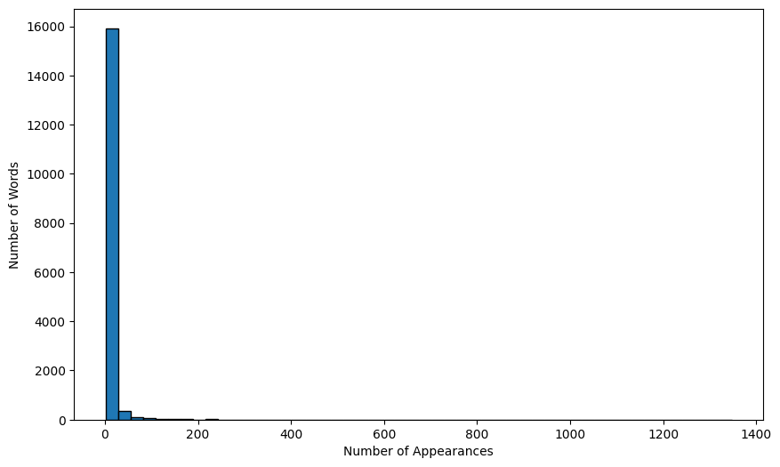
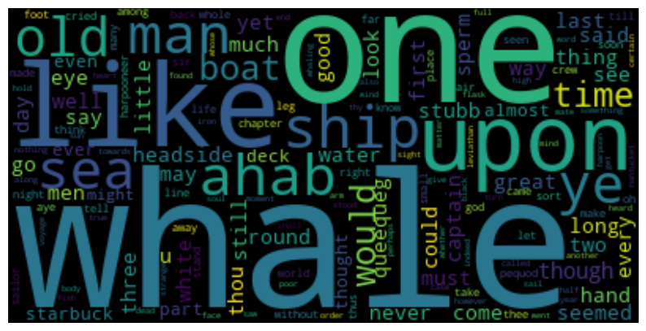

# Tokenization

In this notebook, you'll see how to use the NLTK library to tokenize and normalize text data.


```python
import matplotlib.pyplot as plt
import pandas as pd
import nltk
from collections import Counter

from nltk.tokenize import sent_tokenize, word_tokenize, regexp_tokenize
from nltk.corpus import stopwords

from nltk.stem import PorterStemmer, WordNetLemmatizer
```


```python
nltk.download("stopwords")
nltk.download("punkt_tab")
nltk.download('wordnet')
```

    [nltk_data] Downloading package stopwords to
    [nltk_data]     /Users/drewrichard/nltk_data...
    [nltk_data]   Package stopwords is already up-to-date!
    [nltk_data] Downloading package punkt_tab to
    [nltk_data]     /Users/drewrichard/nltk_data...
    [nltk_data]   Package punkt_tab is already up-to-date!
    [nltk_data] Downloading package wordnet to
    [nltk_data]     /Users/drewrichard/nltk_data...
    [nltk_data]   Package wordnet is already up-to-date!


    True


In this notebook, we'll be working with the full text of Moby Dick.


```python
with open('../data/moby_dick.txt', encoding = 'utf-8') as fi:
    moby = fi.read()
```


```python
moby[:1000]
```


    '  ETYMOLOGY.\n\n\n  (Supplied by a Late Consumptive Usher to a Grammar School.)\n\n  The pale Usher—threadbare in coat, heart, body, and brain; I see him\n  now. He was ever dusting his old lexicons and grammars, with a queer\n  handkerchief, mockingly embellished with all the gay flags of all the\n  known nations of the world. He loved to dust his old grammars; it\n  somehow mildly reminded him of his mortality.\n\n  “While you take in hand to school others, and to teach them by what\n  name a whale-fish is to be called in our tongue, leaving out, through\n  ignorance, the letter H, which almost alone maketh up the\n  signification of the word, you deliver that which is not true.”\n  —_Hackluyt._\n\n  “WHALE. * * * Sw. and Dan. _hval_. This animal is named from\n  roundness or rolling; for in Dan. _hvalt_ is arched or vaulted.”\n  —_Webster’s Dictionary._\n\n  “WHALE. * * * It is more immediately from the Dut. and Ger. _Wallen_;\n  A.S. _Walw-ian_, to roll, to wallow.” —_Richardson’s Dictionary._\n\n\n  חו,  '


First, let's split into sentences. For this, we can use the `sent_tokenize` function.


```python
sentences = sent_tokenize(moby)
```


```python
print(sentences[1000])
```

    Because no man can ever feel his own identity aright
    except his eyes be closed; as if darkness were indeed the proper
    element of our essences, though light be more congenial to our clayey
    part.


If we want to split into tokens, we can utilize one of nltk's word tokenizers.


```python
i = 1000
print(sentences[i])
word_tokenize(sentences[i])
```

    Because no man can ever feel his own identity aright
    except his eyes be closed; as if darkness were indeed the proper
    element of our essences, though light be more congenial to our clayey
    part.


Notice how `word_tokenize` counts punctuation marks as tokens. If we want to be more specific in what we count as a token, we can make use of the `regexp_tokenize` function which allows us to specify a regular expression pattern to define a token.

For example, we can look for word characters using `\w`. This will match one or more of any letter or digit.


```python
regexp_tokenize(sentences[1000], r'\w+')
```


Let's add a couple of other types of characters to catch and then count up the most frequent tokens using the `Counter` class. This will create a dictionary whose keys are the tokens and values are the frequency counts.
```python
moby_counter = Counter(regexp_tokenize(moby, r'[-\'\w]+'))
```
```python
moby_counter['whale']
```
    790


```python
moby_counter['Ishmael']
```
    19

Let's see how large a vocabulary we have.
```python
len(moby_counter)
```
    20302

Or how many total words.
```python
sum(moby_counter.values())
```
    216124

We can also see the most common words.


```python
moby_counter.most_common()
```


You'll notice that the most common words include a large number of words like "the" and "of". These can be considered "stop words", and in certain applications are less interesting and can be removed.

NLTK includes lists of stop words.

```python
stop_words = set(stopwords.words('english'))
stop_words
```


Let's make two modifications to our counter above. First, we'll covert all text to lowercase and the we'll remove stop words.
```python
moby_counter = Counter([x.lower() for x in regexp_tokenize(moby, r'[-\'\w]+') if x.lower() not in stop_words])
```
```python
len(moby_counter)
```
    18550


```python
moby_counter.most_common()
```

We might also want to do further preprocessing of our text. Let's try stemming and lemmatization. First, let's look at stemming. We'll try out the PorterStemmer from NLTK.
```python
porter = PorterStemmer()
```

To use it, you just need to call the `.stem` method and pass in the token to be stemmed.
```python
porter.stem('whales')
```
    'whale'

```python
porter.stem('numerical')
```
    'numer'

```python
moby_counter = Counter([porter.stem(x.lower()) for x in regexp_tokenize(moby, r'[-\'\w]+') if x.lower() not in stop_words])
```


```python
len(moby_counter)
```
    12349

```python
moby_counter.most_common()
```

One disadvanatage of stemming is that you can end up with non-words.

```python
porter.stem('remove')
```
    'remov'

We might instead try a lemmatizer, like the WordNetLemmatizer from NLTK.
```python
wnl = WordNetLemmatizer()
```
```python
wnl.lemmatize('whales')
```
    'whale'


```python
moby_counter = Counter([wnl.lemmatize(x.lower()) for x in regexp_tokenize(moby, r'[-\'\w]+') if x.lower() not in stop_words])
```
```python
len(moby_counter)
```
    16573


```python
moby_counter.most_common()
```


Finally, let's look at the distribution of words.
```python
plt.figure(figsize = (10,6))
plt.hist(moby_counter.values(), bins = 50, edgecolor = 'black')
plt.xlabel('Number of Appearances')
plt.ylabel('Number of Words');
```

    

    

```python
pd.Series(moby_counter.values()).describe()

    count    16573.000000
    mean         6.551077
    std         26.025339
    min          1.000000
    25%          1.000000
    50%          2.000000
    75%          4.000000
    max       1348.000000
    dtype: float64

If we want a fun way to visualize the most frequent words in the text, we can use a word cloud.

```python
from wordcloud import WordCloud

```python
wc = WordCloud()

wc.generate_from_frequencies(moby_counter)
plt.figure(figsize = (10,6))
plt.imshow(wc, interpolation='bilinear')
plt.axis("off");
```
    

    

