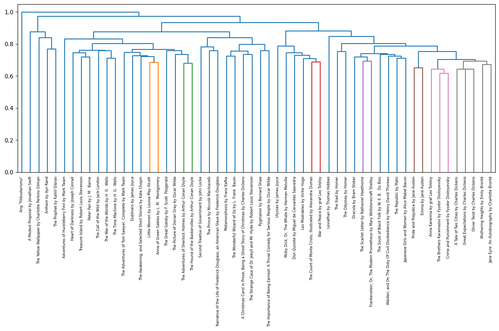

## Tokenization Practice and Simple Document Similarity

For this notebook, you have been provided the top 50 most downloaded books from Project Gutenberg over the last 90 days as text files.


```python
import re
import glob
from tqdm.notebook import tqdm
import pandas as pd
import numpy as np
import seaborn as sns

from sklearn.metrics.pairwise import cosine_similarity
from nltk import sent_tokenize, word_tokenize, regexp_tokenize
from nltk.corpus import stopwords

from collections import Counter
```

Given a filepath, you can open the file and use the `read` method to extract the contents as a string.

For example, if we want to import the full text of War and Peace, we can do that using the following block of code.


```python
filepath = '../books/War and Peace by graf Leo Tolstoy.txt'

with open(filepath, encoding = 'utf-8') as fi:
    book = fi.read()
```

You'll notice that there is some metadata at the top of the file and at the bottom of the file.


```python
book[:1000]
```


    '\ufeffThe Project Gutenberg eBook of War and Peace, by Leo Tolstoy\n\nThis eBook is for the use of anyone anywhere in the United States and\nmost other parts of the world at no cost and with almost no restrictions\nwhatsoever. You may copy it, give it away or re-use it under the terms\nof the Project Gutenberg License included with this eBook or online at\nwww.gutenberg.org. If you are not located in the United States, you\nwill have to check the laws of the country where you are located before\nusing this eBook.\n\nTitle: War and Peace\n\nAuthor: Leo Tolstoy\n\nTranslators: Louise and Aylmer Maude\n\nRelease Date: April, 2001 [eBook #2600]\n[Most recently updated: January 21, 2019]\n\nLanguage: English\n\nCharacter set encoding: UTF-8\n\nProduced by: An Anonymous Volunteer and David Widger\n\n*** START OF THE PROJECT GUTENBERG EBOOK WAR AND PEACE ***\n\n\n\n\nWAR AND PEACE\n\n\nBy Leo Tolstoy/Tolstoi\n\n\n    Contents\n\n    BOOK ONE: 1805\n\n    CHAPTER I\n\n    CHAPTER II\n\n    CHAPTER III\n\n    CHAPTER IV\n\n    CHAPTER V\n\n    CHAP'


```python
book[-18420:-18000]
```


    'scious.\n\n\n\n\n*** END OF THE PROJECT GUTENBERG EBOOK WAR AND PEACE ***\n\nUpdated editions will replace the previous one--the old editions will\nbe renamed.\n\nCreating the works from print editions not protected by U.S. copyright\nlaw means that no one owns a United States copyright in these works,\nso the Foundation (and you!) can copy and distribute it in the\nUnited States without permission and without paying copyright\nro'


Write some code that will remove this text at the bottom and top of the string.

**Hint:** You might want to make use of the [`re.search`](https://docs.python.org/3/library/re.html#re.search) function from the `re` library.


```python
start_pattern = r'\*\*\* START OF THE PROJECT GUTENBERG EBOOK WAR AND PEACE \*\*\*'
end_pattern = r'\*\*\* END OF THE PROJECT GUTENBERG EBOOK WAR AND PEACE \*\*\*'

start = re.search(start_pattern, book)
end = re.search(end_pattern, book)
try:
    book = book[start.end():end.start()]
    print(book[:50])
except Exception as e:
    print(f'Either start or end pattern not found. Error: {e}')
```

    
    
    
    
    
    WAR AND PEACE
    
    
    By Leo Tolstoy/Tolstoi
    
    
        


If we want to be able to scale up our analysis to multiple books, it would be nice to have a function to use repeatedly. Write a function called `import_book` which takes as an argument a filepath and returns the contents of that file as a string with the metadata at the top and bottom removed.


```python
def import_book(filepath) -> str:
    """
    Import the book from the given filepath, removing Project Gutenberg metadata.
    """
    with open(filepath, encoding='utf-8') as fi:
        book = fi.read()
    start_pattern = r'\*\*\*\s+START.*?\*\*\*'  # match *** START ... ***
    end_pattern = r'\*\*\*\s+END.*?\*\*\*'      # match *** END ... ***
    start = re.search(start_pattern, book, re.IGNORECASE)
    end = re.search(end_pattern, book, re.IGNORECASE)
    if start and end:
        return book[start.end():end.start()].strip()
    else:
        print(f"Start or end pattern not found in {filepath}")
        return ""  # or raise an error

```

Now, let's utilize our function to import all of the books into a data structure of some kind.

First, we need to be able to iterate through the list of filepaths. For this, we can use the `glob` function. This function takes as agument a pattern to match. Try it out.


```python
# glob.glob('../books/*.txt')
```


```python
filepath = glob.glob('../books/*.txt')[0]
filepath
```


    '../books/Pygmalion by Bernard Shaw.txt'


It would be nice to save the title of each book without the extra pieces around it. Write code that will remove the "books/" from the front of the filepath and the ".txt" from the end. That is, we want to extract just the "Little Women by Louisa May Alcott" from the current filepath.


```python
titles = [f.replace('../books/', '').replace('.txt', '') for f in glob.glob('../books/*.txt')]
# titles
```

Now, combine together the function you created and the code that you just wrote to iterate through the filepaths for the books and save the contents of each book into a dictionary whose keys are equal to the cleaned up titles.


```python
filepaths = glob.glob('../books/*.txt')
titles = [f.replace('../books/', '').replace('.txt', '') for f in glob.glob('../books/*.txt')]
books = {}
for title, filepath in zip(titles, filepaths):
    books[title] = import_book(filepath)

```

Now let's write some code so that we can cluster our books. In order to cluster, we'll need to be able to compute a similarity or distance between books.

A simple way to compute similarity of documents is the [Jaccard similarity](https://en.wikipedia.org/wiki/Jaccard_index) of the set of words that they contain. This metric computes the amount of overlap between two sets compared to their union. Two books which contain exactly the same words (but not necessarily in the same order or with the same frequency) will have a Jaccard similarity of 1 and two books which have no words in common will have a Jaccard similarity of 0.

**Question:** What might be some of the downsides to using Jaccard similarity to compute the similarity of two books?

In order to use this, we'll need to tokenize each book and store the results in a collection of some kind. Since we are interested in which words appear but not necessarily in what order or how frequently, we can make use of a [set](https://docs.python.org/3/library/stdtypes.html#set-types-set-frozenset). A set is similar to a list, but the order of the contents does not matter and a set cannot contain duplicates.

For practice, let's grab one of our books.


```python
book = books['Little Women by Louisa May Alcott']
```

Write some code which tokenizes Little Women and stores the tokens it contains in a set. It is up to you to decide exactly how you want to tokenize or what you want to count as a token.

Once you are happy with your tokenization method, convert it into a function named `tokenize_book` which takes in a string and returns a set of tokens.


```python
def tokenize_book(book):
    """
    Tokenize the book into sentences and words.
    """
    # Tokenize into sentences
    sentences = sent_tokenize(book)
    
    # Tokenize into words
    words = []
    for sentence in sentences:
        words.extend(word_tokenize(sentence))
    
    return set(words)
words = tokenize_book(book)
print(words)
```

    {'Ferdinando', 'Mama', 'whisper', 'bridal', 'cookery', 'thought—purple', 'cockles', 'peppery', 'grain', 'gruel', 'tale', 'clubroom', 'Has', 'disgraceful', 'company', 'bone', 'successes', 'troublous', 'puff', 'scene.', 'pardoned', 'tied', 'offer', 'being', 'Airy', 'agricultural', 'four-horse', 'weaker', 'occurred', 'solemnity', 'wonder', 'parched', 'cluster', 'hits', 'TWENTY-SIX', 'nom', 'pensively', 'odd', 'momma', 'tousle', 'unwary', 'rid', 'parent', 'questions', 'entire', 'em.', 'graceful', 'thus', 'POET', 'tool', 'outtalked', 'disloyalty', 'sometime', 'Burney', 'Roses', 'Gladly', 'proceeded', 'scorched', 'try', 'reins', 'world.', 'droll', 'Yonder', 'regiments', 'Moffat', 'teaching', 'Brooke', 'humming', 'includes', 'stoutly', 'objecting', 'gale', 'bushy', 'unwise', 'Difficulty', 'arrange', '2', 'splendidly.', 'breach', 'glittering', 'spandy', 'varied', 'm', 'interested', 'hers', 'half-involuntary', 'No', 'viands', 'irascible', 'valued', 'diffident', 'chintz', 'fragments', 'Cuddle', 'southernwood', 'nodding', 'Twelve', 'zest', 'deeds', 'ADVERTISEMENTS', 'shrubs', 'gloves', 'murmur', 'famous', 'report', 'utensils', 'goin', 'delays', 'Rather', 'predicted', 'brotherhood', 'ago', 'class', 'capitally.', 'sneaking', 'shrill', 'S.P', 'Evelina', 'misery', 'American—a', 'birthday', 'shape', 'responsible', 'CONSEQUENCES', 'bruises', 'shrilly', 'seclusion', 'childish', 'TWENTY-TWO', 'replenished', 'boast', 'became', 'gather', 'biting', 'paper.', 'property—viz', 'canary', 'yourselves', 'sounds', 'another.', 'old—forty', 'nargerie', 'tranquility', 'Nobody', 'approved', 'nobody', 'fluently', 'boldness', 'robbed', 'strip', 'pyrotechnics', 'through', 'patted', 'tussle', 'happier', 'ambiguity', 'poky', 'counter', 'wider', 'human', 'comically', 'outright', 'consider', 'cette', 'studious', 'breaths', 'merry-faced', 'ankles', 'reminded', 'Sherwood', 'microscopic', 'afresh', 'dealt', 'forgetful', 'shouldn', 'actors', 'spectacle', 'sometime—the', 'learned', 'washing', 'handsomer', 'THIRTY-TWO', 'celebrities', 'minutes', 'mum', 'blissful', 'situation', ';', 'jovial', 'hob-goblins', 'vampire', 'degeneracy', 'plump', 'words.', 'wound.', 'shortsighted', 'tres', 'lesser', 'tightly', 'glowered', 'hearten', 'lucky', 'shower', 'mystery', 'propriety', 'wiped', 'protection', 'Goes', 'sacred', 'lectured', 'defrauded', 'Rothschild', 'bureau', 'rhythmic', 'confounded', 'warning', 'well-known', 'housedress', 'saint.', 'blackbird', 'minute', 'meetings', 'peacock', 'blond', 'France', 'mated', 'CORRESPONDENT', 'dish', 'sentimentlly', 'dashing', 'anticipations', 'penetration', 'has.', 'pupil', 'destitute', 'half-bitter', 'then—alas', 'delightful', 'countryseats', 'despond', 'pistol', 'provides', 'appreciation', 'Anglais—a', 'Denis', 'valley', 'flat', 'Weary', 'hat', 'change.', 'displeasure—', 'Spiritualism', 'friends.', 'mending', 'amusing', 'persuasions', 'think.', 'twenty', 'spoke', 'personage', 'reading', 'fancywork', 'retreats', 'complaint', 'dreadful.', 'caricatures', 'ebony', 'spring', 'unwomanly', 'tidings', 'manageable', 'planted', 'images', 'lock', 'Try', 'quarters', 'turning', 'gracious', 'stubble', 'mortifying', 'guinea', 'demure', 'gush', 'thither', 'extravagant', 'board', 'shipping', 'mist', 'add', 'instinctively', 'approach', 'meantime', 'weeping', 'stately', 'informed', 'diminutive', 'forget', 'message', 'fixed', 'venerable', 'HALE', 'fifth', 'wrapping', 'Softened', 'ice', 'bewilder', 'paternal', 'loss', 'larder', 'Herein', 'extinguish', 'pities', 'pains', 'Anywhere', 'Laurie', 'prove', 'fly', 'flush', 'imitation', 'instead', 'about', 'Prut', 'countermanded', 'fault.', 'hoarse', 'conjured', 'suspect.', 'arranging', 'trials', 'it.', 'yearning', 'hood', 'grind', 'Winkle', 'unfortunately', 'flutter', 'bracelets', 'crosspatch', 'embarrassment', 'Born', 'cups', 'self-control', 'bath', 'Ted', 'wrinkles', 'text', 'stealthy', 'porcupine', 'Progress_', 'roughshod', 'Pathetique_', 'sweetest', 'papered', 'cheerily', 'tribute', 'or—no', 'Laurie—at', 'overlooking', 'point', 'diplomatic', 'mouf', 'larks', 'pocketed', 'killed', 'lively', 'Joian', 'denounced', 'daring', 'PLAYING', 'quarts', 'earthquake', 'aye', 'nothing', 'martyr', 'sweetmeats', 'league', 'perch', 'American', 'deliciously', 'buffeting', 'too', 'Back', 'separate', 'soft-eyed', 'Ariadne.', 'Whereat', 'reinforcement', 'prospect', 'cause', 'reach', 'readiness', 'Maria', 'points', 'Also', 'Dod', 'coverlet', 'Round', 'David', 'handing', 'brooded', 'wind', 'queens', 'makers', 'waking', 'nigh', 'beard', 'strolled', 'knocks', 'spider', 'Saturday', 'excursions', 'tables', 'approval', 'dabbling', 'Am', 'distrust', 'Harrys', 'both', 'starred', 'corpse', 'tidily', 'slumber', 'Painters', 'ceasing', 'estate', 'powers', 'nightgown', 'describe', 'sank', 'inspected', 'sleeves', 'babies.', 'eat', 'fails', 'cares', 'or', 'blonde', 'arnica', 'irreproachable', 'gambled', 'lower', 'fencing', 'dotes', 'rested', 'heaviness.', 'accomplish', 'Sweet', 'SLAVE', 'dance', 'frolic', 'French-woman', 'burnt', 'unanswerable', 'press', 'Stranger', 'brings', 'Wrongs', 'reminder', 'Rob', 'sentiment', 'member.', 'rising', 'everything.', 'piety', 'relent', 'THIRTY', 'temporary', 'socks', 'Amie.', 'sweetness', 'pretty—new', 'recollection', 'wings', 'frugal', 'sleighing', 'enfant', 'Gummidge—and', 'Dickens', 'hastily', 'discuss', 'Doesn', 'downfall', 'secures', 'Rasselas', 'cavern', 'chill', 'hardness', 'pelted', 'minute.', 'community', 'elaborate', 'eye', 'endow', 'absurd', 'doing', 'river', 'turban', 'voice', 'bolder', 'preside', 'involuntarily', 'Handsome', 'theirs', 'sunset', 'threat', 'august', 'Hum', 'Amy', 'assurance', 'whispered', 'meditated', 'prospective', 'rashly', 'brilliant', 'smoothing', 'waiting', 'steep', 'visits.', 'outdone', 'rest', 'own.', 'luxurious', 'dilapidated', 'pitching', 'rendering', 'rash.', 'couldn', 'freshen', 'brain', 'Nothing', 'repeat', 'sucking', 'maidservants', 'fortunately', 'breezy', 'glossy', 'agitation', 'have', 'ate', 'disapproval', 'successful', 'sprite', 'sleeplessness', 'attract', 'hardening', 'fields', 'depend', 'swim', 'evenly', 'funeral', 'drummer', 'Dodo', 'criticize', 'FOREIGN', 'leaned', 'currant', 'impressively', 'glacial', 'forgif', 'whetted', 'disguised', 'honors', 'bookworm', 'dished', 'aren', 'descriptions', 'incoherent', 'broad-shouldered', 'neighborly.', 'dresses', 'remarks', 'astride', 'propped', 'For', 'tenderest', 'leaving', 'dint', 'grandfather', 'By-and-by', 'burns', 'preparatory', 'mud', 'Even', 'heights', 'topic', 'blots', 'a', 'Friday', 'idle', 'players', 'poorest', 'pitcher', 'frosty', 'contradictions', 'case', 'party', 'wiles', 'trouble', 'practice', 'pertinacious', 'her.', 'rummaging', 'racks', 'wavy', 'garnet', 'nip', 'ours—one', 'letter.', 'gymnasium', 'miracles.', 'disheveled', 'didoes', 'gloomy', 'bucket', 'morals', 'flower', 'out-and-out', 'hard-earned', 'help.', 'special', 'Six', 'furnishing', 'before', 'often', 'sharply', 'Writing', 'heretofore', 'fate', 'inkstand', 'sympathizing', 'viper', 'daughters', 'sage', 'CONFIDENTIAL', 'murmuring', 'publicly', 'weighed', 'mistaken', 'wiggle', 'doings', 'lecturer', 'furnished', 'Weekly', 'daily', 'baker', 'carpentery', 'threw', 'remotest', 'regardless', 'wants', 'refreshment', 'adjourned', 'before.', 'trespass', 'silly', 'chance.', 'nervously', 'dusters', 'worldly', 'huff', 'submit', 'kindred', 'peck', 'foot', 'crew', 'Petrea', 'beacon', 'cordial', 'bounteous', 'drift', 'favors', 'beautify', 'Twins', 'somehow', 'new.', 'Women', 'coming', 'plant', 'homemade', 'blue', 'suburb', 'nicknames', 'Balzac', 'headquarters', 'factory', 'omen', 'difficulties', 'square', 'kids', 'sentimental', 'hedges', 'compliments', 'pleasing', 'limited', 'convenient', 'yards', 'same', 'untold', 'quickly.', 'forebodings', 'hastened', 'ACCIDENT', 'affectations', 'worsted', 'serving', 'book', 'vaults', 'pairs', 'lordliness', 'railroads', 'banner', 'Daughter', 'sleep-prevoking', 'sighing', 'commander', 'scribbles', 'effigy', 'ages', 'wink', 'Destruction', 'hens', 'off', 'harboring', 'balustrade', 'Boys', 'frank', 'bacheldore', 'infantile', 'sheets', 'obstacles', 'undisguised', 'fiercely', 'troops', 'legal', 'captain', 'Criticism', 'recollections', 'globes', 'angrily', 'disappointments', 'impossibilities', 'Toms', 'Prime', 'with', 'hugs', 'general', 'hospitality', 'eagerly', 'wring', 'Three', 'accounts', 'Tutors', 'boldly', 'Tarlatan', 'anywheres', 'tend.', 'Shining', 'Victor', 'Crocker', 'eruption', 'strained', 'Spanish', 'respect', 'Church', 'mind', 'invitations', 'impetuosity', 'down', 'stains', 'counters', 'gentle', 'patient', 'coddling', 'metaphorically', 'approaching', 'Colonel', 'bundled', 's-ease', 'ourselves.', 'THIRTY-THREE', 'snapped', 'Florence', 'bushes', 'coax', 'terms', 'sugar', 'forming', 'web', 'pleasanter', 'vulgar', 'trailing', 'litter', 'applied', 'cutting', 'abandon', 'nine', 'geranium', 'table', 'moves', 'infallible', 'indescribably', 'wraith', 'pussycat', 'callers', 'tie', 'imploringly', 'rolls', 'swarming', 'philander', 'moral', 'commendation', 'limps', 'pot', 'legacies', 'respectability', 'Hearing', '_parry_lized', 'week.', 'disliked', 'Phantom', 'wakes', 'hail', 'capers.', 'charter', 'bass', 'nectar', 'completed', 'inches', 'myrtle', 'Aunty', 'mushrooms', 'tart', 'plucky', 'rumpled', '‘', 'froth', 'Brooms', 'mails', 'convulsed', 'resign', 'household', 'balloon', 'mouse', 'science', 'tease.', 'sailing', 'illustrated', 'garland', 'mercy', 'told', 'But', 'river.', 'coal', 'fascinated', 'startle', 'Davises', 'severe', 'rogue', 'DARK', '_do_', 'unpacked', 'slyly', 'Catch', 'sofas', 'masks', 'endure', 'mat', 'concerned', 'seldom-used', 'celebrated', 'cherishing', 'often.', 'agonies', 'winking', 'mend', 'butcher', 'tended', 'Bethy', 'bib', 'coattails', 'furbish', 'deficiencies', 'bald', 'differ', 'ignoring', 'gushing', 'contributed', 'embraced', 'feasting', 'times', 'luster', 'went', 'holly', 'reverse', 'untasted', 'emotions', 'inner', 'saved', 'out-of-doors', 'going', 'turkquoise', 'condemned', 'December', 'thrill', 'reveled', 'pitty', 'kettle', 'bow', 'flirt', 'something.', 'half-smothered', 'Tired', 'acorn', 'Allow', 'fonder', 'fickleness', 'brusque', 'sweetest-tempered', 'Peeping', 'rampant', 'fellow', 'Wealth', 'harbor', 'feelers', 'good-by', 'soap', 'tattling', 'inexorable', 'climbed', 'Mercifully', 'filigree', 'Nil', 'No.', 'storm-beaten', 'self-denial', 'faulty', 'spangles', 'gainst', 'orphan', 'yer', 'envy', 'balloons', 'apology', 'trim', 'dryly', 'sink', 'Squirrels', 'Doing', 'break', 'foes', 'idly', 'cross.', 'rapidity', 'Amen', 'critically', 'plank', 'mutely', 'plan.', 'toss', 'scapegrace', 'bouncing', 'main', 'husband', 'behaving', 'prediction', 'juice', 'pilgrims', 'God', 'winning', 'though.', 'darlings', 'took', 'pigs', 'Accept', 'see', 'pokes', 'beholder', 'seldom', 'Old', 'fearing', 'indescribable', 'shearing', 'fibs', 'tame', 'standing', 'tonight.', 'Serene', 'Barnville', 'carried', 'Sit', 'bouy', 'Asia', 'poked', 'Bold-faced', 'bees', 'gave', 'toward', 'blighted', 'palatable', 'salts', 'accustomed', 'imperious', 'contradict', 'niminy-piminy', 'scrollwork', 'scenery', 'hopeless', 'cheek', 'demands', 'known', 'charred', 'purpose', 'vanity', 'individual', 'reluctant', 'neckties', 'Sanskrit', 'first-rate', 'revels', 'flatter', 'compassion', 'soonest', 'Yours', 'hoarsely', 'vitals', 'Nonsense', 'weakened', 'enchanted', 'affairs', 'blinds', 'me', 'article', 'prose', 'sisterly', 'asserts', 'gunpowder', 'calm', 'round-about', 'travelling', 's—it', 'stopped', 'wasn', 'desk', 'oar', 'givest', 'salvation', 'pretending', 'prices', 'wiping', 'undeniable', 'well-sweep', 'demoiselles', 'naughtiest', 'landscape', 'cent', 'harm', 'Mediterranean', 'hobbling', 'obliged.', 'vocabilary', 'fruitless', 'repulsed', 'womanly', 'ignorance', 'minding', 'ironin', 'Those', 'likenesses', 'searched', 'embroidered', 'adored', 'members', 'BURDENS', 'fearful', 'flutelike', 'flag', 'Something', 'sly', 'archangels', 'gentler', 'glancing', 'discovering', 'disgust', 'wings.', 'THE', 'stopped.', 'bilin', 'girl', 'dotted', 'cotillion', 'sack', 'pointing', 'spectacles', 'indulging', 'copied', 'duly', 'volcanic', 'tact', 'gentlemen', 'Suddenly', 'Feeling', 'bowing', 'tales', 'impulse', 'boiled', 'marriage', 'manfully', 'send', 'esteem', 'quandary', 'screaming', 'north', 'Ark', 'green-covered', 'merino', 'convert', 'doubles', 'kill', 'editorial', 'bowls', 'a-tapping', 'Author', 'delusion', 'persuasion', 'clover', 'Too', 'grimly', 'disperse', 'sketchbook', 'laundrywoman', 'forgets', 'A.S.', 'banks', 'shopman', 'management', 'queerly', 'outbreak', 'rails', 'lady', 'wriggled', 'wouldn', 'Tink', 'costume', 'breakfast', 'Talent', 'chanted', 'comfortable.', 'acts', 'sprung', 'force', 'useless', 'dreams', 'roved', 'dissolving', 'vivid', 'good-humoredly', 'dusk', 'Mullet', 'exploring', 'arrived', 'Divine', 'dreaminess', 'combs', 'King', 'remainder', 'irresistable', 'tournament', 'heartier', 'south', 'oh', 'creamy', 'askew', 'half-opened', 'ballast', 'will', 'blown', 'regular', 'two.', 'goodbye', 'ogress', 'bluntness', 'involved', 'meannesses', 'aged', 'st', 'withdraw', 'comes', 'pudding', 'concealed', 'edibles', 'advising', 'peaks', 'nonsense', 'ALONE', 'humbly', 'radiant', 'wistfully', 'aggressor', 'outcasts', 'canst', 'travels', 'hod', 'ground', 'wasted', 'newspaper', 'lovely.', 'penny', 'grammatical', 'annoyed', 'sidle', 'educate', 'Sister', 'moat', 'affliction', 'able', '_Vicar', 'begging', 'gingerly', 'smell', 'illustration', 'Vicar', 'round', 'S.L.A.N.G', 'decanters', 'closer', 'sour', 'inexpressible', 'kits', 'addressing', 'Laugh', 'Babel', 'meandered', 'unrequited', 'reposing', 'twinkle', 'says.', 'ungentle', 'wiser', 'retreating', 'strictly', 'feeding', 'prejudices', 'gamboled', 'companionless', 'paused', 'thanks', 'swan', 'chicks', 'deserved', 'Because', 'lover-like', 'roused', 'Waiting', 'Be', 'weren', 'Whether', 'Banquo', 'Is', 'Rival', 'espied', 'fleetly', 'tempers', 'elephants', 'blundering', 'fullest', 'lurch', ',', 'lighted', 'forced', 'fashion', 'Help', 'blower', 'shalt', 'mullein', 'lying', 'gossip', 'lion', 'horse', 'utter', 'reserved', 'ladies', 'learn', 'mus', 'grassy', 'Bacchus', 'flock', 'winds', 'freak', 'prance', 'tousled', 'prosperous', 'HISTORY', 'Theresa', 'aplomb', 'T.', 'tips', 'invalid', 'hire', 'unassuming', 'pumps', 'stage-struck', 'himself', 'ancients', 'helm', 'greatcoat', 'Guardian', 'group', 'consoler', 'trains', 'enlivened', 'enters', 'Russian', 'Touching', 'rashness', 'effective—for', 'rush', 'disported', 'permission', 'earnestly', 'sympathy', 'ninepence', 'smoke', 'directing', 'well-worn', 'heaviest', 'marcies', 'regret.', 'entree', 'fumbling', 'Mr.', 'trifled', 'sky-blue', 'rug', 'jib', 'Demosthenes', 'counsels', 'talk', 'dim', 'pages', 'brightening', 'Mademoiselle', 'tiresome', 'lime', 'trusting', 'buzz', 'obey', 'theirselves.', 'fishermen', 'pinnacle', 'appear', 'Bhaer.', 'lived', 'heroic', 'sonorous', 'us—that', 'interruption', 'beginnings', 'hundred', 'chased', 'Lovely', 'set', 'bloom', 'hats', 'promenading', 'illuminations', 'torn', 'retired', 'lamented', 'Lounging', 'fragment', 'cotton', 'determination', 'rolled', 'of.', 'although', 'written', 'winding', 'bill', 'Alas', 'look.', 'nor', 'summer.', 'angered', 'Truly', 'appeal', 'sunshiny', 'glare', 'series', 'log', 'somber', 'knowing', 'diving', 'Christmas', 'announcing', 'kind', 'passionate', 'strayed', 'paths', 'fender', 'passports', 'preceptor', 'wrote', 'independent', 'exquisite', 'intimate', 'safe.', 'failure', 'politics', 'ditto', 'burst', 'stamped', 'resolved', 'read', 'fantastically', 'refuse', 'Lottchen', 'castanets', 'maids', 'ARTISTIC', 'girlish', 'bided', 'singer', 'copying', 'opposite', 'tempt', 'cure', 'knees', 'reception', 'bonnet.', 'Behold', 'reproached', 'embarrassing', 'implied', 'common.', 'tremble', 'stitch', 'winked', 'overheard', 'vagaries', 'performance', 'chair', 'friendship', 'toiled', 'pranks', 'ruffled', 'object', 'mysteries', 'over-anxious', 'penmen', 'husbands', 'uncomfortably', 'explain', 'miss', 'tears', 'raise', 'prepare', 'Poetic', 'acknowledgment', 'silesia', 'hour', 'opening', 'fetlock', 'mortified', 'clothed', 'expense', 'fulfill', 'pothooks', 'anywhere', 'actor', 'Dorcas', 'VALLEY', 'chains', 'thatched', 'Parian', 'hardship', 'kinds', 'gorgeous', 'ship', 'throne', 'accidently', 'thousand', 'cruelty', 'Greatheart', 'uncomfortable', 'wretch', 'fearfully', 'briny', 'chateau', 'Mayn', 'morning', 'admission', 'leaf', 'fiddled', 'smash', 'underwent', 'grated', 'artistically', 'farmer', 'gowns', 'seashore', 'assuage', 'played', 'walk', 'glory', 'maker', 'Belle', 'letters', 'twelve', 'genius', 'stifled', 'standoff-don', 'pet', 'burdens', 'whim', 'endurable', 'morally', 'Baby', 'severely', 'despair', 'HEARTACHE', 'trifle', 'keeping', 'amazed', 'temper.', '_Dolce', 'revolution', 'anybody', '1', 'aggravating', 'dictate', 'Roderigo', 'seized', 'rigid', 'Madam', 'vessels', 'stares', 'Was', 'John.', 'tend', 'vortex', 'World', 'healing', 'neath', 'rather', 'cakies', 'Major', 'postmistress', 'especial', 'fittest', 'Stay', 'Such', 'peaceful', 'caps', 'poring', 'lellywaiter', 'marble', 'belly', 'happiness—Rob', 'bed-clothes', 'herself.', 'ruling', 'faithful', 'preposterous', 'smiles', 'okay', 'Scarlet', 'posies', 'Kirke', 'Josephine', 'life—helping', 'deceive', 'your', 'talent', 'cheerfully', 'violently', 'secret', 'installment', 'assistant', 'stood', 'hair', 'Papa', 'guitar', 'Adieu', 'hopeful', 'Purrer', 'Lucretia', 'honeysuckle', 'withdrew', 'keeps', 'delicately', 'Friedrich—I', 'smitten', 'thumb', 'securing', 'distinguishing', 'mess', 'suspicious', 'gallant', 'well-cushioned', 'nosegays', 'extravagances', 'Leaning', 'glimpse', 'mount', 'Tisn', 'gardener', 'chests', 'attribute', 'mightn', 'snub', 'quiet', 'gardings', 'emphasis', 'rebelling', 'course.', 'Upon', 'evolved', 'desirable', 'charmingly', 'Death', 'Half-writ', 'intonation', 'regretting', 'mishaps', 'greater', 'sobbed', 'powerlessness', 'Rarey', 'move', 'marble-topped', 'guns', 'circulated', 'nose.', 'oddest', 'postilions', 'comfortable', 'twitch', 'artless', 'shames', 'done.', 'samphire', 'idiot', 'empty', 'narrowly', 'coalbin', 'Hand', 'Schubert', 'boats', 'other', 'outgrew', 'Grandfather', 'sang', 'crotchety', 'deplore', 'mite', 'higher', 'Quartermaster', 'street', 'glasses', 'trooping', 'deserves', 'uproar', 'shall', 'edge', 'living', 'college', 'o', 'Professorin.', 'lives', 'rose', 'Hercules', 'unfolded', 'guidebooks', 'preserved', 'lucre', 'inconsolable', 'deserting', 'confectionery', 'countries', 'tragic', 'well-beloved', 'bound', 'Chesters', 'acted', 'tasks', 'scribbling', 'contented.', 'safely', 'deed', 'the—the', 'lavender', 'hacks', 'Louisa', 'satisfied', 'pensive', 'loop', 'noise', 'haired', 'descend', 'barricade', 'P.M.', 'Pile', 'breath', 'humor', 'barked', 'examining', 'Jo—humble', 'settle', 'measures', 'shirked', 'FOUR', 'behold', 'curled', 'tells', 'salute', 'compromised', 'Hummels', 'sins', 'flirtations', 'sayings', 'hymn', 'trifle.', 'frightening', 'ours', 'hymnbook', 'diminished', 'omnibus', 'chivalrous', 'bobbed', 'pressed', 'M.M.', 'succeeds', 'studio', 'witty', 'scold', 'arm', 'accepted', 'mission', 'content', 'archway', 'The', 'feathers', 'jaunty', 'peals', 'en', 'drive', 'else.', 'rumor', 'thrones', 'keg', 'asparagus', 'effective', 'trust', 'detains', 'grayer', 'countenance', 'overflowed', 'libitum', 'delicate', 'tamely', 'called', 'passage.', 'richer.', 'candor', 'DAISY', 'tomorrow', 'cooks', 'same.', 'cheerfulness', 'tall', 'fence', 'T.T', 'half-helped', 'seeming', 'girl.', 'gods', 'rudest', 'treasured', 'naturally', 'superstition', 'wry', 'consist', 'walking', 'doy', 'wrong', 'frere', 'croaked', 'back', 'specter', 'club', 'Esther', 'short-comings', 'necklace', 'witnessed', 'study', 'pretense', 'Nathaniel', 'spiritless', 'rills', 'ankle', 'canonized', 'captives', 'pilgrim', 'home', 'sells', 'gold-paper', 'lie', 'hardened', 'peopled', 'rich—ever', 'Fun', 'moping', 'Blanc', 'glorified', 'hereafter', 'steadfast', 'one', 'blossoms', 'encouraged', 'looming', 'passes', 'refused', 'solid', 'Constant', 'square-toed', 'helping', 'dandy', 'fling', 'booty', 'holy', 'blow', 'school', 'deeply', 'disregard', 'baggy', 'giver', 'together—trying', 'homelike', 'repaying', 'pleasures', 'admire', 'sixty', 'Quaker', 'candles', 'dislikes', 'baby.', 'what', 'dreary', 'BEREAVEMENT', 'contradick', 'acquainted', 'sallied', 'tableaux', 'dinner.', 'martyrdom', 'squeeze', 'twenty-two', 'spritely', 'third', 'brood', 'swinging', 'recess', 'occasionally', 'postman', 'FROM', 'error', 'Palais', 'cinders', 'unlock', 'frizzle', 'sipped', 'Aye', 'sounding', 'amount', 'Wouldn', 'right', 'turned.', 'slang', 'Amy—Middling', 'incantation', 'lengthening', 'unseen', 'vehicle', 'inquiring', 'culinary', 'stand-by', 'rouser', 'pinks', 'silenced', 'attracted', 'sweeper', 'Rhine', 'waste', 'Bernard', 'patronizing', 'angry', 'strewn', 'balance', 'mischief.', 'passion', 'semioccasional', 'panacea', 'darkly', 'pecking', 'pantoufles', 'grasp', 'esteemed', 'field', 'inch', 'readers', 'General', 'sprays', 'VANITY', 'summer', 'vigorous', 'undaunted', 'entrance', 'dispatches', 'saucer', 'dates', 'Chair', 'Parks', 'Clarens', 'informs', 'lets', 'stuff', 'prudently', 'NEW', 'faces', 'York', 'Villa', 'squeak', 'Sphinx', 'harshness.', 'bough', 'hesitating', '[', 'deplorable', 'mandarin', 'buttons', 'panniers', 'dove-like', 'trips', 'Disgusted', 'AND', 'happy-go-lucky', 'credit', 'bridge', 'pangs', 'I', 'repulsive', 'provided', 'devices', 'shortcomings', 'Polly', 'coins', 'likes.', 'weather-beaten', 'muffin', 'Pharaohs', 'sister.', 'erect', 'picnic', 'exit', 'tune', 'hearty', 'expression', 'sees', 'shameful', 'waistcoats', 'Society', 'wait', 'precipitately', 'delved', 'worm', 'jolly', 'MEETS', 'do.', 'commended', 'oppress', 'bob', 'mountains', 's-harp', 'nevertheless.', 'six', 'sons', 'title', 'Ours', 'broke', 'cozily', 'MY', 'deference', 'ambitions', 'rascal', 'but—I', 'tempted', 'room.', 'corporal', 'muffs', 'welcoming', 'poet', 'chattering', 'shrine—', 'Vanity', 'slightly', 'confides', 'stagger', 'journey', 'assuming', 'matron', 'tired', 'aunt', 'brew', 'gymnast', 'Blurred', 'roundness', 'breathing', 'seminary', 'fared', 'rained', 'dressing', 'dread', 'Hush', 'pummeled', 'sight', 'South', 'quilted', 'plants', 'relics', 'spare', 'sadly', 'pawing', 'two-thirds', 'statuesque', 'ain', 'sobriety', 'CASTLES', 'confiding', 'MAY', 'religion', 'short', 'pins', 'LEARNING', 'likes—talk', 'tilting', 'grumpy', 'wearied', 'PAT', 'nestled', 'reposed', 'sprouted', 'supper', 'pen', 'may.', 'sword', 'Call', 'servant', 'billiard', 'premise', 'meeting', 'conflict', 'representative', 'collared', 'roar', 'claimed', 'dismal', 'Redclyffe', 'imbecile', 'cheered', 'informing', 'groom', 'lunatic', 'testiness', 'anon', 'not.', 'supported', 'supper-table', 'prompt', 'reproaches', 'restraint', 'freedom', 'published', 'FORTY-THREE', 'prefer', 'animal', 'splendor', 'rippling', 'coxcomb', 'cap', 'sheet', 'People', 'threatens', 'fascinating', 'talked', 'be.', 'fourteen', 'Eliott', 'grief', 'apparently', 'protest', 'rough', 'hindrances', 'Heidelberg', 'however', 'ordeal', 'rocks', 'That', 'alterations', 'duel', '_must_', 'largest', 'pleased.', 'outside', 'awake', 'new', 'lament', 'desires', 'yielded', 'yearly', 'temptations', 'sports', 'chattered', 'heros', 'rubbers', 'manhood', 'vases—that', 'imagining', 'deaf', 'mouchoir', 'always', 'fidelity', 'Shut', 'whisky', 'provide', 'others', 'passed', 'scarabei', 'gently', 'fragrant', 'hampers', 'Croaker', 'niece', 'four-year', 'pleasantest', 'solacement', 'there.', 'injustice', 'fretting', 'prickly', 'flute', 'minor', 'afforded', 'Imagine', 'wand', 'notions', 'Opy', 'wailed', 'Precious', 'praises', 'suspected', 'dinnertime.', 'good-for-nothing', 'Pausing', 'enemy', 'bulletin', 'satisfying', 'pride', 'bind', 'TROUBLES', 'nose', 'timid', 'trudged', 'anyway', 'willingly', 'debt', 'rumpling', 'band', 'proved', 'sunny', 'supporting', 'Du', 'silliness', 'dowagers', 'inquire', 'inconvenient', 'compensation', 'grandchild', 'cultivated', 'fear', 'homely', 'listlessly', 'notion', 'straining', 'simplicity', 'Sartor', 'hidden', 'merely', 'breastpin', 'ignominiously', 'horns', 'aunt-like', 'share', 'Morals', 'men', 'succeeding', 'bowed', 'clothes.', 'fourth', 'had', 'eats', 'Kittens', 'young.', 'temptingly', 'Bonn', 'crumples', 'punished', 'grocer', 'submitted', 'recovered', 'spells', 'presentable', 'Kennst', 'adopt', 'entertained', 'dust', 'incorrigible', 'altogether', 'sign', 'pine', 'expose', 'picture-loving', 'JOURNAL', 'chasseed', 'feed', 'moralize', 'worn', 'Rainy', 'wrist', 'committing', 'caressed', 'Babydom', 'specimen', 'pleasure-loving', 'minion', 'tremendous', 'Where', 'Dundee', 'continent', 'Franz', 'nun', 'cordially', 'fresh-faced', 'nights', 'half-reproachful', 'displeased', 'housemaid', 'next', 'magnifique_', 'chess', 'surrounds', 'inconsistency', 'farm', 'beery', 'hiccough', 'pleasure.', 'Gott', 'crickets', 'accompanied', 'hovered', 'Jenny', 'cleaning', 'white-veiled', 'prayers', 'praised', 'brute', 'warerooms', 'faintly', 'masterpiece', 'coaches', 'offering', 'distaff', 'hurting', 'background', 'instance', 'lends', 'slaves', 'does.', 'chatted', 'rakish-looking', 'oughtn', 'literal', 'SEVEN', 'pokers', 'gaiety', 'wilt', 'moire', 'breathes', 'steal', 'pirate', 'plaid', 'toga', 'costing', 'teasing', 'madam.', 'threaten', 'apply', 'cherry-bounce.', 'spits', 'garden', 'petted', 'returned', 'bother.', 'career', 'fun.', 'we', 'hoisted', 'tread', 'belong', 'convulsive', 'troubles.', 'fell', 'Edgeworth', 'motioned', 'venturing', 'Therefore', 'churchyard', 'jobs', 'coiffures', 'Today', 'needn', 'cry', 'draft', 'abdicate', 'boots—', 'violets', 'unreasonable', 'Professor', 'UNDER', 'painted', 'withdrawing', 'buggy', 'jewel', 'Little', 'sane', 'humbug', 'unmanly', 'inkstands', 'trays', 'guests', 'rejected', 'murdered', 'only', 'hath', 'yawning', 'not', 'disclosing', 'Pin', 'Mercury', 'sentinel', 'understand', 'loseth', 'distributing', 'added', 'leisure', 'blowzy', 'virtually', 'portfolios', 'irrepressible', 'civilly', 'nettles', 'games', 'Silence', 'three', 'reproachful', 'armed', 'suffered', 'Friedrich', 'warmth', 'internal', 'exhaustion', 'sights', 'softer', 'contented', 'quietly.', 'overdoing', 'inevitable', 'gratified', 'heimweh', 'zigzagging', 'night.', 'knee-deep', 'confidential', 'thrown', 'Courage', '_cafes_', 'Katy', 'containing', 'spoil', 'professorins', 'such', 'wife', 'Out-and-out', 'understands', 'responsibility', 'memorial', 'treacherously', 'anyhow', 'punchtuation', 'Heavenly', 'hugging', 'objection', 'placed', 'moving', 'flights', 'rehearse', 'luck', 'Passers-by', 'lamentations', 'breadth', 'Geese', 'profit', 'BOUNCER', 'dignified', 'trudge', 'sniffing', 'breakfasts', 'hot', 'This—this', 'French', 'MARRIAGE', 'isn', 'spick-and-span', 'beings', 'protests', 'calmer', 'bustle', 'dialogue', 'yours.', 'contributions', 'sake—how', 'NINE', 'changing', 'affianced', 'dismally', 'rotten', 'spiritualistic', 'rig', 'getters-up', 'Highty-tighty', 'mud-pie', 'rings', 'flatteringly', 'Every', 'Language', 'Rodrigo', 'patronize', 'kitten', 'maybe', 'threatened', 'wretches', 'rendered', 'raspy', 'sensitive', 'constantly', 'record', 'wield', 'Northbury', 'Talking', 'claws', 'muslins', 'abashed', 'congratulation', 'brotherly', 'Hans', 'ourselves', 'preachy', 'hope.', 'education', 'rowers', 'Quakeress', 'expensive', 'wristbands', 'likewise', 'softhearted', 'facing', '18—', 'fed', 'humdrum', 'hay', 'peacocks', 'cigars', 'lace', 'impression', 'copybooks', 'crumble', 'meadows', 'theory', 'sped', 'pause', 'Duke', 'happily', 'mindful', 'curiously', 'editor', 'enthusiastic', 'shoulders', 'prospect.', 'hairdresser', 'listen', 'candy', 'Madonna', 'consent.', 'Lifting', 'complaints', 'intractable', 'offices', 'Preaching', 'spin', 'LETTERS', 'his', 'writing.', 'questioned', 'griefs', 'heaven.', 'jerked', 'wardrobe', 'time.', 'varying', 'SONG', 'savage', 'heartens', 'lover', 'shore', 'symptoms', 'whine', 'Noter', 'postscripts', 'purse', 'fitness', 'World_', 'oats', 'arguments', 'virtues', 'Marsch', 'forlornly', 'flight', 'ignored', 'studied', 'degrading', 'starched-up', 'critical', 'restrained', 'sincerest', 'personal', 'feelings', 'Greek', 'events', 'placid', 'Chick', 'savings', 'sparrows', 'pole', 'Splendid', 'apples', 'discover', 'streaming', 'inventor', 'bought', 'imp', 'an', 'ache', 'mathematical', 'Tut', 'vexes', 'ubiquitous', 'stale', 'awe', 'creeping', 'remembered', 'purposes', 'smokiest', 'demand', 'salads', 'Wrongdoing', 'rapidly', 'three-and-twenty', 'fragrance', 'thy', 'promiscuous', 'is.', 'novelist', 'pocketbook', 'teachers', 'pestle', 'innocence', 'nice', 'horror', 'flour', 'grudging', 'half-commanding', 'harsh', 'Italian', 'omelet', 'leather', 'demoiselle', 'level', 'hopped', 'musical', 'ledge', 'court', 'NINETEEN', 'attended', 'bend', 'salve', 'Beautiful', 'sudden', 'Nor', 'Years', 'suddenly', 'inspiration', 'pressures', 'angles', 'bare', 'Catherine', 'snarled', 'shopped', 'hes', 'churning', 'asks', 'got', 'net', 'reigned', 'red-headed', 'trustful', 'themselves', 'Par', 'escaped', 'beatitude', 'studies', 'faces—eyes', 'horn', 'statirical', 'unite', 'affable', 'welcomes', 'side-ache', 'desks', 'large', 'self-forgetfulness', 'chance', 'M.', 'tramp', 'fight', 'answering', 'scowled', 'suggestive', 'bandbox', 'yourself.', 'salubrious', 'poplins', 'rebelled', 'army', 'calling', 'humanity', 'tarlaton.', 'over-strained', 'half-averted', 'plumes', 'capaline', 'Chillon', 'tottered', 'hearer', 'polka', 'dahlia', 'charm', 'perturbed', 'travel', 'faraway', 'Illusion.', 'Longmeadow', 'seating', 'love.', 'fists', 'lies', 'romantic', 'progressing', 'honestly', 'consented', 'shadow', 'ominous', 'Josyphine', 'impossible.', 'domino', 'ridden', 'chillen', 'whither', 'IMPRESSIONS', 'Michelangelo', 'rapturous', 'slashed', 'Scotchmen', 'pipe', 'horse-chestnut', 'follies', 'likeness', 'canvas', 'mischief', 'Belsham', 'loose', 'peddling', 'relapse', 'oil', 'jumble', 'plateau', '.', 'Turner', 'imperfections', 'green', 'hitch', 'True', 'topics', 'As', 'startled', 'drowned', 'Or', 'skipping', 'overhearing', 'tassel', 'wander', 'faint', 'shake', 'queerest', 'second', 'clashing', 'Till', 'Woe', 'inhabitants', 'vanquished', 'beholding', 'them', 'anxiously', 'awful', 'headed', 'resolutely', 'proportions', 'clay', 'pots.', 'gone.', 'bargain', 'unfitted', 'eggs', 'Chester', 'frocks', 'half-scornful', 'may', 'fatherless.', 'pigeonholes', 'preaching', 'softness', 'though', 'mansion', 'returns', 'thrice', 'volume', 'floury', 'prone', 'contrary-minded', 'approve', 'inspirer', 'working', 'influences', 'recognize', 'croqueting', 'describing', 'performing', 'fine', 'attention', 'thrilling', 'Queen', 'tranquil', 'meerschaum', 'festivals', 'Not', 'nicely', 'princess', 'faithfulness', 'uninteresting', 'stick', 'secure', 'Sakes', 'fastening', 'bearded', 'saves', 'feeling', 'nautical', 'surrendering', 'simultaneous', 'Gondola', 'Jew', 'low', 'womenfolk', 'sarcastic', 'spite', 'miserable.', 'opportunity', 'reminisced', 'destination', 'mamma', 'Beethoven', 'assumed', 'commisary', 'staggered', 'partaken', 'apple-pie', 'life.', 'graduates', 'air—love', 'thickly', 'improved', 'false', 'homilies', 'kindnesses', 'disaster', 'bonfire', 'vanished', 'resent', 'suppressed', 'Mind', 'eldest', 'betokens', 'confusion', 'Knights', 'endeavoring', 'convincing', 'contraries', 'principles', 'vittles', 'latest', 'swore', 'nowadays', 'pillowed', 'madly', 'Salt', 'attentively', 'deck', 'surveying', 'hoarded', 'gangway', 'Christopher', 'stairs', 'childhood', 'ballad', 'paint', 'privately', 'style.', 'anymore', '_will_', 'bad-tempered', 'pressure', 'deranged', 'Resartus', 'watchman', 'saving', 'cabinet', 'breeze', 'gold-bead', 'telltale', 'l', 'envelopes', 'cymbal', 'decent', 'Smoke', 'allow', 'rouse', 'cream', 'utterance', 'undertaking', 'detection', 'beanstalks', 'effort', 'borrowing', 'Spread', 'goodies', 'Evening', 'drawbacks', 'Will', 'correcting', 'open', 'stouter-hearted', 'vexed', 'Tents', 'unlocking', 'pair.', 'genuine', 'subjugated', 'hysterics', 'fits', 'SHADOW', 'Their', 'ferns', 'apoplectic', 'victim', 'select', 'afflictions', 'aspects—beating', 'FORTY-ONE', 'groaned', 'Millinery', 'shirts', 'discussed', 'Baden-Baden', 'therefore', 'persuaded', 'trait', 'swollen', 'eatables', 'confirmed', 'festooned', 'ist', 'exact', 'style', 'audible', 'lesson', 'basely', 'handkerchief', 'magpie', 'very', 'tricks', 'father.', 'carpeted', 'stamps', 'reformers', 'outwits', 'impossible', 'feeble', 'maintop', 'die', 'exertions', 'bijou.', 'destroyed', 'gray-headed', 'consciousness', 'love-worthy', 'sicker', 'Westminster', 'Tucked', 'cup', 'dangling', 'EIGHTEEN', 'overdo', 'fumed', 'broken', 'wrathfully', 'coasting', 'income', 'sidling', 'customary', 'carry', 'Lisbon', 'Poor', 'mutter', 'revengeful', 'loath', 'tossed', 'puddles', 'hurts', 'misses', 'teapot', 'butterfly', 'florally', 'midst', 'groceries', 'WINKLE', 'departed', 'loved', 'Devereux', 'rice', 'infectiously', 'because', 'entered', 'showed', 'unselfish', 'wolf', 'lark', 'Bhaers', 'owe', 'am', 'yelped', 'PUBLIC', 'Scotts', 'surely', 'reduced', 'twittered', 'horrified', 'puddle', 'hundreds', 'table.', 'ends', 'chatting', 'removing', 'plaintive', 'ride', 'unlocks', 'why', 'nipped', 'ever', 'soon', 'issued', 'sugarplum', 'lengthened', 'laugh', 'guarded', 'half-wistful', 'risen', 'preemptorily', 'prancing', 'horsehair', 'mort', 'roaring', 'platform', 'plantation', 'stable', 'crushed', 'muscle', 'festivities', 'especially.', 'modesty.', 'sealing', 'moment', 'antique', 'slip', 'polished', 'pitched', 'Crinkle', 'Bhaer—doesn', 'provocation', 'sew', 'periods', 'dampness', 'massive', 'pledged', 'possibility', 'jerk', 'Wonder', 'twins', 'Tin', 'touching', 'mate', 'satisfactory', 'oblige', 'council', 'shirt', 'wife.', 'wide-spreading', 'disconsolately', 'vanities', 'Him.', 'argument', 'lamblike', 'thanked', 'sending', 'woe', 'advice.', 'beg', 'mountain', 'smother', 'darkness', 'd', 'handling', 'commons', 'Humor', 'tuddy', 'clear', 'lonely.', 'matronly', 'illness', 'savagely', 'mind.', 'printed', 'covers', 'crayon', 'earrings', 'Tina', 'parted', 'realized', 'imagined', 'wondering', 'valuable', 'image', 'reflections—which', 'amendment', 'a-wooing', 'chaos', 'stake.', 'trying-on', 'teach.', 'try_inger_', 'missed', 'disappeared', 'indeed', 'confide', 'damp', 'cravat', 'enjoys', 'author', 'passer-by', 'compensation—', 'chicken', 'Betty', 'P.S', 'appropriate', 'boulevard', 'gulls', 'soothing', 'vestige', 'Punch', 'Clara', 'turnover', 'studying', 'coveted', 'swimmingly', 'slave', 'overtakes', 'manger', 'driving', 'lockets', 'nutmeg', 'immediate', 'possessions', 'chap', 'sir.', 'searching', 'livelier', 'Vienna', 'prime', 'uniting', 'newly', 'unconquerable', 'bonnet', 'daughter', 'picking', 'toothbrush', 'On', 'buy—in', 'buttercups', 'chimneys', 'phantom', 'bad-tasting', 'pictorial', 'gloss', 'bustled', 'frames', 'Ditto', 'see—well', 'twirl', 'babytending', 'mask', 'womankind', 'weeks.', 'hand', 'pacing', 'game', 't-touch-me', 'acceptance', 'ho', 'straw', 'herself', 'philanthropic', 'valuables', 'cuffs', 'irritating', 'among', 'grown', 'arrive', 'opinions', 'Coventrys', 'easy', 'jell', 'sad', 'maid', 'preached', 'paragraphs', 'digest', 'treasuries', 'demonstration', 'terror-stricken', 'practiced', 'distinction', 'gypsies', 'shepherd', 'Homer', 'centaur', 'harmless', 'expressions', '_Ivanhoe_', 'Regent', 'calmly', 'contentedly', 'jiffy', 'good.', 'umbrella', 'journal-letter', 'ruins', 'Peggotty', 'reaping', 'Plato', 'groped', 'buoyancy', 'grander', 'explosions', 'tipsy', 'Hang', 'showers', 'wrench', 'October', 'brains', 'voluntarily', 'rebuke', 'crooked', 'lame', 'tongue—they', 'blank', 'dollanity', 'complacent', 'promotes', 'daunts', 'goodnight', 'alacrity', 'Englishwoman', 'weaned', 'lumpy', 'pecked', 'unbent', 'darling', 'Water', 'year', 'homesickness', 'vivacity', 'hides', 'Instant', 'below', 'comical', 'care.', 'could.', 'rode', 'run', '_Oh_', 'wet-blanketed', 'grovelers', 'difficult', 'Hoffmann', 'sworn', 'desolated', 'expect', 'finest', 'protesting', 'furniture', 'bank', 'stroked', 'mercifully', 'hand-in-hand', 'tap', 'Besides', 'dependable', 'forebearing', 'bolted', 'elegant', 'came.', 'failures', 'moss', 'wicket', 'nobler', 'lizards.', 'aprons', 'flatirons', 'Alone', 'Sabbath', 'bids', 'howling', 'printing', 'constructed', 'cat', 'smooth', 'things—nice', 'jangled', 'execution', 'ingenuity', 'sentimentality', 'retiring', 'peep', 'gravity', 'FRIEND', 'finely', 'serious', 'preparation', 'dose', 'growth', 'presents', 'robin', 'accidents', 'raisins', 'suggestively', 'flask', 'travelled', 'nods', 'uneasily', 'lifelike', 'far', 'course', 'cunning', 'September', 'pummelled', 'relived', 'tempting', 'sort', 'heavens', 'deluded', 'heavily', 'visit', 'Tusser', 'well-mannered', 'Oh', 'sky', 'winey', 'spasm', 'cheery', 'engaging', 'satisfaction', 'Augustus', 'Bon', 'absurdities', 'rouge', 'Master', 'despondency', 'experiments', 'beauties', 'kissing', 'nosegay', 'brocade', 'customs', 'philosopher', 'required', 'humbled', 'ludicrous', 'excluded', 'attributes', 'stroking', 'bit.', 'flank', 'cover', 'fairer', 'problems', 'preserve', 'expediency', 'stratagem', 'services', 'parasol', 'Lucifer', 'well-powdered', 'clever', 'forgetting', 'nevvy', 'Letters', 'throat', 'Mignon', 'increased', 'place.', 'har', 'poker-sketching', 'renouncing', 'door.', 'half-angry', 'counterfeit', 'blent', 'groups', 'never', 'exactly', 'villas', 'argue', 'muslin', 'genteel', 'fainting', 'skilfully', 'dogs', '_', 'Raphaella', 'adventure', 'arose', 'vent', 'can.', 'pity.', 'German—rather', 'dodge', 'illustrating', 'mauve', 'whippersnappers', 'devise', 'REPORT', 'aboard', 'Swarthy', 'refraining', 'then', 'evasions', 'beheld', 'ethereal', 'smallness', 'rustle', 'Earthly', 'pining', 'encamped', 'nothingness', 'impetuously', 'please', 'person', 'loving', 'nursing', 'lane', 'trimming', 'capturing', 'mirrors', 'masterful', 'stooping', 'observations', 'infinite', 'trash.', 'suggested', 'diverted', 'brewery.', 'copy.', 'prouder', 'tops', 'hurt', 'gadding', 'duckling', 'evil', 'milder', 'settles', 'language', 'lasted', 'culprits', 'recovering', 'regretful', 'protectingly', 'superior', 'beguiled', 'evenings', 'mane', 'firmly', 'oak', 'fuller', 'Brookes', 'cakes', 'night—at', 'ologies', 'laughs', 'dismiss', 'go.', 'overlook', 'broom', 'intellectual', 'bodyguard', 'poor', 'tableau', 'immensely.', 'sighed', 'blarnerying', 'pacify', 'cuddled', 'interferingest', 'loneliness', 'sleep', 'PAW', 'myself—I', 'wing', 'inexpressibly', 'immense', 'airily', 'novice', 'promised', 'don', 'Cake', 'Jura', 'lattice', 'twinkling', 'quit', 'treadmill.', 'Man', 'Anything', 'papa', 'Berlin.', 'bubchen', 'cock', 'gravel', 'stalks', 'Kearney.', 'glimpses', 'told.', 'uncharitableness', 'triumph', 'rash', 'hundred-dollar', 'lashes', 'grimy', 'brave', 'appealing', 'hanged', 'play.', 'fish-man', 'spurned', 'relenting', 'warned', 'doorway', 'deliver', 'Race', 'Mansion', 'towered', 'lecture', 'dollars', 'statue', 'bumped', 'schooner', 'plot', 'comprehension', 'boarding', 'Bryant', 'employment', 'stayed', 'flowerpot', 'distracted', 'regarded', 'goal', 'wore', 'eloquent', 'also—perhaps', 'female', 'objectionable', 'clearing', 'cal', 'misfortune', 'QUESTION', 'bog', 'wickedly', 'A.M', 'Graduating', 'tripped', 'distant', 'risked', 'strait', 'shouldst', 'patch', 'Seldom', 'quantity', 'Shadowy', 'becomes', 'alas', 'distress', 'saint', 'possibly', 'rides', 'interruptions', 'Relieved', 'delicacy', 'receive', 'choky', 'sauciest', 'manor', 'snowbank', 'mortification', 'quarter', 'Isn', 'gallop', 'Want', 'sick', 'pasting', 'Change', 'harum-scarum', 'flew', 'mocking', 'uncomplainingly', 'hobbledehoy', 'wide', 'threshold', 'inhospitable', 'catch', 'begins', 'joyful', 'sprightly', 'mass', 'futurity', 'sidesaddle', 'aversion', 'tete-a-tete', 'beggarmaid', 'tantrums', 'pictures', 'sorts', 'nurse', 'sewinsheen', '—but', 'tea.', 'elves', 'tiff', 'degree', 'lamenting', 'go-to-concert-and-theater', 'job', 'kindly.', 'cardcase', 'Park', 'Himself', 'benefactor', 'sharpest', 'contained', 'detested', 'phenomenon', 'rescued', 'firelight', 'anger', 'crimp', 'pucker', 'wistful', 'vases', 'Volcano', 'master', 'grimmer', '_go_', 'none.', 'George', 'Hall', 'great', 'Laurences', '_tres', 'Christ', 'flourishes', 'softens', 'Inclination', 'inconsistent', 'stupidity', 'closely', 'reclined', 'form', 'roll', 'undertaken', 'backward', 'sample', 'gauzy', 'face—and', 'beautifier', '—with', 'Suppose', 'foil', 'downs', 'prettier', 'fern', 'toast', 'inquiry', 'curl', 'purple', 'poke', 'fireside', 'magpies', 'posture', 'shipbuilding', 'bows', 'wit', 'unmercifully', 'March.', 'discouragingly', 'saw—the', 'separated', 'softened', 'Believing', 'vessel', 'print', 'trained', 'riot', 'desultory', 'tapped', 'polite', 'fringed', 'THREE', 'beneath', 'masked', 'years', 'triumphs', 'marks', 'dares', 'pyre', 'buttoning', 'seizing', 'biscuit', 'solve', 'dejected', 'lovelocks', 'vanishes', 'taking', 'satisfy', 'breaking', 'corners', 'sit', 'Boswell', 'Afar', 'everybody', 'bus', 'Swartz', 'revoir', 'comparing', 'entry', 'consoled', 'scolds', 'Contentment', 'koblods', 'nourish', 'clocks', 'outraged', 'consigned', 'prayed', 'delightsome', 'rapture', 'self-respect', 'tired.', 'relented', 'tingling', 'moneybags', 'addressed', 'inherited', 'repress', 'bronzes', 'warbled', 'resolve', 'rainbow', 'delivering', 'period', 'moil', 'trick', 'thoughtful', '_Macbeth_', 'John', 'wonderschones', 'quarrel.', 'groping', 'great-aunt', 'leisurely', 'library', 'consents', 'mortification.', 'related', 'accuracy', '$', 'urgency', 'subterranean', 'scientific', 'drama', 'passions', 'lined', 'Stoop', 'handled', 'animated', 'calico', 'did.', 'Rather.', 'sacque', 'City.', 'which', 'discoveries', 'scuppers', 'Espagne', 'hobby', 'ashes', 'faltered', 'rummage', 'looks', 'stifling', 'corned', 'Ahem', 'receipt', 'paradisiacal', 'by', 'conscience', 'blushes', 'duchesses', 'further', 'la', 'sepulchral', 'grew', 'remember', 'generous', 'pleasanting', 'unusually', 'tightened', 'sacrifices', 'obstinacy', 'connected', 'refrain', 'drinking', 'slammed', 'shame', 'stones', 'obligingly', 'hardhearted', 'sisters', 'composed', 'Catholic', 'meekly', 'Like', 'chimney', 'barrel', 'soar', 'tip-toeing', 'line', 'forgiven.', 'indulgence', 'listless', 'noble', 'oaks', 'decorous', 'gad', 'occasional', 'Dirty', 'overhaul', 'suffer', 'traveling', 'likely', 'uninvited', 'concern', 'galley', 'Banner_.', 'encourage', 'no.', 'HUMILIATION', 'was', 'witch', 'Chief', 'tooted', 'struggles', 'Ammon', 'hatchet', 'Tom', 'ungracious', 'faded', 'popping', 'feels', 'topsy-turvy', 'tenderer', 'there', 'enthusiasm', 'howled', 'forty.', 'neatness', 'limes', 'lowering', 'EIGHT', 'arsenic', 'cradle', 'comforter', 'palace', 'order', 'smarter', 'enthusiastically', 'circulating', 'HER', 'Fame', 'relieve', 'composing', 'assuaged', 'brick', 'pops', 'B.', 'struggle', 'half-sweet', 'violet', 'inwardly', 'damages.', 'seen', 'limbs', 'uncongenial', 'quiver', 'maiden', 'secrecy', 'fox', 'Kitty', 'motionless', 'Hyde', 'cow', 'mademoiselle', 'pouch', 'Charms', 'consequence', 'nowadays.', 'mortyfied', 'in', 'Well—the', 'revenged', 'talented', 'badly', 'mornings', 'Wear', 'draws', 'so.', 'Ma', 'teeth', 'LESSONS', 'stopping', 'reproachfully', 'Weathercock', 'A', 'alarmingly', 'excellent', 'serenity', 'shouting', 'necessaries', 'fame', 'gayest', 'opened', 'mine.', 'spoils', 'haymaking', 'larches', 'Hurry', 'gruffer', 'LAST', 'reliving', 'rain', 'order.', 'posy', 'staff', 'Sancho', 'mannie', 'Sitting', 'Emperor', 'expecting', 'whistles', 'grateful.', 'Bhaer', 'bust', 'Mother.', 'bliss', 'ill-bred', 'acknowledge', 'look', 'moody-looking', 'Mabel', 'topsy-turvey', 'coaxingly', 'bee', 'la_', 'runs', 'pair', '—namely', 'magnificently', 'colder', 'riddles', 'confiscated', 'humility', 'all-perfect', 'guess', 'feather', 'treasure', 'hoping', 'beyond', 'outlay', 'proof', 'immediately.', 'wills.', 'story.', 'napkin', 'over-turning', 'crochety', 'unalterable', 'friendship.', 'busts', 'illumination', 'recklessly', 'evident', 'offended', 'carved', 'moved', 'Two', 'penwipers', 'lids', 'JUNGFRAU', 'gruffly', 'SNODGRASS', 'drag', 'swallows', 'imaginary', 'throw', 'Yet', 'beer', 'ignominious', 'Legend', 'facinating', 'lullaby', 'handful', 'cards', 'delivered', 'pecks', 'wickets', 'scissors', 'month', 'scrapbooks', 'abase', 'cease', 'impressed', 'priest', 'repast', 'steamer', 'grimmest', 'whatever', 'dies', 'chasing', 'Commander', 'subsiding', 'whiff', 'Waving', 'warnings', 'newspapers', 'rushing', 'correspondence', 'remove', 'self-sacrificing', 'desired', 'showing', 'playbill', 'arts', 'fussing', 'flies', 'irrestible', 'warn', 'couple', 'fatherly', 'west', 'conducted', 'marked', 'cements', 'fortified', 'Spirit', 'oily', 'demoralized', 'benefits', 'downward', 'Nick', 'insist', 'bribe', 'Name', 'fold', 'attacks', 'foundations', 'harm.', 'unusual', 'mirror', 'hate', 'let', 'ceiling', 'storms', 'serenely', 'colt', 'THIRTY-ONE', 'stories', 'larkspur', 'covertly', 'altered', 'hand.', 'resisting', 'know.', 'luxuriously', 'bookkeeper', 'parliamentary', 'throng', 'entrancingly', 'Diaries', 'cabinets', 'free.', 'Dranpa', 'snake', 'eating', 'essay', 'live.', 'Joanna', 'delightfully', 'delve', 'toy', 'likely.', 'neglects', 'bight', 'perseverance', 'reconciled', 'Beth—Very', 'people', 'waked', 'Misses', 'heaven', 'codicils', 'romance—very', 'can', 'chin', 'meanwhile', 'affection', 'Making', 'flame', 'snuff', 'composure', 'beating', 'streamed', 'tight', 'bedside', 'derangement', 'rebuked', 'S.', 'excitedly', 'grinding', 'hospitals', 'resided', 'fort', 'imperial', 'reckless', 'reads', 'earthquake.', 'desperately', 'strikes', 'handiwork', 'enlightened', 'colonel', 'book.', 'scraped', 'pronounced', 'mignonette', 'trickling', 'rat', 'sauce', 'stained', 'bundle', 'temptation', 'ant', 'nut', 'Go', 'Impetuosity', 'swiftly', 'pique', 'behaved', 'tinware', 'Hospitable', 'givin', 'represented', 'delinquencies', 'baskets', 'fitting', 'indignant', 'cone', 'port', 'Mozart', 'correction', 'tricky', 'row', 'leaping', 'coquettish', 'Nearer', 'ants', 'generally', 'decided—', 'gratify', 'wealth', 'lisping', 'shawls', 'substantial', 'eaves', 'began', 'jokes', 'Fessor', 'frowns', 'trace', 'marched', 'soothed', 'characters.', 'crosser', 'sickness.', 'forehanded', 'nuns', 'welcomed', 'breathe', 'auburn', 'wonders', 'strife', 'bounded', 'collars', 'continues', 'Undo', 'flustered', 'pin', 'Susie', 'fo_', 'all-important', 'Irish', 'delayed', 'indignantly', 'poetic', 'enacted', 't.', 'Perkins', 'outward', 'Camp', 'oppressed', 'unexpectedly', 'pleasuring', 'forever.', 'dangerously', 'inmost', 'means', 'Caroline', 'bootblack', 'S', 'wreaths', 'diligently', 'crackers', 'ancient', 'woman.', 'respects', 'Frenchman', 'lee', 'untouched', 'gruff', 'tun', 'process', 'Funny', 'tracing', 'maternal', 'surpass', 'honey', 'tastes', 'spoons', 'promise.', 'horribly', 'ardor', 'hatbrims', 'JO', 'mermaid', 'clue', 'cartoons', 'Sinners', 'half-injured', 'Brooke.', 'hen', 'soon.', 'saddening', 'face', 'thinking', 'tidy', 'fastidious', 'insisted', 'Bountiful', 'audacious', 'fortune', 'late', 'promises', 'committed', 'mushroom', 'much', 'milk', 'well-meaning', 'write', 'dined', 'heavenly', 'puss', 'correctly', 'drying', 'patron', 'seeking', 'belle', 'caused', 'CHAPTER', 'column', 'gathering', 'April', 'names', 'Believe', 'heap', 'cheeks', 'Ah', 'unsolved', 'dirty-footed', 'fist', 'La', 'circumspection', 'impression—', 'comelier', 'repentant', 'hamper', 'tempered', 'he', 'reread', 'quizzing', 'whispers', 'counts', 'total', 'halls', 'utterly', 'day.', 'Tuileries', 'remind', 'clears', 'buried', 'foliage', 'twitted', 'servants', 'olives', 'Hampton', 'Pilgrims', 'nieces', 'swing', 'punching', 'weird', 'yours', 'pay.', 'clustered', 'Jones', 'Sacred', 'impulsive', 'home—he', 'lid', 'nuts', 'fit', 'stumped', 'Rome', 'Dodgers', 'earn', 'jackets', 'joked', 'straps', 'descending', 'Welleresque', '&', 'Hannah', 'fruitful', 'carol', 'perhaps.', 'tucked', 'keep-house', 'FAITHFUL', 'truest', 'orations', 'up-lifted', 'tub', 'empress', 'rein', 'piquante', 'thick', 'lovingly', 'NEIGHBORLY', 'lifting', 'they', 'blush', 'eagerness', 'necklaces', 'effervescence', 'slender', 'liberally', 'taught', 'crimes', 'EXPERIENCES', 'gesticulate', 'suppose.', 'thoughtlessness', 'follow', 'striking', 'make—forgotten', 'tending', 'dearly', 'condescension', 'ruffle', 'Atlanta', 'sheltered', 'twigs', 'Timidly', 'helpful', 'undiminished', 'editors', 'half-timid', 'bosom', 'sneezed', 'dare', 'fires', 'bones', 'occupying', 'hysterical', 'distract', 'fighter', 'dauber', 'narrow', 'friendly', 'Earnest', 'fond', 'clearer', 'brushed', 'deary', 'inconsistencies', 'town', 'attentions', 'stole', 'vanish', 'opera', 'shunned', 'uttered', 'purchases', 'mixture', 'formed', 'halo', 'large-nosed', 'packing', 'Within', 'vivan—what', 'evidently', 'chaplain', 'emotional', 'feature', 'bottles', 'years.', 'allusion', 'By', 'quoted', 'burn', 'West', 'subjects', 'pies', 'comfort', 'above', 'petulant', 'effusion', 'quietly', 'triumphal', 'fidgety', 'clearly', 'Show', 'wrongdoing', 'insult', 'Time', 'flattering', 'keen', 'heartburnings', 'doubtful', 'taming', 'supply', 'wavering', 'suits.', 'hearthrug', 'vest', 'admirable', 'prospects', 'workaday', 'Last', 'hale', 'veil', 'loyally', 'sometimes.', 'together', 'coughed', 'triumphantly', 'helplessness', 'chapel', 'outsiders', 'hustle', 'Hat', 'pedals', 'hunger', 'rousing', 'alone', 'Washington', 'repented', 'Dannecker', 'vibrated', 'sentence', 'white-winged', 'hymns', 'holidays', 'SEVENTEEN', 'henceforth', 'clarifying', 'presence', 'marm', 'doze', 'Lotty', 'republican', 'Socratic', 'content.', 'SOCIETY', 'helpless', 'rewrite', 'Gold', 'complimentary', 'assiduity', 'frequency', 'After', 'sums', 'dismay', 'none', 'bespattered', 'thereby', 'incident', 'haste', 'pausing', 'short-sighted', 'elector', 'Histories', 'hard', 'limper', 'reverence', 'contributor', 'settin', 'approvingly', 'carefully', 'fifteen', 'rusty', 'talking', 'solitary', 'compose', 'limped', 'opportunities', 'slippers', 'lamb', 'overwhelming', 'darns', 'fail', 'befall', 'cakes.', 'herbs', 'illustrations', 'mock', 'satirizing', 'thyself.', 'heaps', 'tempests', 'wreck', 'congratulate', 'volubly', 'well-behaved', 'worry', 'saintly', 'plaster', 'characteristic', 'long-cherished', 'restore', 'baked', 'convulse', 'devouring', 'abuse', 'rear', 'half-laugh', 'tough', 'over-shadowed', 'beseechingly', 'nod', 'recollect', 'advisers', 'invisible', 'gilded', 'comforts', 'luncheon', 'queen', 'changes', 'prosing', 'skillful', 'noon', 'Henshaw', 'all-absorbing', 'complete', 'child', 'truant', 'peony', 'tipped', 'apparent', 'heal', 'courage', 'Delectable', 'brown-paper', 'Hadn', 'afford', 'owed', 'revive', 'pause—then', 'bestows', 'pat', 'defense', 'wooden', 'thirteen', 'details', 'yourself', 'quite', 'tragically', 'adrift', 'hates', 'immediately', 'flying-jib', 'concealment', 'cursed', 'countryman', 'wilful', 'lay', 'DOMESTIC', 'like', 'source', 'expound', 'easterly', 'edition', 'kindlier', 'pricked', 'Minna', 'spied', 'invitingly', 'nimble', 'beanstalk', 'sir', 'memories', 'Moffats', 'heroically', 'toil', 'pleased', 'lawns', 'height', 'capacious', 'reproving', 'high-heeled', 'neglecting', 'drooping', 'pinched', 'wrapped', 'tickled', 'precipitating', 'prim', 'diamond', 'dancing', 'pleasurable', 'roundabout', 'specs', 'climate', 'lightly', 'casts', 'red-hot', 'grateful', 'jolie', 'issuing', 'estimate', 'mopes', 'fess', 'blandly', 'dry', 'lot', 'hushing', 'gloves.', 'cooler', 'shopping', 'visions', 'exerted', 'straight', 'suspension', 'glove', 'prostrate', 'rate', 'sung', 'overhead', 'snood', 'abruptness', 'opener', 'dumbly', 'nearly', 'miserable', 'drove', 'oft', 'gilding', 'slid', 'Teddie', 'Keeping', 'beads', 'MISCHIEF', 'fry', 'nothin', 'hash', 'goodnatured', 'necessity', 'picturesque', 'sooner', 'cloth.', 'upper', 'phrases', 'deportment', 'fust', 'Hold', 'filed', 'initiated', 'verge', 'water', 'thoughtless', 'solemn', 'conscience-stricken', 'fall', 'pledge', 'speaker', 'Johnsonianly', 'midgets', 'deciding', 'settled.', 'ring', 'dudgeon', 'departure', 'whence', 'rascals', 'LAZY', 'happen', 'cookies', 'hither', 'PORTFOLIO', 'recommend', 'defending', 'forgot', 'batch', 'SHELF', 'fact', 'model', 'Mothers', 'waiter', 'insulted', 'dwell', 'abrupt', 'reprovingly', 'classical', 'stile', 'elegantly', 'clipped', 'frettin', 'Unlike', 'frighten', 'detachment', 'day', 'seals', 'grievance', 'gives', 'Shylock', 'Anxious', 'visited', 'last.', 'determined', 'doubt', 'playing', 'fineness', 'sumptuously', 'anon.', 'prefers', 'oasis', 'poverty', 'scraping', 'newcomer', 'wintry', 'News', 'unambitious', 'sailor', 'drops', 'preparing', 'Mercy', 'out.', 'toilets', 'wonderful', 'smiled', 'ostentatiously', 'our', 'example', 'reasoned', 'good-naturedly', 'clean', 'aforesaid', 'disastrous', 'rejoiced', '_Femme', 'politest', 'laurels', 'dozed', 'breathless', 'Fling', 'speckled', 'battery', 'naughtinesses', 'HARVEST', 'danger', 'Wellington', 'Antoinette', 'dove-colored', 'families', 'white-headed', 'SIX', 'shriek', 'magnanimous', 'farmhouses', 'hustling', 'latticed', 'footmen', 'services.', 'nobility', 'fro', 'amused', 'sift', 'Murillo', 'loyalty', 'housekeeping', 'risks', 'untidy', 'settling', 'forgivable', 'due', 'withering', 'Court', 'Watch', 'Cheops', 'thrills', 'woes', 'somersault', 'P.C.', 'Ha', 'superiority', 'speculated', 'demon', 'complaining', 'ambitious', 'P.O', 'cologne', 'motives', 'Parker', 'blooms', 'scandalous', 'imps', 'Any', 'earlier', 'expectant', 'always.', 'nutting', 'good-tempered', 'jubilation', 'choose', 'scandalizing', 'Bangs', 'deception', 'plunge', 'division', 'farming', 'hump', 'reversed', 'gridiron', 'toilet', 'blur', 'infringed', 'disgusted', 'backs', 'TEDDY', 'hard-working', 'SECRET', 'hunt', 'mild', 'good-natured', 'Lawrence', 'merrymakings', 'wisely', 'm.', 'appearing', 'discouraged', 'harmlessly', 'spirits', 'confessed', 'instinctive', 'stout', 'ribbon—sure', 'Hark', 'completely', 'willful', 'misunderstandings', 'intentions.', 'luxury', 'fencing.', 'mellow', 'resolving', 'mistook', 'labor', 'brushing', 'meal', 'pots', 'plum-pudding', 'Your', 'slipping', 'lingering', 'Fire', 'fitted', 'roving', 'sips', 'longings', 'rushed', 'Early', 'accordin', 'slipshod', 'owners', 'laughter', 'healthfully', 'distinctly', 'convenience', 'provoking', 'use.', 'watched', 'stops', 'music', 'Please', 'entertaining', 'lull', 'turquoise', 'honor', 'cloudy', 'deared', 'sewed', 'FIRST', 'lads', 'haven', 'dood', 'Columbus', 'harrrow', 'used', 'Lying', 'aisles', 'earnestness.', 'exploits', 'Uncle', 'countenances', '76', 'pronunciation', 'atop', 'demeanor', 'proposing', 'It', 'lingy', 'Sanctifies', 'Columella', 'groan', 'speeches', 'lacked', 'here.', 'remarkable', 'diary', 'glared', 'baptizing', 'dive', 'dogskin', 'Before', 'honest', 'guise', 'villa', 'mispronouncing', 'alee', 'ideas', 'investigating', 'daughter-in-law', 'sleepless', 'Bless', 'helpfulness', 'Henceforth', 'aloft', 'paradise', 'continually', 'recited', 'waits', 'ferment', 'overcome', 'Rest', 'trouble.', 'guard', 'dining', 'demurely', 'coachman', 'perverse', 'wages', 'About', 'stammered', 'seedcakes', 'JANUARY', 'talks', 'sigh', 'fingers', 'relieved', 'reprehensible', 'Thus', 'Halifax', 'dew', 'wise', 'consisting', 'comes.', 'calculated', 'week', 'improved.', 'enveloped', 'baron', 'disgrace', 'custom', 'tuned', 'hotly', 'establishing', 'powerful', 'anything.', 'bundles', 'infectious', 'Tragedy_', 'fished', 'bowl', 'talents', 'capabilities', 'motherish', 'mischief-loving', 'congratulating', 'light', 'ravishing', 'James', 'rations', 'brightly', 'aloud', 'lads—a', 'hesitated', 'Won', 'graciously', 'whiskers', 'glance', 'flounces', 'sentimentally', 'mysterious', 'Nov.', 'attempting', 'unsatisfied', 'checks', 'place', 'heart.', 'urn', 'poor.', 'Bois', 'liking', 'covering', 'haunts', 'expressing', 'ungentlemanly', 'Rich', 'wile', 'melting', 'then.', 'mouchoirs', 'fie', 'earned', 'chaperone', 'constant', 'President', 'A.', 'apple', 'cheering', 'improper', 'graduate', 'blunderbuss', 'insensibility', 'ugliness', '_Rambler_', 'increasing', 'contrite', 'grandfather—oh', 'proving', 'admired', 'longer', 'panting', 'colds', 'plans.', 'hose', 'lots', 'sire', 'active', 'influence', 'shorn', 'affectation', 'saw.', 'jokingly', 'prospering', 'Grace', 'exulting', 'surmount', 'recall', 'prisoner', 'casting', 'Dolce', 'regarding', 'prettiest', 'redoubtable', 'rail', 'Shakespeare', 'mistakes', 'important', 'Objective', 'riotous', 'reg', 'Fervently', 'hostess', 'despised', 'scratching', 'grapes', 'sincere', 'sea.', 'vague', 'majesty', 'monitor', 'extent', 'independent.', 'alone.', 'prink', 'dashed', 'tremendously', 'Marriage', 'threads', 'Meg—Good', 'artist', 'menagerie', 'copy', 'otherwise', 'God.', 'portion', 'pillars', 'rigging', 'trio', 'impress', 'artlessly', 'sister', 'tutors', 'vigorously', 'souls', 'by.', 'shown', 'mood', 'daintily', 'poppies', 'seeable', 'unknown', 'wrastle', 'recognized', 'rubbish.', 'grandmother', 'Nan', 'admitted', 'gentleness', 'behavior', 'shouldered', 'masquerade', 'oranges', 'Beth', 'resting', 'stove', 'Act', 'jealously', 'requests', 'won', 'king', 'cold.', 'shells', 'inmate', 'listening', 'Genoa', 'Fisher', 'preach', 'rumble', 'silent', 'fluttering', 'FIVE', 'eligible', 'sprained', 'trinkets', 'flecked', 'equestrian', 'wet.', 'TWENTY-FIVE', 'Grandpa', 'experience', 'fib', 'foreseen', 'wall', 'sympathizes', 'bloomed', 'sobbing', 'curiosity', 'till', 'fireplace', 'JAMES', 'rekindled', 'advanced', 'bridegroom', 'absorb', 'profanation', 'something', 'prevail', 'cozy', 'blurred', 'incurred', 'alighting', 'tarlaton', 'exploit', 'nicely.', 'Speak', 'assent', 'Five', 'sarcasm', 'motherhood', 'PICKWICK', 'cheeriness', 'ad', 'jellies', 'famously', 'theaters', 'Spartan', 'Samuel', 'ornamental', 'bark', 'heroes', 'OUR', 'overwhelmed', 'gaily', 'up.', 'benefited', 'floor', 'sech', 'Procrastination', 'Straws', 'putting', 'beginners', 'desperation', 'silver', 'Teuton', 'deep', 'hence', 'golden', 'remorsefully', 'affect', 'plans', 'result', 'freezing', 'heartiness', '20', 'Hotel', 'Mouse', 'fashion-plate', 'stirring', 'guidebook', 'consoling', 'honeymoon', 'freshness', 'poems', 'Mr', 'ever.', 'borne', 'wrapper', 'Happy', 'chant', 'awaiting', 'head', 'arrangement', 'thorny', 'estimable', 'escape', 'encounters', 'half-amused', 'unkindly', 'mama', 'emphasize', 'discharged', 'honorable', 'rules', 'habits', 'Instead', 'docility', 'Quel', 'ruin', 'Carrol', 'advertisements', 'relapses', 'gifest', 'broadcast', 'tomb', 'littler', 'aggravated', 'hesitation', 'pale', 'burr', 'flying', 'wheelbarrow', 'nursery', 'each', 'declare', 'Corinne', 'very.', 'trifles', 'elder', 'disturb', 'visibly', 'upside', 'tip', 'accused', 'Marry—no', 'holders', 'writes', 'Devonshire', 'care', 'donkey', 'authority', 'Primroses', 'tingle', 'facts', 'Stir', 'mouse-colored', 'nerves', 'like.', 'Hill', 'roads', 'TENDER', 'Bliss', 'succeeded', 'obstinate', 'neuralgia', 'damask', 'outset', 'horrors', 'weeds', 'mallet', 'fool.', 'envious', 'Cook', 'come.', 'prepared', 'rifling', 'mates', 'divulged', 'hearers', 'drunk', 'Write', 'actress', 'gust', 'unprofitable', 'laboured', 'newcomers', 'badges', 'forgive', 'coachmen', 'Congratulating', 'attacked', 'continuing', 'Busy', 'agriculture', 'messes', 'argued', 'gabble', 'politeness', 'awoke', 'relate', 'chatelaine', 'Later', 'signed', 'assuring', 'thou', 'boards', 'decree', 'Gloves', 'heir', 'ways', 'strong', 'discreetly', 'ladyship', 'seemed', 'alike', 'regrets', 'repressed', 'wear', 'lovelornity', 'vaguely', 'roamed', 'pint', 'when', 'its', 'kite', 'darted', 'deposited', 'defiantly', 'proxy', 'moan', 'worked', 'snatched', 'de', 'owner', 'Birds', 'Under', 'M', 'her', 'naughties', 'CAMP', 'accident', 'hyacinth', 'thrust', 'see—and', 'boyish', 'Sometimes', 'tying', 'ALL', 'starved', 'whoop', 'Alcibiades', 'goings', 'This', 'Vevay', 'stampede', 'shimmering', 'Get', 'horseback', 'cultivate', 'refresh', 'scribbled', 'midnight', 'tedious', 'nephews', 'knights', 'dislike', 'elephantine', 'forgiveness', 'broad-brim', 'Finding', 'breakfast.', 'praise', 'saddened', 'tries', 'telegraphed', 'discipline', 'parlor', 'locked', 'housework', 'beef', 'broken-down', 'waltz', 'attractive', 'utmost', 'tender', 'apart', 'Dancing', 'cultivating', 'thorn', 'Europe', 'aromatic', 'cleaner', 'Foreign', 'Nearly', 'housekeeper', 'intervals', 'Shan', 'primer', 'shrines', 'parcel', 'hints', 'braid', 'drinks', 'Peinte', 'bang', 'until', 'immensely', 'selling', 'poison', 'scrapes', 'devote', 'aching', 'boldest', 'tweaked', 'detriment', 'little', 'trusted', 'attend', 'burdened', 'sere', 'paler', 'criticizing', 'appeased', 'salver', 'dictionaries', 'pedestrians', 'slighted', 'party.', 'Can', 'significance', 'kiss', 'rabbit', 'filagree', 'adhered', 'spreading', 'endowing', 'Eve', 'supplying', 'parrot', 'Step', 'sand', 'Daisy', 'yesterday', 'dreaming', 'evergreen', 'telegrams', 'stabbing', 'she—and', 'weary', 'fatigue', 'discomfiture', 'Buy', 'exclaiming', 'yes', 'staring', 'clusters', 'Tranquility', 'dirty', 'easier', 'Italy', 'whether', 'movements', 'Read', 'storm', 'grieving', 'flickering', 'assurances', 'sparkled', 'brooms', 'heels', 'soberly', 'TWENTY-THREE', 'Eagles', 'window.', 'lofty', 'damaged', 'Italians', 'tireless', 'arrested', 'chrysanthemum', 'original', 'sleeping', 'psalms', 'jubilee', 'evermore', 'hotels', 'Mark', 'scholar', 'gladly', 'build', 'tyrannize', 'speaking', 'valentines', 'tell', 'black', 'singing', 'claw', 'true.', 'wrung', 'crowd', 'embrace', 'twice', 'compelled', 'pennies', 'unprotected', 'waving', 'leg', 'one.', 'autumn', 'Boaz', 'allayed', 'depths', 'Half-finished', 'self-abnegation', 'dreads', 'Sensible', 'enticed', 'Maybe', 'using', 'philoprogenitiveness', 'stuck', 'kittens', 'retaliation', 'old', 'live', 'beat', 'honesty.', 'mainspring', 'police', 'sadder', 'artlessy', 'encouragement', 'park', 'bachelorhood', 'ogre', 'suspecting', 'Demon', 'velour', 'page', 'medicine', 'capricious', 'insinuation', 'useful', 'sobs', 'healthily', 'embroider', 'Indian', 'fete', 'contradicted', 'mix', 'ensued', 'Vive', 'patience', 'regain', 'publishers', 'idiotic', 'threatening', 'fide', 'machinery', 'whip', 'redden', 'English', 'answers', 'Yes', 'instantly', 'bird', 'November', 'LEAL', 'mosquitoes', 'kingdom', 'printed.', 'agreeably', 'crisp', 'parish', 'self-possession', 'bump', 'voluminous', 'selfishnesses', 'restful', 'organ', 'centuries', 'reminding', 'N.W', 'wheedle', 'Abroad', 'found', 'Hey', 'perfume', 'hounds', 'officer', 'capture', 'creaked', 'lovering', 'supine', 'playmates', 'Theatre', 'Child', 'sun', 'mortally', 'face.', 'surveyed', 'parcels.', 'Lord', 'clasped', 'Take', 'lacings', 'appetite', 'who', 'morose', 'Babyland', 'Other', 'vainly', 'composer', 'furbelows', 'greener', 'ball.', 'confused', 'll', 'selfish.', 'candle', 'cheat', 'sea', 'derisive', 'viol', 'quaint', 'piping', 'intellect', 'Latin', 'pension', 'boiler', 'note', 'slightest', 'rights', 'Recess', 'azalea', 'stealing', 'showered', 'furnace', 'Unless', 'gayer', 'hoist', 'merchant', 'mother', 'chairs', 'curtained', 'elastic', 'cold', '_Pilgrim', 'protestations', 'performances', 'refreshment—for', 'washed', 'blessing', 'perched', 'invited', 'sheep', 'commissary', 'artfully', 'quiz', 'relished', 'byplay', 'wells', 'accurate', 'scoldings', 'undoubtingly', 'unavailing', 'turnovers', 'singularly', 'richness', 'momentary', 'woman', 'Maritime', 'private', 'hands.', 'engage', 'disguise', 'refractory', 'jew', 'confessing', 'magazines', 'whisk', 'artful', 'attempts', 'willows', 'tartly', 'tug', 'character', 'plummy', 'Dovecote', 'produces', 'THIRTEEN', 'gentleman', 'aspiring', 'Tracy', 'despite', 'abominably', 'lapping', 'enclosing', 'calamity', 'former', 'hinting', 'hunters', 'Scotch', 'drumsticks', 'flames', 'Along', 'subside', 'Fiddlesticks', 'uphill', 'bask', 'humble', 'conversation.', 'bumping', 'offered', 'gained', 'buckles', 'blesses', 'unfailing', 'merrymaking', 'sunshade', 'keys', 'around', 'recalled', 'brutal', 'miscellaneous', 'Father', 'placidly', 'flown', 'cymbals', 'hospital.', 'barrier', 'yield', 'tumble', 'amazingly', 'hotel', 'shrieks', 'comfortably', 'near', '_—', 'tumbles', 'daisy', 'deprived', 'immortality', 'manuscript', 'America', 'govern', 'tongues', '7th', 'Corsica', 'characteristically', 'healths', 'married.', 'unnatural', 'five', 'matter-of-fact', 'plum', 'between', 'kindled', 'couples', 'toads', 'Poll', 'seeds', 'fancied', 'Play', 'kind.', 'handed', 'ivy', 'entrenching', 'unclasped', 'cumbrous', 'checked', 'lady.', 'outskirts', 'face—a', 'notebook', 'base', 'persons', 'are.', 'away', 'holds', 'phlegm', 'draw', 'full', 'sticks', 'hadn', 'gape', 'gits', 'Royal', 'Know', 'start', 'stuck-up', 'approving', 'profusion', 'tantalizing', 'afar', 'poppy', 'decision', 'bluntly', 'founded', 'months.', 'already', 'designing', 'gayly', 'pendulum', 'trying', 'fancy.', 'Year', 'affably', 'benefit', 'counsel', 'curlpapers', 'fathers', 'theater', 'burning', 'behind-hand', 'today', 'dignity.', 'acknowledgement', 'miser', 'brighter', 'destruction', 'Greece', 'bribed', 'curtsies', 'Recamier', 'flourished', 'peacemaker', 'confidingly', 'administered', 'Aster', 'papers', 'Lion', 'delicious', 'headgear', 'expressed', 'truer', 'What', 'ladies—I', 'snivel', 'pointed', 'acquiesced', 'grotto', 'turn', 'month.', 'flow', 'Buffaloes', 'char-a-banc', 'survey', 'nowhere', 'e', 'molasses', 'that.', 'thing.', 'enduring', 'country', 'relation', 'described', 'dropping', 'suggestion', 'lisped', 'treating', 'named', 'noiselessly', 'estates', 'Carrols', 'new-made', 'half-consciously', 'wrong.', 'lackadaisical', 'managed', 'shock', 'do—tried', 'reside', 'chaperon', 'Open', 'explanations', 'son.', 'crowns', 'drop', 'seem', 'plums', 'astray', 'Keep', 'blissfully', 'injured', 'kitchen', 'grave', 'matrons', 'amiable', 'store-room', 'collection', 'buxom', 'stiffly', 'tapers', 'particle', 'gas', 'race', 'Each', 'Him', 'unsentimental', 'him—a', 'outgrow', 'loverly', 'untrue', 'heartily', 'Hamlet', 'DEMI', 'ANNIVERSARY', 'disconsolate', 'failed', 'into', 'spinsters', 'flowers', 'Afghan', 'tomorrow.', 'kisses', 'bestowed', 'Tragedies', 'reaching', 'contrasting', 'space', 'testing', 'more', 'dart', 'price.', 'grown-up', 'did', 'When', 'Thomas', 'material', 'discussing', 'drum', 'prudence', 'coffee', 'beggars', 'Rushing', 'scared', 'denouement', 'gratefully', 'languages', 'wilderness', 'eventful', 'count', 'Men', 'barn', 'resulted', 'wounded', 'dressmaking', 'glances', 'horsebreaker', 'actual', 'scenes', 'dat', 'prize', 'desecrate', 'decently', 'led', 'diamonds', 'MEADOWS', 'mended', 'Why', 'have—you', 'true', 'gallivanting', 'PALACE', 'resignation', 'independence', 'pinafore', 'happiest', 'believing', 'afflicted', 'silky-soft', 'depends', '_operatic', 'stamina', 'playmate', 'shocked', 'scattering', 'full-grown', 'pegged', 'regards', 'linger', 'piling', 'jacket', 'pleasant.', 'unfold', 'omitting', 'pancakes', 'angelic', 'expressionless', 'rats', 'pretended', 'Laurie.', 'pardner', 'bemoan', 'destroyed.', 'Valnor', 'composition', 'Cavendish_', 'enjoy', 'youthful', 'Do', 'BEING', 'bear', 'masculine', 'meaning', 'amazement', 'reverses', 'packets', 'foreheads', 'Meg', 'skim', 'pallor', 'twenty-seven', 'scandalized', 'chestnut', 'struck', 'Flora', 'Que', 'pranced', 'lar', 'Pigs', 'snipping', 'quick', 'created', 'office.', 'ha', 'telling', 'headdress', 'expedition', 'say.', 'fish', 'figure', 'overshoes', 'Paglioni', 'poised', 'tuneful', 'hill', 'instrument', 'commissions', 'failing', 'foolish', 'friend—the', 'Paradise', 'exile', 'rent', 'intelligent', 'stitches', 'inevitability', 'Artful', 'promenades', 'dreamer', 'pronunciation.', 'juicy', 'beguile', 'ill-pleased', 'art', 'parents', 'comply', 'nightingale', 'aquatic', 'imposing', 'nature', 'notes', 'widowed', 'cabbage', 'bewildered.', 'APOLLYON', 'experiences', 'afraid—Laurie', 'charities', 'Franca', 'treats', 'treacherous', 'approached', 'pudding.', 'elegance', 'apparition', 'dragged', 'nation', 'first-born', 'piously', 'praiseworthy', 'weight', 'fortunes', 'students', 'stillness', 'masse', 'Successfully', 'mince', 'TWENTY', 'DECEMBER', 'Jeameses', 'larking', 'resolute', 'However', 'Ward', 'asunder', 'showy', 'Emmanuel', 'miles', 'refill', 'LAURIE', 'richest', 'choir', 'listeners', 'shouts', 'These', 'ODE', 'greatly', 'elder-sisterly', 'monstrous', 'sacrificed', 'elated', 'lasting', 'bequeaths', 'spirit', 'excused', 'conflagration', 'den', 'lavished', 'new-leaved', 'ripen', '_bijouterie_', 'wild', 'embitter', 'pussies', 'favor', 'asleep', 'worshipers', 'seventy', 'worshiped', 'unless', 'doomed', 'helps', 'bona', 'sweeter', 'so', 'cells', 'festival', 'kindling', 'leading', 'slapping', 'git', 'also', 'waters', 'later', 'ear—the', 'tut', 'enter', 'stone-blind', 'attracts', 'salad', 'rummaged', 'Dr.', 'president', 'mad', 'plainly', 'summerlike', 'sermon', 'conducive', 'pronounce.', 'revelation', 'Having', 'mantelpiece', '...', 'Hither', 'chosen', 'whipped', 'smoother', 'shaking', 'posed', 'Jungfrau', 'soldiers', 'metaphysics', 'inquisitive', 'beloved', 'beautified', 'instruments', 'Mrs.', 'manuscripts', 'eyebrows', 'chilled', 'indolent', 'shone', 'compasses', 'hearth', 'Hortense', 'voices', 'Goodness', 'Yesterday', 'coil', 'Quick', 'Fred', 'trapdoor', 'balls.', 'served', 'exult', 'stop.', 'impromptu', 'painless', 'Bosun', 'daunted', 'importance', 'flashed', 'heroines', 'whit', 'orchards', 'familiar', 'heavier', 'relative', 'attire', 'Demi', 'exhausted', 'lieth', 'Cutter', 'revealed', 'shining', 'controlled', 'sorry.', 'mourners', 'retire', 'hush', 'balmy', 'Ashamed', 'comfort.', 'hooting', 'luxurious.', 'intent', 'irregular', 'sometimes', 'economy', 'expenses', 'bibs', 'cattle', 'Aid', 'melodramatic', 'star', 'folding', 'ma', 'exertion', 'creation', 'hug', 'chuckle', 'freely', 'arrives.', 'rapid', 'controlling', 'afternoon', 'spot', 'embroidery', 'resources', 'sympathize', 'irritable', 'squalling', 'looped', 'scandalization', 'dogged', 'fellows', 'no', 'within', 'hasn', 'alders', 'repair', 'serene', 'figures', 'displaying', 'Satan', 'engagement', 'trading', 'work.', 'correct', 'goodhumoredly', 'Slippers', 'orange', 'rightly', 'arrival', 'teething', 'you.', 'nat', 'beggar', 'petting', 'visits', 'bruised', 'uncommonly', 'mechanical', 'elegant.', 'doos', 'dishes', 'sake—', 'soothes', 'unnecessary', 'nice.', 'scattered', 'slighting', 'walls', 'secret.', 'breaks', 'Save', '_Hamlet_', 'supposing', 'thing', 'believe', 'governesses', 'against', 'pie', 'frown', 'society', 'despairing', 'hearted', 'If', 'frowning', 'Santa', 'abundant', 'Pewmonia', 'vegetables', 'truth—an', 'soften', 'furnish', 'wash', 'agonizing', 'Sweets', 'flocks', 'up', 'mankind', 'ensue', 'love', 'Rousseau', 'word', 'soothe', 't—it', 'manager', 'They', 'N.', 'unfriendly', 'doves', 'sublime', 'avenue', 'felt', 'oration', 'West.', 'adoring', 'toys', 'Better', 'CALLS', 'labors', 'Kearney', 'easy.', 'shoe', 'proper', 'shrouded', 'savest', 'strong-minded', 'coolness', 'bottom', 'mounting', 'disagreement', 'admonitory', 'cuff', 'recumbent', 'slung', 'adjournment', 'prison', 'heath', 'crowning', 'Me', 'hero', 'aware', 'capitals', 'Never', 'eminently', 'considered', 'walked', 'downcast', 'liked', 'complains', 'paddling', 'reality', 'ideas.', 'chubby', 'berries', 'dressing-up', 'relinquish', 'jelly', 'columns', 'LAND', 'estate.', 'words—', 'missis', 'touched', 'wandering', 'Dim', 'cropped', 'bigger', 'stranger', 'flints', 'over', 'pocket', 'lonely', 'started', 'clothespin', 'turf', 'Bacon', 'stocked', 'reports', 'adieu', 'horrid.', 'you—that', 'benignity', 'attempt', 'language-master', 'prevailed', 'wreath', 'win', 'ceaseless', 'says', 'miniature', 'atone', 'rubber', 'climbing', 'irritated', 'Certainly', 'reminders', 'sum', 'pencils', 'olive', 'death', 'apple-picking', 'blithe', 'Wait', 'jour', 'respectfully', 'generously', 'relations', 'acid', 'must', 'call', 'Eager', 'possess', 'uncovered', 'us', 'All', 'snowflakes', 'vehicles', 'donkeys', 'everywhere', 'Lausanne', 'Pilgrim', 'capped', 'half-repentant', 'Juliet', 'explosion', 'word.', 'seems', 'paying', 'saltspoons', 'lips', 'stain', 'SAD', 'hideous', 'cap.', 'epitaphs', 'collecting', 'languished', 'forward', 'double', 'scribble', 'ladies.', 'maple', 'again', 'Cornelius', 'Megs', 'coats', 'cavalier', 'Many', 'busily', 'frolicking', 'whisking', 'somewhat', 'workbasket', 'truth', 'blossom', 'Napoleon.', 'P.C', 'dramatic', 'use', 'dearly.', 'plunged', 'father', 'sympathetic', 'forlorn', 'rosettes', 'us.', 'children', 'revived', 'much-injured', 'crumbs', 'inveterate', 'oddly', 'alarming', 'nest', 'LORD', 'hilarious', 'spire', 'disappointing', 'alternations', 'rapped', 'mighty', 'preserver', 'Gardening', 'thorns', 'charmed.', 'she—went', 'proves', 'streak', '_The', 'beauty', 'advertise', 'enemies', 'all.', 'Good', 'counting', 'parting', '_Sonata', 'steered', 'GOES', 'darting', 'discretion', 'hurrying', 'harmonious', 'restored', 'India.', 'marred', 'Let', 'Plumfield', 'monster', 'timely', 'benevolence', 'remarked', 'extra', 'Malaprop', 'homesick', 'Co.', 'smelling', 'goodly', 'Run', 'indefatigably', 'be—', 'local', 'rivulets', 'bared', 'glad', 'deeper', 'flirted', 'imploring', 'confidante', 'THIRTY-NINE', 'Slough', 'Kneeling', 'clasp', 'many', 'compliment', 'attack', 'yawn', 'lately', 'draggle-tailed', 'secluded', 'cases', 'comeliness', 'dungeons', 'church', 'easily', 'rope', 'cart', 'Alcott', 'feathers.', 'abstracted', 'certainly', 'poetry.', 'soothingly', 'mean—and', 'partners', 'begun', 'vividly', 'MERRY', 'friend.', 'ago.', 'white-walled', 'privileges', 'comforted', 'boiling', 'rakishly', 'sharp', 'curiosities', 'crossbeam', 'Ones', 'proceeding', 'angel.', 'Pole', 'strangest', 'motto', 'judging', 'Egypt', 'last', 'disposition', 'taper', 'definition', 'save', 'simply', 'stuffed', 'exasperating', 'gasped', 'Socrates', 'Everyone', 'Merry', 'Toodles', 'now—stupide', 'sunburned', 'take', 'goodness', 'encircled', 'search', 'after-triumphs', 'Bhaer-garten', 'sleeps', 'Spiders', 'Coblentz', 'Burdened', 'intelligible', 'McFlimsey', 'hammered', 'noticed', 'eleven', 'unjust', 'cleared', 'spiders', 'twos', 'pursuits', 'glorious', 'variable', 'opposition', 'teach', 'lounge', 'up—language', 'stuttered', 'Luxembourg', 'freshmen', 'mollified', 'stocks', 'monsieur', 'delight', 'kings', 'petulantly', 'astonish', 'seventeen', 'anxiety', 'scrape', 'robes', 'Prim', 'wishing', 'writing', 'gypsy', 'sect', 'man-of-war', 'Dashwoods', 'influenced', 'considering', 'amicable', 'Sam', 'hanging', 'unceremoniously', 'dream.', 'hoods', 'Diana', 'Parpar.', 'catholic', 'flyaway', 'fatal', 'Next', 'first', 'troubles', 'fishballs', 'Guess', 'sob', 'Demijohn', 'des', 'sowing', 'paced', 'whole.', 'decayed', 'Elysees', 'country-like', 'courtesy', 'cast', 'company.', 'door', 'pinning', 'Mis', 'sidelong', 'impetuousity', 'requested', 'days', 'Vladimir', 'mutual', 'suppose', 'window', 'examined', 'melt', 'refreshing', 'Sands', 'jabbering', 'parade', 'masterly', 'rap', 'freed', 'duck', 'operatic', 'gold', 'staying', 'lettuce', 'publisher', 'laying', 'overnight', 'Apollo', 'way.', 'joined', 'whistling', 'health', 'blows', 'Englishman', 'learns', 'confidence', 'tares', 'heart', 'penitence', 'tasted', 'harming', 'pines', 'bankrupt', 'ribbon', 'tragical', 'salutations', 'ohs', 'Apollyon', 'swell', 'flushed', 'popular', 'Madam—', 'marry', 'coat', 'needlework', 'every', 'Perhaps', 'quench', 'diplomatically', 'rung', 'borders', 'confidences', 'wildly', 'bush', 'lifelong', 'Sea', 'diversions', 'Weeks', 'loved.', 'portray', 'mishap', 'unpinned', 'BLUGGAGE', 'dirt', 'tombs', 'fussed', 'hove', 'Doll', 'shut-up', 'waked-up', 'lovey', 'suck', 'suit', 'faced', 'FORGET', 'captivate', 'feathery', 'outlives', 'too.', 'guilty', 'cask', 'Votre', 'closing', 'ELEVEN', 'city', 'clock.', 'Zara', 'hopes', 'labored', 'simplest', 'Jardin', 'distilled', 'buttoned', 'Parisian', 'christened', 'swung', 'lurid', 'speechless', 'lingered', 'Finish', 'elbow', 'dances', 'interrigation', 'helplessly', 'hours', 'endured', 'reward', 'foreign', 'anyway.', 'clattered', 'self.', 'freaks', 'puckered', 'reveries', 'deal', 'pickles', 'minister', 'splash', 'Highness', 'smiling', 'might', 'weal', 'clenched', 'insinuatingly', 'to', 'graduated', 'met', 'shadows', 'echoed', 'entering', 'Despond', 'verse', 'decorated', 'posted', 'Cutlasses', 'bearlike', 'drafted', 'husky', 'enthroned', 'boxes', 'meanness', 'glories', 'frankly', 'thank', 'scratch', 'petition', 'feminine', 'conflicting', 'sofa—long', 'deepened', 'monosyllable', 'free-and-easy', 'Instantly', 'dawdled', 'gifted', 'gallery', 'deuce', 'scented', 'stitching', 'tucks', 'riding.', 'Simple', 'bandanna', 'college.', 'overseeing', 'astonishing', 'relishin', 'telegraph', 'During', 'inward', 'light-footed', 'trample', 'mashay', 'opposites', 'fifty', 'relinquished', 'worldly-minded', 'manifest', 'five-and-twenty', 'apiece', 'dumb', 'Jack', 'arrived—Ristori', 'propose', 'Pray', 's-his-name', 'July', 'lumbering', 'dismayed', 'chamber', 'neglected', 'Liverpool', 'wondered', 'sense', 'balky', 'question', 'unbecoming', 'fairy', 'once', 'verses.', 'TWENTY-ONE', 'perjured', 'Frenchy', 'stunning', 'spelling', 'curly-haired', 'righted', 'sweet-fern', 'literature', 'becoming', 'gymnastic', 'Turn', 'Bremer', 'Gifted', 'blindly', 'Blondchen', 'alluded', 'transported', 'overwhelmingly', 'darkened', 'slippery', 'sock', 'banishment', 'High', 'kept', 'Cherie', 'dote', 'allows', 'conservatory', 'plague', 'OF', 'serpent', 'counted', 'sober.', 'afghan', 'mysteriously', 'tomboy', 'asking', 'died', 'Down', 'meat', 'pretend', 'presiding', 'dignity', 'streets', 'revolutions', 'banquet', 'Mother', 'ambling', 'rude', 'gate', 'elders', 'remarkably', 'contempt', 'believed', 'account', 'sleepy', 'needful', 'preserves', 'heat', 'Blimber', 'vanishing', 'giggled', 'Mop', 'give', 'groves', 'Dame', 'loyal', 'jackdaw', 'heard', 'Exactly', 'ORANTHY', 'splendors', 'nudge', 'rustled', 'revolve', 'forth', 'off.', 'palest', 'twenty-five', 'Wide', 'wheels', 'benevolent', 'bore', 'mirth', 'side', 'rich', 'wicked', 'ices', 'piques', 'lamps', 'unsubmissive', 'seaweed', 'Tumbling', 'distortions', 'Land', 'rewarded', 'Portuguese', 'confession', 'unheard', 'bankers', 'partial', 'Home', 'difference.', 'pearls', 'question.', 'defeating', 'TWO', 'tea', 'chaotic', 'potion', 'response', 'Chere', 'pickled', 'convinced', 'blaze', 'mature', 'lands', 'impatiently', 'taken', 'silence', 'chafed', 'sorry', 'Things', 'Day', 'akimbo', 'wailing', 'daisies', 'chord', 'carriages', 'Half', 'bedclothes', 'huddled', 'markets', 'defend', 'princesses', 'external', 'cot', 'spending', 'clutch', 'colors', 'impulses', 'Lakes', 'maddening', 'cabalistic', 'fictions', 'replace', 'peppermints', 'amuses', 'unlike', 'terrace', 'anyone', 'breasts', 'wearin', 'WILL', 'surprisin', 'query', 'joke.', 'knelt', 'Portfolio', 'Cabbages', 'effects', 'happens', 'moods', 'mute', 'interred', 'cheers', 'tiles', 'future', 'adventurous', 'duties', 'splendid', 'Dashwood', 'rowing', 'possession', 'rushes', 'threateningly', 'nevertheless', 'exclamation', 'brief', 'nonsense.', 'discovery', 'consumed', 'innocent', 'chickweed', 'strength', 'landed', 'limp', 'ungrateful', 'hev', 'pills', 'sot-bookay', 'regret', 'Dashwood.', 'plucked', 'Gummidge', 'vase', 'has', 'despise', 'wrought', 'FOURTEEN', 'standish', 'historian', 'hairpins', 'slept', 'following', 'spoken', 'Professorin', 'pets', 'Fulness', 'proofs', 'appealed', 'Some', 'them.', 'judgment', 'GARRET', 'carriage', 'toughness', 'MASKED', 'sweetly', 'inexpensive', 'literally', 'directed', 'aint', 'abroad', 'smartly', 'Requiem', 'contradictory', 'Soldier', 'the—the—illusion—you', 'dearies', 'lake.', 'Wouldst', 'seasons', 'attempted', 'salt', 'matter', 'orderly', 'intensely', 'heaved', 'Betsey', 'consternation', 'steadied', 'racket', 'jingling', 'dawdling', 'half', 'households', 'Once', 'mania', 'creature', 'bonnie', 'either', 'desponding', 'coquetry', 'sky-rockets', 'test', 'observing', 'resented', 'shorter', 'Lamb', 'low-necked', 'fever.', 'Make', 'declaration', 'maps', '?', 'mademoiselle.', 'awaked', 'unkind', 'inkstand—she', 'boating', 'modest', 'gay', 'unmaidenly', 'accepting', 'implore', 'hesitate', 'suspicion', 'Souls', 'top', 'TWENTY-NINE', 'orchard', 'indecorous', 'readily', 'expected', 'those', 'ballroom', 'wound', 'twisting', 'spirit-stirring', 'conferred', 'silvery', 'half-open', 'uncontrollable', 'Adelon', 'Austrian', 'shield', 'were', '_marchen_', 'barrels', 'rare', 'hopefully', 'artificial', 'element', 'And', 'prince', 'ball', 'excite', 'situated', 'fun', 'statues', 'tasting', 'dexterity', 'rigmarole', 'strand', 'Sairy', 'war', 'knitting', 'native', 'flinching', 'withdrawn', 'clasping', 'atonement', 'foe', 'lords', 'vacation—how', 'picters', 'shaded', 'thoughts', 'beams', 'THIRTY-FIVE', 'instant', 'belles', 'tearing', 'grounds', 'pricking', 'desert', 'Look', 'remonstrated', 'wish', 'pull', 'reluctance', 'explaining', 'tendencies', 'linen', 'heroine', 'decidedly', 'How', 'sacrifice', 'earning', 'pricks', 'Romeo', 'starched', 'world', 'coupe', 'barouches', 'Mademoiselle.', 'pronouncing', 'warbler.', 'Curly', 'tranquilly', 'larks.', 'good-for-nothing.', 'half-dead', 'ob', 'boot', 'jiffy.', 'highly', 'doth', 'exploding', 'eclipsed', 'whiffle', 'clawing', 'PLAY', 'apron', 'ONE', 'displeasure', 'autocrat', 'Aristotle', 'tomb.', 'Sintran_', 'wail', 'occupied', 'emerged', 'Actually', 'fleecy', 'over-flow', 'experiment', 'Die', 'highest', 'hopelessly', 'dream', 'rinse', 'holding', 'Weller', 'refinement', 'burrs', 'stared', 'barricade.', 'cling', 'declaring', 'grooms', 'about.', 'invention', 'trip', 'Give', 'own', 'ups', 'consent', 'creeters', 'good-byes', 'symptoms—is', 'gem', 'shopping.', 'skating', 'slopbowl', 'oppose', 'Very', '_so_', 'apprehensions', 'jewelry', 'BOY', 'reprimands', 'homes', 'businessman—girl', 'gallantly', 'amusements', 'still', 'particular', 'china', 'rock', 'Slipping', 'money.', 'tried.', 'practicability', 'Dicks', 'galloped', 'women.', 'present.', 'forethought', 'joys', 'shelves', 'pauses', 'Kenilworth', 'invented', 'afore', 'said—', 'morality.', 'suited', 'complained', 'alcove', 'examine', 'equally', 'coo', 'frills', 'forefinger', 'slowly—but', 'Wakefield_', 'depict', 'plagued', 'rose-colored', 'bills', 'submissive', 'morning-glories', 'liberties', 'umbrellas', 'trembling', 'Truth', 'chanting', 'invent', 'said.', 'Ach', 'respeckful', 'sensible', 'man', 'privations', 'judged', 'Hoping', 'tenderly', 'stationary', 'sparkling', 'nests', 'tedium', 'circumstances', 'trump', 'pane', 'initials', 'with.', 'Trop', 'betraying', 'reverential', 'corner', '_Rambler', 'mean', 'show', 'impressions', 'him.', 'breathlessly', 'Curtis', 'dewy', 'paraded', 'button-hole', 'abstinence', 'sometime.', 'boon', 'Haven', 'arbor', 'mashed', 'rides—old', 're', 'disappoint', 'shrubbery', 'prejudice', 'holiday', 'sin', 'revel', 'Monaco', 'what-you-call-it', 'Continent', 'Boy', 'least.', 'Sir.', 'self-reproachfully', 'ravishingly', 'omit', 'boat', 'THIRTY-SIX', 'plumy', 'receptacle', 'piazza', 'Johnson', 'brooch', 'chuckled', 'condemning', 'themselves.', 'centerpiece', 'crept', 'slipped', 'pour', 'greet', 'Fortunately', 'came', 'guy', 'Earth', 'slang.', 'Berne', 'cheerful', 'riding', 'forgotten', 'energy', 'professor', 'Kings', 'signs', 'ready', 'rattling', 'disrespectful', 'sounded', 'ray', 'fashions', 'exulted', 'baptized', 'refuge', 'bold', 'setout', 'quarter-inch-long', 'cocked', 'unacknowledged', 'subjection', 'crowing', 'a-visiting', 'steam', 'operas', 'at', 'Royale', 'leapfrog', 'expatiating', 'woe-begone', 'heartiest', 'Kitchen', 'smashed', 'thankfully', 'Remembering', 'Bonnivard', 'ferrule', 'raged', 'Come', 'polish', 'tongue', 'repeated', 'denoument', 'pencil', 'institution', 'Mass', 'Hogarth', 'waistcoat', 'go', 'endeared', 'horrid', 'gain', 'perfect', 'halves', 'toes', 'introduce', 'peculiarly', 'ocean', 'turtles', 'elfin', 'spaces', 'eight-and-twenty', 'shrine', 'May—that', 'blushed', 'warningly', 'wearily', 'watch', 'clap', 'Joneses', 'simper', 'tarts', 'capital', 'Though', 'whisked', 'spiritless—not', 'Shrouded', 'sentiments', 'dozen', 'dozy', 'gentlemanly', 'vines', 'truck', 'compared', 'refusing', 'knife', 'looked', 'closets', 'Saw', 'Cock', 'Snow', 'extending', 'beggar.', 'welcome', 'peal', 'buckwheats', 'mischievous', 'weak', 'dandelions', 'effigies', 'fix', 'Have', 'afire', 'girlhood', 'tea-rose', 'disapprobation', 'overflowing', 'articles', 'escapes', 'me—busy', 'sheaf', 'rainy', 'values', 'brighten', 'Richmond', 'sufferers', 'rainbows', 'speak—intelligibly', 'imitate', 'calmness', 'Marmar', 'gossiped', 'morrow', 'blanc', 'readiest', 'guessed', 'absurdity', 'seasickness', 'outstrip', 'flourish', 'trash', 'advised', 'afternoons', 'Milton', 'interfere', 'cambric', 'Chauvain', 'gentlemen—allow', 'mein', 'destitution', 'thence', 'seven', 'Napoleon', 'daddy-longlegs', 'owned', 'stabbed', 'months', 'investment', 'transfixed', 'prolonged', 'engineers', 'feasible', 'brothers', 'more.', 'L.', 'spoiling', 'hospitalities', 'pattering', 'Spoils', 'undone', 'self-disapproval', 'apologize', 'capitally', 'manner', 'villain', 'avoided', 'Canada', 'magnificent', 'prodigies', 'hieroglyphics', 'cooling', 'foremast', 'retaliate', 'Laurence.', 'unspeakable', 'graces', 'honored', 'cared', 'unladylike', 'agreeable', 'loud', 'Tell', 'Jupiter', 'notices', 'speech.', 'mouths', 'ornamented', 'chewing', 'sings', 'does', 'Eagle_', 'ordained', 'marrying', 'hunting', 'evoked', 'DAYS', 'blushing', 'thermometer', 'pearl-colored', 'angel', 'kindly', 'addition', 'boundless', 'manly', 'translated', 'intends', 'richer', 'sunsets', 'anointed', 'behave', 'lift', 'certain', 'mar', 'immortalize', 'twenty-six', 'lifeless-looking', 'drew', 'sparkle', 'dinner', 'shortest', 'falter', 'pinching', 'tire', 'disposed', 'Beths', 'barouche', 'Lazy', 'Providence', 'grieves', 'flirting', 'O', 'well—last', 'affability', 'enjoyed', 'slow', 'testiment', 'overtures', 'In', 'stormy', 'instructions', 'idol', 'schooltime', 'chirping', 'Tea', 'brine', 'fortuitous', 'exceeded', 'robs', 'report.', 'contested', 'ears', 'cellar', 'nymph', 'mannling', 'shiver', 'relaxed', 'ancestors', 'EXPERIMENTS', 'pianee', 'step', 'fur-trimmed', 'acquaintance', 'bordered', 'Sunshine', 'exiles', 'kindness', 'Always', 'tarantella', 'cries', 'Fatherland', 'employed', 'shook', 'scorn', 'anguish', 'bureaus', 'earth', 'saunter', 'well-ordered', 'coolly', 'lounging', 'chop', 'winter', 'upsetting', 'throwing', 'lexicon', 'mentioning', 'leaked', 'stalked', 'receiving', 'bland', 'traitor', 'Does', 'enchantment', 'tablecloths', 'knapsack', 'authoress', 'docile', 'suppertime', 'philosophy', 'Meek', 'squeal', 'les', 'cravats', 'life', 'dowdy', 'worrying', 'coals', 'dying', 'eyes', 'irresistibly', 'willing', 'stop', 'collect', 'hailed', 'Kiss', 'puffs', 'wanderers', 'Love', 'spinning', 'Lager', 'dauntless', 'tin', 'Miss', 'been', 'roadside', 'hospital', 'abuses', 'unable', 'ridiculed', 'Daisey', 'thieves', 'dragging', 'perishable', 'sunshine-maker', 'jubilant', 'life—uneventful', 'universal', 'takes', 'potatoes', 'Saxon', 'paddled', 'miracle', 'cooled', 'Midi', 'lighting', 'piteous', 'telegraph.', 'Stop', 'thanking', 'perplex', 'dispelled', 'specimens', 'Fighting', 'Shall', 'laboring', 'radiance', 'Jo', 'rises', 'birth', 'conquering', 'bits', 'reminiscences', 'arching', 'FORTY-FOUR', 'Pooh', 'betray', 'thrash', 'ceased', 'six-foot', 'white', 'promenaded', 'crimson', 'days.', 'Blest', 'neighbors', 'indignation', 'granting', 'magnanimity', 'framed', 'Chloe', 'nets', 'Send', 'thanksgiving', 'amiability', 'breezes', 'choked', 'castle', 'talisman', 'remains', 'glided', 'mamas', 'well-bred', 'shy', 'washin', 'chorus', 'cyclops', 'red', 'Ain', 'better', 'particularly', 'sakes', 'mischievous-looking', 'bulbs', 'hang', 'yellow', 'catnip', 'tray', 'cloud', 'misdemeanors', 'prodigious', 'lectures', 'stroke', 'Vere', 'crave', 'landscapes', 'whoever', 'Dent', 'haunted', 'speech', 'Going', 'soldierly', 'THIRTY-FOUR', 'mourn', 'weakness', 'stock', 'tile', 'volumes.', 'betrothed', 'soaps', 'worktable', 'gazing', 'know', 'Dreams', 'Nassau', 'irresistible', 'kick', 'numerous', 'explained', 'girls—Meg', 'spritly', 'comb', 'browsed', 'control', 'audience', 'Are', 'windmill', 'confirm', 'hoped', 'merits', 'kernels', 'fervent', 'humblest', 'persuade', 'TWELVE', 'molehill', 'quieted', 'Teddy', 'caprices', 'rage', 'venture', 'harder.', 'palette', 'bobbing', 'concocting', 'Green', 'books', 'affair', 'pig', 'enlightenment', 'crammed', 'pretty', 'child.', 'bathed', 'Couldn', 'stocking', 'bud', 'Amy.', 'Ow', 'Rue', '20th', 'to.', 'throve', 'long', 'airy', 'made', 'fears', 'up—', 'voraciously', 'invents', 'Fib', 'dispatch', 'looks.', 'conscious', 'attraction', 'watches', 'responded', 'doll', 'granddaughter', 'Kingsley', 'shade', 'rocked', 'stand', 'roof', 'reboiled', 'persevered', 'Vevay.', 'cushion', 'buy', 'deserted', 'digress', 'huskily', 'Getting', 'frivolous', 'teens', 'pincushion', 'dull', 'whichever', 'lovelornity.', 'contents', 'moody', 'jaws', 'tender-hearted', 'slap', 'were.', 'ones', 'shoot', 'slamming', '..', 'principle', 'advice', 'Talk', 'doin', 'curb', 'big', 'effect', 'quoting', 'females', 'ought', 'abed', 'splitting', 'serves', 'trembled', 'headache', 'hall', 'kneel', 'democratic', 'name', 'sweeping', 'organs', 'devised', 'drink', 'nobleness', 'shot', 'floated', 'worldlings', 'Tudor', 'FAIR', 'collar', 'turned', 'alighted', 'Tearing', 'sudar', 'spell', 'artistic', 'expect.', '_was_', 'Jimmy', 'think—', 'else', 'tulle', 'well.', 'Snodgrass', 'even', 'post', 'leaning', 'sketches', 'cane', 'novel', 'managing', 'rooms', 'Genius', 'stair', 'belladonna', 'animals', 'rely', 'Goot', 'fiery', 'invite', 'established', 'follows', 'lovely', 'absent-minded', 'push', 'prevent', 'whirling', 'Relics', 'handkerchiefs', 'story', 'geese', 'multitude', 'ramped', 'fellows.', 'padlocks', 's-harp.', 'obeyed', 'trot', 'cents', 'India-rubber', 'orders', 'hear', 'quickly', 'expects', 'mustache', '_parley', 'reverent', 'thrilled', 'youths', 'fermented', 'forboding', 'Hebes', 'emphatically', 'you', 'anecdotes', 'come', 'Which', 'fixedly', 'ladylike', 'meditation', 'rebel', 'today.', 'politicians', 'Contents', 'Leaving', 'absorbing', 'Goethe', 'poisons', 'Friend', 'backed', 'croquet', 'frowned', 'mayn', 'mounted', 'Lambs', 'characterized', 'Don', 'eight', 'sends', 'wedding', 'affirms', 'LAURENCE', 'Frank', 'flattery', 'absently', 'Alpine', 'Africa', 'hedge', 'repent.', 'Bull', 'prosper', 'neither', 'absent', 'apathy', 'Rivoli', 'disillusioned', 'misjudged.', 'selfish', 'regrets.', 'flowed', 'blunder', 'merit', 'Chamberlain', 'gloom', 'inky', 'Hayes', 'laced', 'teacher', 'lead', 'ah', 'rather.', 'squint-and-string', 'aristocratic', 'bequeath', 'ragged', 'helter-skelter', 'weep', 'threes', 'bless', 'trivial', 'received', 'Didn', 'immaculate', 'hugged', 'Oui', 'phalanx', 'running', 'paid', 'pipers', 'cooked', 'ceremony', 'earnestness', 'Teddyism', 'warmed-over', 'thunder', 'offending', 'directions', 'spun', 'tried', 'impart', 'weariness', 'sore', 'woo', 'Somehow', 'disapproving', 'bells', 'relatives', '_à', 'spicy', 'spices', 'path', 'size', 'entirely', 'strange', 'I—well', 'Grundy', 'string', 'Pomonas', 'alive', 'strangers', 'handshake', 'intently', 'excitement', 'connoisseur', 'sealed', 'glimmer', 'wane', 'seriously', 'rampage', 'Cinderella', 'ushered', 'haunting', 'bluer', 'past', 'girls.', 'harrowing', 'obscure', 'rosebud', 'messroom', 'blithely', 'array', 'simmered', 'mortal', 'testament', 'criticisms', 'GREEK', 'headfirst', 'rebellious', 'wholesale', 'needlewoman', 'list', 'almonds', 'FINDS', 'splashed', 'poking', 'widows', 'untoward', 'wean', 'romps', 'feel', 'Niente_', 'packs', 'perked', 'much—plucky', 'likes', 'Nap', 'shadowy', 'verses', 'startling', 'preventive', 'Should', 'Well', 'station', 'reportable', 'dainty', 'atom', 'most.', 'Mentor', 'Trifles', 'spends', 'denials', 'wrongs', 'sweetheart', 'anteroom', 'relief', 'sprawled', 'desire', 'deliberately', 'rippled', 'chits', 'perfection', 'hatbrim', 'beseech', 'tower', 'most', 'dispose', 'Did', 'gladness', 'wax', 'Kensington', 'fairylike', 'load', 'records', 'shapes', 'viciously', 'adjoining', 'earl', 'ached', 'midsummer', 'ran—it', 'redowa', 'coldly', 'tarlatan', 'minutes.', 'merrier', 'astounding', 'obliging', 'knocked', 'justly', 'Everything', 'materials', 'Engel-kinder', 'Prunes', 'royal', 'man.', 'homey', 'queer', 'splendid.', 'served.', 'forgave', 'saucy', 'finger', 'moaned', 'castoff', 'season', 'pondering', 'spread', 'victorious', 'bleak', 'rank', 'purchaser', 'driven', 'seam', 'lor', 'fulfilled', 'clattering', 'balcony', 'Castle', 'snowball', 'Mamma', 'cooking', 'pony', 'terror', 'wives', 'ragamuffin', 'ended', 'Gingolf', 'stare', 'chopped', 'dignify', ':', 'knew—except', 'absorbed', 'FORTY-SEVEN', 'command', 'chaps', 'autumnal', 'sets', 'meekness', 'Saint', 'stretched', 'upset', 'proposed', 'lobster', 'helped', 'affected', 'rumors', 'presently', 'allude', 'duty', 'Thankee', 'earnings', 'hazed', 'unsubstantial', 'discussion', 'perplexed', 'spend', 'flirts', 'harvest', 'draperies', 'Ask', 'wanting', 'fashioned', 'trees', 'needed', 'Fifteen-year-old', 'croak', 'over—for', 'discouraging', 'half-blown', 'illusions', 'liveliest', 'bye-bye', 'proper.', 'hiding', 'Thank', 'hole', 'grubbing', 'pleasure', 'plan', 'bread', 'cherry', 'riches', 'spark', 'Bent', 'returning', 'sprout', 'broad-brimmed', 'itself', 'cluck', 'lessin', 'fortnight', 'precious', 'anniversary', 'winged', 'expectancy', 'Ellen', 'CURTIS', 'frantic', 'crossing', 'shyness', 'crimson-covered', 'property', 'conjugal', 'mine', 'literary', 'cupboard', 'Work', 'sundry', 'Tupman', 'Blue', 'puzzled', 'Indeed', 'put', 'strokes', 'everyone', 'harden', 'distinguished-looking', 'rustling', 'Tower', 'classic', 'Sixteen', 'business', 'Gardiner', 'longer.', 'unfeminine', 'passers-by', 'worse', 'excited', 'envying', 'shoveled', 'lump', 'sat', 'body', 'clock', 'Hollow', 'C.', 'molds', 'underscored', 'someone', 'Domino', 'turns', 'Pride', 'keep.', 'Teutonic', 'bower', 'rubbish', 'BETH', 'restless', 'lit', 'saddle', 'advantage', 'ill.', 'loitering', 'cherished', 'promising', 'paws', 'prepared.', 'pathetic', 'bashfully', 'unmasked', 'Mine', 'stableman', 'sinners', 'swallow', 'sleigh', 'icily', 'remembering', 'top-heavy', 'bringing', 'costly', 'curtains', 'Among', 'hills', 'tragedian', 'warm', 'condemns', 'exclaim', 'makes', 'Pickwick', 'underneath', 'poles', 'ruled', 'shutting', 'clutching', 'recesses', 'growing', 'uncertain', 'colliery', 'festive', 'meals', 'traveled', 'personae', 'Bible', 'speed', 'adore', 'roam', 'prophetess', 'Bhaery', 'supplied', 'complexion', 'figuratively', 'several', 'abject', 'elegance.', 'ascended', 'purified', 'confess', 'intricate', 'sensational', 'Again', 'missionary', 'well-kept', 'diaphanous', 'tyrannical', 'spotless', 'right.', 'oysters', 'Germanic', 'tinkling', 'taste', 'camphor', 'clutched', 'celebrity', 'infinitely', 'gifs', 'decks', 'bales', 'here', 'render', 'attributed', 'opportunely', 'arsenicum', 'effalunt', 'caress', 'immortal', 'providing', 'jolis', 'understanding', 'member', 'granted—mine', 'reef', 'bonfires', 'examples', 'high-spirited', 'improves', 'excellently', 'camps', 'spared', 'places', 'squabbled', 'sunny-faced', 'Few', 'kindest', 'FORTY-SIX', 'Promenade', 'grumbled', 'oven', 'unconscious', 'regions', 'planning', 'be', 'Arabian', 'shop.', 'portraits', 'roughened', 'pushed', 'this', 'helped.', 'contrary', 'idling', 'needle', 'devoted', 'vowed', 'Now', 'plates', 'house', 'fussy', 'knowledge', 'I.', 'neighborly', 'Bath', 'stupor', 'relish', 'steeds', 'necessary', 'older', 'reassuring', 'hated', 'chapter', 'memorable', 'dear', 'passionately', 'solicited', 'position', 'culprit', 'upright', 'cream.', 'except', 'monstrosities', 'desk.', 'quantities', 'Great', 'Shadow', 'chrysanthemums', 'snowy', 'amuse', 'sensation', 'Who', 'badness', 'stiff', 'pitch', 'chandelier', 'quirk', 'wort', 'clumsy', 'encouraging', 'teasing.', 'she', 'disappointment', 'service', 'seat.', 'unscathed', 'mange', 'Lake_', 'march', 'combination', 'well', 'muddle', 'colored', 'conquer', 'Prone', 'whistle', 'sturdy', 'seeing', 'drinkables', 'execute', 'concerts', 'ravages', 'cakie', 'best.', 'scalded', 'costumes', 'discreet', 'velvet', 'rack', 'pettishly', 'devilish', 'rejoicing', 'bewilderment', 'member—one', 'appreciated', 'Reynolds', 'going.', 'said', 'parts', 'wool', 'thwart', 'toss-up', 'descended', 'fast', 'impetuous', 'perwisin', 'pictured', 'fewer', 'lawn', 'devoured', 'beckoned', 'shabbier', 'maidenly', 'accept', 'cool', 'spatted', 'recreant', 'depravity', 'resigned', 'nonsensical', 'Hear', 'reverie', 'locks', 'money', 'way', 'philosophical', 'Valrosa', 'spreadeagle', 'Parpar', 'Pay', 'ringlets', 'tenderhearted', 'warble', 'happening', 'wheedler.', 'grass', 'instructive', 'remember.', 'recollecting', 'asters', 'delighted', 'guilt', 'significantly', 'blankets', 'Sleep', 'Captain', 'partner', 'observation', 'assume', 'cigarette', 'revelations', 'gingham', 'Gay', 'much-enduring', 'parlor—all', 'coherent', 'leap', 'remodeled', 'rosiest', 'pitied', 'friendless', 'close', 'bolt', 'folly', 'annihilated', 'grant', 'trickled', 'chest', 'home.', 'Books', 'dollar-a-column', 'subjected', 'cream-colored', 'passenger', 'talkers', 'elder-brotherly', 'ragamuffins', 'peace.', 'emptying', 'worship', 'Beautiful.', 'smile', 'miraculously', 'pulling', 'damage', 'audacity', 'strolls', 'He', 'contraband', 'saw', 'Palace', 'Forgive', 'huffy', 'senna', 'twinge', 'shifts', 'brickbats', 'jeune', 'gif', 'violent', 'clapped', 'house-band', 'grand', 'loverlike', 'steadily', 'wan', 'procured', 'honeypot', 'overhung', 'encampment', 'rockets', 'contrasted', 'afraid.', 'appreciate', 'disapprove', 'mental', 'Philosophy', 'ridicule', 'librarians', 'harrow', 'bell', 'ink', 'fair', 'denouncing', 'PARIS', 'rosy', 'held', 'knight', 'vengeance', 'highborn', 'dearie', 'fiction', 'prophetic', 'glitter', 'woke', 'tatting', 'womanhood', 'beautiful', 'pounding', 'smoothly', 'Merci', '_commy', 'critic', 'drawing', 'faintest', 'especially', 'Eve.', 'stool', 'spoonful', 'halfway', 'fever', 'comment', 'fare', 'faults', 'slopes', 'traits', 'dividing', 'wheedlesome', 'fright', 'injury', 'Curse', 'battered-looking', 'mit', 'solace', 'Rook', 'Guard', 'banishing', 'born', 'propitious', 'protect', 'frantically', 'oldest', 'bunches', 'Faber', 'distasteful', 'haughty', 'common-place', 'distributed', 'meager', 'Forever', 'pursed', 'forever', 'crumple', 'steady', 'suffering', 'Presently', 'economical', 'bonnets', 'Curiosity', 'irritation', 'wave', 'Only', 'clanking', 'adopted', 'having', 'stretch', 'excavated', 'renew', 'Yankees', 'prairies', 'millions', 'ones.', 'footstool', 'gentlest', 'jealousy', 'dropiscal', 'done', 'dandified', 'advise', 'worst', 'pickle', 'offend', 'thought', 'inelegantly', 'continued', 'patting', 'grandly', 'snoods', 'speaks', 'together.', 'Progress', 'slide', 'Sleepy', 'hearts', 'poodle', 'twilight', 'perplexity', 'disorderly', 'producing', 'movement', 'ef', 'explode', 'kinder', 'vocal', 'lustily', 'congregate', 'different', 'blessing.', 'moon', 'rob', 'err', 'pinned', 'harvesting', 'beach', 'choke', 'lamentation', 'breakages', 'cut', 'patchwork', 'bounce', 'hinted', 'expressive', 'societies', 'dissatisfied', 'P', '“', 'mail', 'lunatics', 'AUNT', 'do—teaching', 'brought', 'observer', 'favorite', 'boggled', 'PILGRIMS', 'selling.', 'final', 'difficulty', 'raging', 'preparations', 'sadden', 'bottle', 'branch', 'state', 'Pere', 'charge', 'cats', 'saleswomen', 'license', 'Remember', 'O.', 'jet', 'demijohn', 'needing', 'task', 'subdued', 'choicest', 'sing', 's.', 'Switzerland', 'March—father', 'roof.', 'peeped', 'infirm', 'dear.', 'illusion', 'yet', 'Natural', 'omniboos', 'shoulder', 'outfit', 'motherly', 'help', 'dusted', 'roast', 'wholesome', 'including', '_Flirtations', 'kettleful', 'conduct', 'symposium', 'ordered', 'pepper', 'views', 'insinuating', 'black-eyed', 'letting', 'lemon', 'efface', 'shrill-voiced', 'sobered', 'corked', 'snowdrops', 'heavy-eyed', 'strict', 'incidents', 'accumulate', 'propitiate', 'easiest', 'flapping', 'blase', 'reasonable', 'election', 'wanderings', 'raising', 'cave', 'wrenched', 'awhile', 'poetry', 'lines', 'Mean', 'gift', 'fitly', 'slouching', 'self-possessed', 'bookcase', 'Rubens', 'encouragingly', 'Sight-seeing', 'moments', 'minded', 'Jews', 'whole', 'strengthened', 'porch', 'vacancies', 'revelling', 'Anni', 'affliction.', 'Put', 'raisins.', 'accomplished', 'stirred', 'Dear', 'k', 'puzzle', 'desperandum', 'eighteen', 'wagon', 'statement', 'sinner', 'treated', 'estimation', 'reporting', 'chokes', 'Patronage', 'smooth-haired', 'appalling', 'daubed', 'thinner', 'early', 'clutches.', 'half-kind', 'present', 'morsel', 'whirlpool', 'ear', 'folks', 'Holding', 'elderly', 'grandpa', 'duet', 'Meanwhile', 'SURPRISES', 'leghorn', 'bitter-sweet', 'risk', 'stern', 'Lie', 'jumbled', 'introduction', 'pleasant', 'trotted', 'buying', 'dimple', 'smoothed', 'appeared', 'handles', 'young', 'piece', 'henpecked', 'parading', 'downstairs', 'joke', 'forbid', 'biddies', 'Meantime', 'burned', 'Subjective', 'mole', 'SETTLES', 'labels', 'marches', 'commanded', 'roosted', 'infuriated', 'nearest', 'briskly', 'scolded', 'disobedience', 'unsaddened', 'Seeing', 'Frankfurt', 'AMY', 'cones', 'wrath', 'associate', 'Margaret.', 'bracket', 'interchanged', 'unapproachable', 'wide-awake', 'breakneck', 'speculating', 'courteous', 'joy', 'Nearest', 'repaid', 'Speaking', 'puts', 'grieved', 'milkman', 'suppers', 'things.', 'cure.', 'amazing', 'underlies', 'ON', 'ten', 'imperceptibly', 'perpetual', 'amid', 'industry', 'pain', 'gingerbread', 'spectator', 'fretful', 'tragedy', 'eternal', 'petulance', 'tank', 'matched', 'spilled', 'chose', 'happened', 'proud', 'minds', 'bounds', 'professors', 'lent', 'inclined', 'subdue', 'Operatic', 'succeed', 'Mountain', 'all', 'vigil', 'disappearing', 'devotion', 'affects', 'quieter', 'defiance', 'sharpened', 'field—', 'exonerate', 'tripping', 'handkerchief.', 'forbear', 'softly.', 'distance', 'dreamed', 'doubts', 'twig', 'devout', 'Strong', 'childlike', 'brother', 'Sandwich', 'smart', 'TO', 'patiently', 'Stefan', 'need', 'unlimited', 'trunk', 'habit', 'finish', 'charmed', 'traces', 'gradually', 'sick.', 'chaperons', 'fleet', 'plain', 'gesticulating', 'hornpipe', 'unbelieving', 'sorrowfully', 'nervous', 'scrub', 'vacation', 'Hugo', 'dress—', 'fume', 'imperturbable', 'hired', 'clothes', 'work', 'pop', 'conclusion', 'partake', 'strongminded', 'advantages', 'Soon', 'now.', 'muffings', 'assured', 'recitation', 'lights', 'discouragements', 'pounds', 'accent', 'depended', 'arms', 'FORTY-TWO', 'heiress', 'herewith', 'embarked', 'stolen', 'rebellion', 'identical', 'vale', 'invigorating', 'Madame', 'chessboard', 'dry-goods', 'suspense', 'crash', 'stay', 'merrily', 'scarcely', 'Lady', 'promoting', 'headless', 'sphinx', 'emperor', 'tropical', 'occupation', 'Bess', 'observed', 'clinging', 'grammar', 'splendidly', 'covered', 'haunt', 'bulls', 'stiffness', 'suavity', 'quicker', 'Mary.', 'observes', 'developed', 'twitching', 'billiards', 'bustling', 'hammer.', 'gallows', 'petticoat', 'unintelligible', 'fairness', 'chagrin', 'Out', 'motley', 'hapless', 'permitted', 'stockings', 'affectionately', 'submission', 'chirp', 'common', 'sketch', 'sequestered', 'pounded', 'Cowley', 'attic', 'babies', 'creep', 'frightened', 'Although', 'gray-coated', 'bravely', 'Elizabeth', 'age', 'defined', 'barricading', 'ventured', 'Scrabble', 'bare-legged', 'mischievously', 'hilltops', 'surpassing', 'SIXTEEN', 'support', 'simmering', 'swear', 'lisp', 'heads', 'costs', 'throats', 'biggest', 'instinct', 'Rembrandt', 'noble-looking', 'words', 'braided', 'skein', 'portions', 'behind', 'reproach', 'powerless', 'sloped', 'gathered', 'virtue', 'cleaned', 'raised', 'spoon', 'embodied', 'Societies', 'undoing', 'been.', 'button', 'feathered', 'but—you', 'prescribed', 'happy', 'forbade', 'student', 'sting', 'pinafores', 'ATTEMPTS', 'Beyond', 'Away', 'London', 'WOMAN', 'thicker', 'fortress', 'terrible', 'unspoiled', 'featherbeds', 'K.', 'screwed', 'carries', 'resume', 'Corso', 'dears', 'doesn', 'drill', 'shoes', 'Avenger', 'cover—and', 'palettes', 'Hegel', 'Montreux', 'out', 'solemnly', 'pierce', 'From', 'Money', 'Grief', 'Head', 'male', 'criticism', 'approves', 'schoolbooks', 'separation', 'Fritz', 'shelf', 'built', 'occupants', 'salutation', 'ardent', 'all—the', 'labor-saving', 'refuses', 'banditti', 'Just', 'Champs', 'baize', 'dissoluble', 'mammas', 'figure.', 'handsome', 'gifts', 'fresh', 'along', 'peeping', 'exchanged', 'hussy', 'bridges', 'old.', 'bronze', 'Priscilla', 'bright', 'MRS.', 'forests', 'feelings.', 'yellow-haired', 'ecstasy', 'laces', 'shroud', 'weak.', 'frostbitten', 'predicament', 'grin', 'loveliest', 'dandies', 'daughterly', 'Health', 'suspect', 'good-night', 'patriotic', 'exasperated', 'gone', 'think', 'enterprises', 'advancing', 'relevant', 'ridiculous', 'sickroom', 'improve', 'Young', 'quilt', 'sprain', 'woodbine', 'signing', 'usurper', 'pitying', 'FORTY-FIVE', 'feared', 'fishing', 'but', 'extended', 'tag', 'l——', 'ruthlessly', 'bridling', 'proverbially', 'hold', 'unromantic', 'crocky', 'forcibly', 'works', 'burial', 'Both', 'quizzical', 'bachelor', 'skip', 'dresser', 'ask', 'crustiness', 'rustic', 'chat', 'vacant', 'beliefs', 'Earl', 'numbered', 'curious', 'hardships', 'occasions', 'foretaste', 'benevolently', 'manners', 'Ought', 'freedmen', 'middle', 'blooming', 'opinion', 'boy', 'document', 'documents', 'tear', 'Quite', 'lilies', 'folded', 'boys', 'salary', 'weeks', 'sow', 'slapped', 'MARCH', 'pensez-vous', 'hardly', 'rosyfaced', 'clothespins', 'thirsty', 'mice', 'shop', 'coaxing', 'toe', 'Touched', 'sinking', 'Children', 'sugared', 'braids', 'rattle', 'mustaches', 'commanding', 'curves', 'chocolate', 'respected', 'wrinkle', 'rite', 'visible', 'Viola', 'ironed', 'Snuffbox', 'millennium', 'maroon', 'appetites', 'surprised', 'knives', 'Hurrah', 'proposal', 'conferences', 'scorching', 'Break', 'duties.', 'Memories', 'keep', 'crackled', 'Thursday', 'Seven', 'spider.', 'bad', 'arches', 'Capital', 'sharp-eyed', 'Laying', 'pilot', 'cowardly', 'Pining', 'compartment', 'electrified', 'bargains', 'name—I', 'blew', 'precisely', 'expulsion', 'stoop', 'Book', 'equipages', 'giant', 'understood', 'never.', 'know—Grandfather—', 'plays', 'time', 'Sentimental', 'crumpling', 'debts', 'stricken', 'Wednesday', 'grocery', 'taller', 'intended', 'enabled', 'politely', 'cheer', 'ceremonious', 'accounted', 'blame', 'buttonhole', 'sleeve-buttons', 'begin', 'concoction', 'basin', 'portfolio', 'Crosspatch', 'consolingly', 'devour', 'silk', 'tramped', 'while', 'chastened', 'jump', 'military', 'mop', 'upstairs', 'hearties', 'chambers', 'root', 'purchasers', 'Especially', 'miracles', 'leaped', 'grieve', 'sepia', 'stubborn', 'deserve', 'leaves', 'suffers', 'torch', 'clung', 'inside', 'depart', 'ripples', 'Monday', 'mossy', 'niente', 'uprightly', 'saying', 'harder', 'Flo', 'romp', 'probably', 'scrambling', 'ornament', 'things', 'worthy', 'unruly', 'Leave', 'atoned', 'from', 'oars', 'vista', 'crown', 'gutter', 'gentleman.', 'Herculaneum', 'powdered', 'unspoken', 'once.', 'impressive', 'tempest', 'storks', 'convicted', 'flannel', 'disgraced', 'sleepin', 'if', 'tires', 'pulled', 'charms', 'forgiving', 'grudge', 'primitive', 'scream', 'Unfortunately', 'unconditional', 'decorums', 'ashamed', 'bearing', 'climbers', 'sail', 'matches', 'remark', 'go-to-bed', 'view.', 'believers', 'perversity', 'brake', 'please.', 'Laertes', 'the', 'perhaps', 'reviews', 'silks', 'adjourn', 'fierce', 'admiring', 'tour', 'conversation', 'wet', 'passive', 'watching', 'ordering', 'woolen', 'praying', 'tragedy_', 'Cast', 'Carved', 'office', 'renounced', 'sailed', 'None', 'telegram', 'pang', 'pianny', 'fiddle', 'imaginative', 'impartial', 'exert', 'more—his', 'disdainful', 'Phillips', 'whatnot', 'road', 'bead', 'replied', 'monks', 'subsided', 'crow', 'complicate', 'coldness', 'aside', 'dess', 'luggage', 'rough-and-ready', '1861', ')', 'thin', 'pile', 'wails', 'Bereft', 'length', 'Hattie', 'Gardiners', 'Valley', 'supposed', 'Cockle-top', 'mystified', 'abused', 'Charcoal', 'serve', 't—oh', 'foreboding', 'express', 'rule', 'Berlin', 'sticking', 'lives.', 'stitched', 'vooing_', 'Coming', 'preachment', 'strengthen', 'bread-and-milk', 'unworldly', 'hasty', 'region', 'lapse', 'smuggled', 'wherein', 'snow.', 'virtuous', 'pans', 'glorify', 'frolicked', 'muttering', 'dead.', 'aloof', 'project', 'killing', 'upon', 'P.', 'skill', 'uphold', 'Psyche', 'dreadfully', 'beaming', 'conviction', 'Jacks', 'sketching', 'ceremonies', 'Teddy.', 'escorts', 'cages', '_not_', 'France.', 'spoiled', 'hope', 'March', 'success.', 'inspired', 'feasted', 'spent', 'hurry', 'host', 'mathematics', 'odors', 'convent', 'a-cryin', 'waved', 'irksome', 'self', 'could', 'hopping', 'portrait', 'quarterly', 'Street', 'doctor', 'statuary', 'rosary', 'traitorous', 'memory', 'Minnie', 'mentioned', 'sake', 'for—well', 'distinguish', 'overlooked', 'dentist', 'Myself.', 'beset', 'Excellently', 'wonderfully', 'tutor', 'finishing', 'Twenty-five', 'MS.', 'MISS', 'ills', 'folds', 'spank', 'firm', 'shine', 'titles', 'crazy', 'corroberate', 'announced', 'schoolgirl', 'browned', 'Another', 'strolling', 'Row', 'sixteen', 'Calm', 'comic', 'bedaubed', 'latch', '_Undine', 'wrestled', 'spice', 'imagination', 'outspread', 'fuel', 'times.', 'mon', 'Tree', 'Blank', 'Monsieur', 'crisscross', 'needlebook', 'Returning', 'sadness', 'defects', 'disposing', 'wears', 'dearest', 'heavy', 'ornaments', 'bitten', 'resolutions', 'Ever', 'twittery', 'Vaughn', 'beseeching', 'bothering', 'saints', 'semi-occasionally', 'yarn', 'sandwiches', 'Haughty', 'Dis', 'flourishing', 'Fly', 'kettle-holder', 'hooked', 'rowed', 'innocently', 'bed', 'knew', 'Allen', 'Promise', 'figs', 'sermons', 'actually', 'blamed', 'piles', 'gabbling', 'small', 'integrity', 'jest', 'unsold', 'significant', 'drank', 'giggle', 'freshly', 'pardon', 'pack', 'quaver', 'robe', 'dessert', 'gentlemen.', 'Jo—Bad', 'woods', 'gesture', 'establishment', 'Keats', 'fixed.', 'greeted', 'spares', 'fountain', 'bracelet', 'pace', 'pastime', 'end', 'despondently', 'fairies', 'odor', 'finally', 'mug', 'Marmee', 'Chiny', 'loquacity', 'air', 'defied', 'MEG', 'out-of-door', 'times—', 'frequent', 'civil', 'gnats', 'opposed', 'Newfoundland', 'liberte', 'deepening', 'guide', 'stored', 'tablecloth', 'hide', 'Baron', 'Good-by', 'crushing', 'buttonholes', 'TIME', 'soiled', 'filling', 'southern', 'pockets', 'exposed', 'troubadour', 'baby', 'Bundle', 'glycerine', 'dreaded', 'shut', 'fable', 'blest', 'unnaturally', 'myself', 'pray', 'relationship', 'crimped', 'kind-hearted', 'roses', 'quarreled', 'monastery', 'choking', 'healthy.', 'devil', 'gravely', 'thirty', 'muttered', 'pens', 'blazed', 'burglar', 'demanded', 'prudent', 'joyfully', 'spectators', 'touches', 'consume', 'located', 'conspirators', 'Clasp', 'make', 'clumping', 'nook', 'us—so', 'personable', 'wanted', 'cheap', 'saintliest', 'inflammable', 'protege', 'Would', 'vote', 'Bring', 'Jouvin', 'exercise', 'bandage', 'married', 'sturdily', 'Fortune', 'hunts', 'beneficial', 'twinkled', 'plentiful', 'TELEGRAM', 'surfeit', 'covetousness', 'picked', 'curling', 'criticized', 'knobby', 'Das', 'chair.', 'tore', 'cloak', 'piled', 'nursed', 'songs', 'conceited', 'Annie', 'blindest', 'shows', 'upholsterer', 'Painters.', 'Sorry', 'Course', 'beaten', 'rampantly', 'conquered', 'De', 'luxuries', 'console', 'womanliest', 'astonished', 'prettily', 'rejoice', 'panes', 'Doctor', 'hears', 'endless', 'romance—had', 'hug-me-tight', 'acknowledged', 'meditate', 'droning', 'postscript', 'disfavor', 'resentment', 'number', 'clothesbrush', 'housewife', 'braver', 'mistress', 'Paris', 'scramble', 'toasting', 'strongly', 'frill', 'darning', 'bit', 'moulding', 'laid', 'idea', 'simpler', 'envied', 'testify', 'exclamations', 'lend', 'climax', 'elsewhere', 'half-shut', 'barber', 'mittens', 'housetop', 'August', 'enough.', 'shabby', 'skirts', 'nightingales', 'pell-mell', 'hint', 'virtuously', 'dolls', 'Grandma', 'Bad', 'exists', 'gracefully', 'jumped', 'pardonable', 'Fechter', 'liquid', 'Shouldn', 'artists', 'beatified', 'allegory', 'difference', 'Mees', 'energetic', 'Queenstown', 'carnival', 'tide', 'murmured', 'destroy', 'decapitated', 'some', 'worth.', 'cage', 'doubly', 'Gracious', 'mothers', 'leads', 'neatly', 'sell', 'family.', 'Ferdinand', 'pleases', 'dawned', 'glow', 'roguish', 'forsook', 'russet', 'luxury—', 'peek', 'stalk', 'intending', '100', 'simple-hearted', 'less', 'Junoesque', 'pome', 'frothy', 'generosity', 'mantle', 'bouquet', 'surrounded', 'hurrycanes', 'scatterbrain', 'honesty', 'reply', 'industrious', 'veins', 'mildly', 'Dance', 'LITERARY', 'parties', 'betrayed', 'satin', 'sorrow', 'borrow', 'faith', 'fastened', 'Lullabies', 'neat', 'weapon', 'omens', 'again.', 'crop', 'softly', 'bright-faced', 'lobsters', 'hard.', 'land', 'gymnastics', 'toiling', 'rang', 'hovels', 'waves', 'Haf', 'rescue', 'discovered', 'dissipated', 'garret', 'hoard', 'mustn', 'obedience', 'accompaniment', 'army—one', 'reluctantly', 'muddy', 'Grecian', 'islands', 'refreshed', 'longing', 'disquiet', 'their', 'hands', 'Pat', 'adoration', 'parks', 'muffled', 'bonbons', 'Oughtn', 'spires', 'clapping', 'intelligence', 'applicable', 'bereft', 'pianos', 'wiggled', 'lunches', '_Sir', 'shamefully', 'Titania', 'demonstrative', 'reported', 'sardines', 'begged', 'veal', 'pickers', 'Regard', 'mortified.', 'lounged', 'cricket', 'friends', 'dictionary', 'Club', 'officers', 'chirped', 'Christian', 'aches', 'unmistakable', 'awkward', 'emotion', 'Americans', 'ruse', 'patty', 'dusty', 'contrast', 'unhurt', 'shout', 'vex', 'dutifully', 'prophesy', 'sentences', ']', 'darned', 'MEETING', 'sequel', 'trusts', 'Hem', 'nodded', 'tice', 'plume', 'fan', 'June', 'quakey', 'decide', 'shelter', 'undignified', 'Polish', 'exclusion', 'Angelo', '_ein', 'Au', 'Allyluyer', 'uneventful', 'night-capped', 'beholders', 'concatenation', 'tunes', 'dashes', 'musing', 'best', 'bumps', 'dearer', 'method', 'fool', 'Aren', 'depth', 'bedewed', 'ungratefully', 'failure.', 'dark.', 'squalled', 'single', 'twirled', 'knock', 'ventures', 'implored', 'greatest', 'quality', 'reminds', 'blued', 'gliding', 'noses', 'russets', 'playfellows', 'null', 'refined', 'regard', 'dine', 'shouted', 'sincerely', 'have.', 'Smart', 'grandma', 'heel', 'Coffee', 'holes', 'meant', 'Randal', 'indolence', 'end.', 'marching', 'event', 'goose', 'fury', 'arch', 'An', 'funds', 'battles', 'errand', 'conventionalities', 'refreshments', 'crochet', 'bosoms', 'Stopped', 'curls', 'mollusks', 'lean', 'finding', 'dagger', 'reflected', 'lovingest', 'lest', 'letter', 'distorting', 'brackets', 'tweak', 'attitudes', 'BEAUTIFUL', 'disappointed.', 'miss.', 'involuntary', '”', 'thee', 'produced', 'Orpheus', 'Much', 'cab', 'tree', 'rubbing', 'chestnuts', 'scratched', 'and', 'millionaires', 'fled', 'Gossip', 'mismanagment', 'Pyramids', 'speck', 'Frenchwoman', 'unlucky', 'mold', 'debarred', 'pieces', 'mottoes', 'claim', 'wandered', 'witness', 'currants', 'reasons', 'blunders', 'forgiven', 'unsettled', 'reward.', 'Cathedral', 'alarm', 'thinks', 'IN', 'My', 'sweetfaced', 'lake', 'Think', 'uneven', 'banged', 'unawares', 'grasshopper', 'impracticable', 'Heaven', 'walks', 'condition', 'philosophers', 'apt', 'sadly.', 'souls—but', 'do', 'a-beggin', '—the', 'messages', 'surprise', 'exchange', 'Frost', 'towels', 'PART', 'With', 'guitars', 'tease', 'scrubbing', 'looms', 'pan', 'dug', 'ear.', 'ruinous', 'rebelliously', 'Savoy', 'Then', 'bring', 'Gate', 'scorned', 'perfectly', 'so—and', 'emboldened', 'family', 'precincts', 'Venice', 'looking', 'Mum', 'respectable', 'marketing', 'yet.', 'damsel', 'goddesses', 'asylums', 'properly', 'dress', 'type', 'quarrel—we', '_Uncle', 'well-stored', 'principal', 'bitterly', 'twirling', 'dangerous', 'Wish', 'needler', 'salon', 'on.', 'intruder', 'slowly', 'clouds.', 'nearer', 'badge', 'deer', 'causes', 'gratitude', 'on', 'usual', 'dolly', 'mourner', 'defended', 'bushel-basket', 'coop', 'rankled', 'SUDS', 'Mrs', 'return', 'solitude', 'Rotten', 'coiffure', 'poodles', 'seat', 'Celestial', 'half-sorrowful', 'grow', 'possessed', 'sniff.', 'Everybody', 'gum', 'grocerman', 'swept', 'finds', 'denied', 'unkindness', 'beat—they', 'agility', 'customer', 'lightning', 'fancies', 'entertain', 'breast', 'wine', 'train', 'denial', 'peace', 'pasteboard', 'dazzling', 'books.', 'structure', 'questioning', 'musicians', 'recommended', 'bear-man', 'wrinkled', 'forged', 'guards', 'dismissed', 'feats', 'afflatus', 'tenders', 'matters', 'borrowed', 'penance', 'Jove-like', 'affections', 'straightway', 'strawberries', 'writer', 'trail', 'him', 'starch', 'manners.', 'organdie', 'give.', 'kicked', 'idols', 'dangers', 'window—', 'loves', 'Hamburg', 'and—oh', 'underside', 'falling', 'acquaintances', 'profane', 'somewhere', 'bears', 'shaggy', 'provoke', 'mouth', 'Often', 'accomplishment', 'missing', 'redress', 'TWENTY-SEVEN', 'token', 'finery', 'alway', 'wherever', 'map', 'proposition', 'everything', 'saucepan', 'join', 'owing', 'dedicated', 'wrathful', 'patroness', 'glowed', 'self-reproachful', 'trimmed', 'verb', 'retainer', 'price', 'Taking', 'long.', 'Devinely', 'Women_', 'Maud', 'Tommy', 'cruel', 'remorse', 'bashful', 'impatient', 'dash', 'links', 'confided', 'brisk', 'lullabies', 'romping.', 'poorly', 'weds', 'effacious', 'kicking', 'prophesied', 'just', 'medal', 'nephew', 'coast', 'scornfully', 'Tuesday', 'glanced', 'Brown', 'bade', 'actions', 'pleasantly', 'get', 'limeless', 'defender', 'Neither', 'benefactors', 'shall.', 'Aunt', 'Following', 'truth—a', 'catching', 'perform', 'renewed', 'lovers', 'tail', 'bumblebee', 'undisturbed', 'pink', 'Witches', 'mention', 'fluttered', 'prison-house', 'Percy', 'cumbered', 'wood', 'pave', 'dressed', 'strangely', 'plumed', 'healthy', 'timidity', 'dawn', 'maneuver', 'priests', 'soft', 'Shun', 'Hospital', 'Goldenrod', 'sits', 'triumphant', 'yard', 'belied', 'hum', 'suggest', 'foam', 'whenever', 'Selfish', 'beds', 'agree', 'fervently', 'sitting', 'parcels', 'declined', 'tonight', 'malicious', 'pen-and-ink', 'amusement', 'quenched', 'uses', 'So', 'crinkle', 'worth', 'precipice', 'liked—freedom', 'shawl', 'productions', 'Really', 'distinguished', 'greeting', 'philter', 'captive', 'bargain-hunter', 'wits', 'shrieking', 'funnel', 'wary', 'sown', 'pure', 'glowing', 'sideboard', 'smothered', 'cheese', 'Tour', 'basket', 'Rights', 'weekly', 'gets', 'carpeting', 'unutterably', 'laundry', 'turkey', 'current', 'procession', 'counteract', 'vellum', 'truly', 'His', 'choice', 'Heir', 'There', 'bridle', 'Ned', 'dared', 'housewives', 'diver', 'stamp', 'bewildered', 'crossly', 'protested', 'sympathize.', 'budding', 'tar', 'Our', 'Bee', 'morbid', 'remonstrations', 'allowed', 'funny', 'palm', 'aunty', 'storybook', 'TEN', 'Marches', 'attitude', 'fate.', 'beauty-loving', '!', 'craving', 'detest', 'Faded', 'simple', 'abominable', 'ducking', 'lumber', 'Four', 'inaudible', 'Tom_', 'other.', 'salle', 'yellower', 'nineteen', 'poverty.', 'silently', 'garments', 'country.', 'butter', 'assembled', 'interesting', 'boy.', 'merry', 'thrashed', 'enjoying', 'skyrockets', 'earnest', 'happy-hearted', 'fighting', 'Most', 'invested', 'experiment—would', 'somebody', 'affectionate', 'tramping', 'prank', 'feet', 'mistaking', 'questions.', 'domestic', 'pupils', 'consul', 'Lincoln', 'holder', 'despair.', 'unhappy', 'regretfully', 'invitation', 'incumbrances', 'dusting', 'errands', 'practical', 'LADY', 'drawer', 'Nile', 'confine', 'Cyclops', 'primming', 'impertinent', 'atlas', 'beforehand', 'bunch', 'musician', 'neighborhood', 'Norton', 'shirking', 'You', 'discussions', 'hit', 'chats', 'beginning', 'bay', 'answer.', 'distracting', 'meditative', 'fortune.', 'musingly', 'distressed', 'blot', 'lambs', 'weaknesses', 'unearthly', 'enthusiasms', 'box', 'repose', 'strive', 'superannuated', 'exhilarating', 'lending', 'scene', 'Well—I', 'melted', 'em', 'moonlight', 'justice', 'beginnest', 'travels.', 'impose', 'too—I', 'languid', 'chief', 'would', 'installed', 'AIR', 'Somewhat', 'skipped', 'dried', 'blames', 'enough', 'announce', 'myself.', 'wrappers', 'spirited', 'success', 'practicing', 'scholars', 'beam', 'Marmar.', 'earwiggy', 'lose', 'romance', 'loan', 'obedient', 'meadow', 'lovable', 'scant', 'coach', 'fools', 'pastry', 'Turning', 'fashion.', 'peculiar', 'stronger', 'spacious', 'unforeseen', 'two', 'seated', 'blossomed', 'sold', 'Telemachus', 'precocious', 'degenerate', 'fallen', 'punctuation', 'delights', 'executed', 'patronized', 'sewing', 'Bottom', 'drenching', 'modern', 'fountains', 'kindle', 'painful', 'ward', 'nettled', 'peas', 'banisters', 'desolation', 'unreproved', 'inmates', 'didn', 'gut', 'undecided', 'various', 'scarlet-stockinged', 'horses', 'given', 'ambition', 'untiring', 'Pocket.', 'embalm', 'inaudibly', 'cost', 'Heart', 'Dearest', 'history', 'bride', 'Goodbye', 'Snowball', 'interrupted', 'peeps', 'fortunate', 'knee', 'energetically', 'occasion', 'nervous.', 'wet-blanket', 'blushy', 'food', 'promptly', 'meteor', 'LITTLE', 'heaping', 'anxieties', 'curly-tailed', 'bothered', 'onto', 'tummin', 'Jove', 'noisy', 'Cardiglia', 'Still', 'tyrant', 'counting-houses', 'benignly', 'stamping', 'straighten', 'remorseful', 'vain', 'motive', 'scribblers', 'instead.', 'lifeless', 'mistaken.', 'really', 'lecturing', 'listener', 'survived', 'natural', 'measles', 'ships', 'disappointed', 'coral', 'Piccadilly', 'under', 'soured', 'grumble', 'Putting', 'prinked', 'flash', 'much.', 'victory', 'contentment', 'extravagance', 'ED', 'discharge', 'compare', 'Breakfast', 'novels', 'faithfully', 'shrug', 'spinster', 'clouds', 'pinch', 'Germans', 'lad', 'comforting', 'club.', 'tent', 'match', 'Spirits.', 'goes', 'store', 'stone', 'conversations', 'squeezed', 'economize', 'cook', 'kernal', 'brocades', 'straightforward', 'bounced', 'incoherently', 'rocking', 'creeter', 'revolved', 'assert', 'China', 'headstrong', 'surprisingly', 'charged', 'eying', 'anemones', 'uniform', 'banished', 'ingenious', 'eyelids', 'fruit', 'scuttled', 'snow-balling', 'flap', 'hue', 'snubbings', 'across', 'Since', 'buds', 'Chaise', 'commencement', 'gondola', 'buff', 'Authors', 'Hope', 'melancholy', 'succession', 'gown', 'jumping', 'acting', 'balm', 'anything', 'disquietude', 'precipitated', 'soreness', 'masquerading', 'calls', 'LAMENT', 'debonair', 'affecting', 'Hanged', 'machine', 'regularly', 'Gustave', 'decided', 'doctored', 'pail', 'forbidden', 'bridal-looking', 'son', 'rubbishy', 'grim', 'employing', 'shaken', 'bun', 'frolicsome', 'stores', 'complacently', 'dishcloths', 'reproof', 'painting', 'pick', 'marriage.', 'Commissary', 'endowed', 'warmest', 'lugged', 'bug', 'Perfectly', 'nutshell', 'merrycle', 'conjectures', 'objects', 'housewifely', 'suiting', 'repent', 'children—and', 'conceit', 'grove', 'clashed', 'mastered', 'gasp', 'color', 'Glad', 'picnics', 'picture', 'brown', 'hard-looking', 'carpet', 'stir.', 'steps', 'panic', 'self-pity', 'address', 'healed', 'curly', 'craggy', 'Pedro', 'good', 'lemonade', 'appearance', 'try.', 'Cupid', 'worried', 'condescended', 'circus', 'stepped', 'mingled', 'shovel', 'friendliest', 'occasioned', 'firmness', 'calamities', 'bred', 'few', 'caresses', 'dark', 'unsuspected', 'making', 'part', 'hysterically', 'Laurence', 'undertook', 'Josy-phine', 'flesh', 'Almost', 'pass', 'contenting', 'fire', 'raven', 'sausage', 'find', 'lightened', 'supper.', 'check', 'potions', 'heliotrope', 'lighten', 'boathouse', 'trial', 'whereat', 'innocents', 'exultation', 'struggled', 'meant.', 'Mornin', 'reserve', 'wal', 'Noah', 'inviting', 'Byronic', 'guest', 'coralline', 'impending', 'consolation', 'punishment', 'bond', 'Watching', '_deggerredation_', 'turtle', 'scribble-scrabble', 'farewell', 'opens', 'murder', 'ironing', 'outcry', 'ripe', '_Seven', 'Wicket', 'Queens', 'standard', 'dispersed', 'das', 'rattlepated', 'couch', 'tomato-colored', 'secrets', 'description', 'draped', 'smilingly', 'safe', 'hates.', 'agitated', 'efening', 'bitterness', 'martin', 'well-cut', 'Being', 'broad', 'pilgrimage', 'modestly', 'Fearing', 'darker', 'excuse', 'recommendation', 'Dora', 'dissatisfaction', 'block', 'urged', 'freshest', 'We', 'usually', 'shrewd', 'sniffs', 'tempestuously', 'repinings', 'FORTY', 'Governess', 'indulged', 'mats', 'Praise', 'Vaughns', 'newborn', 'handsomest', 'buffaloes', 'ramble', 'imbibed', 'ravished', 'dozing', 'blotted', 'skates', 'assure', 'blessed', 'Serves', 'companion', 'clerk', 'doors', 'nibble', 'coffin', 'frankness', 'whispering', 'fret', 'Made', 'picket', 'am.', 'neck-or-nothing', 'wooing', 'droop', 'Whatever', 'disgusting', 'retorted', 'quaked', 'Puck', 'recorded', 'contribution', 'eager', 'despairingly', 'patriarch', 'remedied', 'Heinrich', 'combed', 'rider', 'blind', 'belonged', 'popularly', 'thundercloud', 'quarrels', 'divided', 'properties', 'accomplishments', 'SECRETS', 'labyrinth', 'lance', 'Killarney', 'pathetically', 'jig', 'expressly', 'twin', 'curtain', 'While', 'airing', 'Sir', 'overpraise', 'straightened', 'conclude', 'over—but', 'meshes', 'sodden', 'five-barred', 'pate', 'starting', 'scrambled', 'wills', 'judge', 'Fired', 'gadded', 'indulge', 'Anderson', 'Paw', 'wash.', 'carpets', 'delusive', 'warmed', 'crying', 'Begging', 'smelled', 'Endeavor', 'catastrophe', '_Blarneystone', 'uncommon', 'hateful', 'fascination', 'wake', 'wheat', 'yellowish', 'honorary', 'next.', 'drab', 'snow', 'bandboxes', 'valleys', 'betokening', 'attached', 'duration', 'ransacked', 'lord', '_her_', 'iron', 'Tomorrow', 'Essays', 'oblivious', 'mother.', 'allumettes', 'magic', 'loses', 'Heloise', 'trod', 'discontent', 'alphabet', 'ran', 'conceal', 'adding', 'hop', 'this.', 'flowery', 'afraid', 'firin', 'bashfulness', 'burden', 'my', 'THIRTY-EIGHT', 'sweet', 'nightcaps', 'weigh', 'remain', 'four', 'cinder', 'Hints', 'unseemly', 'surprising', 'beware', 've', 'sketched', 'partly', 'sustain', 'giraffes', 'playtime', 'lions', 'Islands', 'Loved', 'castles', 'idiots', 'deaconed', 'concert', 'poker', 'knows', 'transition', 'racked', 'Soldier_', 'drawers', 'raptures', 'covert', 'MAKES', 'younger', 'lifts', 'intentions', 'puritanical.', 'declarations', 'Hagar', 'how.', 'bondwoman', 'tangled', 'obliged', 'promenade', 'Hummel', 'congratulations', 'beautifully', 'fortitude', 'disturbed', 'offers', 'rudely', 'plenty', 'soldier', 'value', 'charity', 'frail', 'prisms', 'tribulation', 'pure-hearted', 'inquired', 'respectably', 'remained', 'outlive', 'warming', 'eatin', 'hockey', 'Germany', 'disagreeable', 'baby-lovers', 'shan', 'naughty', 'Nicely', 'admiration', 'er', 'fill', 'crumpled', 'where', 'obeying', 'cousin', 'crossest', 'longed', 'zeal', 'real', 'popped', 'benediction', 'Liebe', 'wisest', 'Lennox', 'nurse.', 'tenderness', 'marplot', 'united', 'policy', 'change', 'unclasp', 'fuzzy', 'dog', 'insensibly', 'workers', 'bothering.', 'bright-eyed', 'learning', 'speedily', 'bidden', 'tars', 'vow', 'baths', 'faster', 'mildness', 'connection', 'east', 'indifference', 'explanation', 'HEIDELBERG', 'godmother', 'prizes', 'cigar', 'gathers', 'extreme', 'cousins', 'seats', 'sent', 'sunshine', 'seams', 'mere', 'pirouettes', 'play', 'reason', 'violence', 'Publique', 'enforce', 'byelow', 'HINTS', 'cried', 'busied', 'ugly', 'jar', 'Impertinence', 'planned', 'Lucky', 'perusal', 'Hail', 'afterward', 'stints', 'request', 'dragon', 'purr', 'absence', 'jealous', 'grater', 'floating', 'intend', 'Yankee', 'laughed', 'annihilation', 'Sallie', 'pulpit', 'sportive', 'Grasshoppers', 'conciliatory', 'fat', 'imagine', 'filthy', 'drizzled', 'elbows', 'rolling', 'voyage', 'WEDDING', 'scolding', 'espousing', 'probability', 'paired', 'setting', 'riz', 'Wasn', 'mists', 'mightily', 'it', 'alarmed', 'secured', 'everlasting', 'Unmask', 'lakes', 'creatures', 'interesting.', 'Avigdor', 'substitutes', 'streamer', 'cabins', 'acknowledging', 'plaguing', 'elopement', 'infect', 'jars', 'rise', 'develops', 'action', 'thoughtfully', 'Post', 'simile', 'tuckers', 'foibles', 'stump', 'careful', 'cornices', 'overcame', 'PLEASANT', 'fancy', 'Elle-Meme_', 'youth', 'alter', 'Restante', 'groaning', 'Emil', 'Forum', 'models', 'increase', 'high', 'bein', 'fifty-second', 'limb', 'troubled', 'twitched', 'peeks', 'manliest', 'shortening', 'pockets—also', 'plodding', 'tempestuous', 'hemlock', 'grace', 'threaded', 'strain', 'unfashionable', 'passing', 'stage', 'tongs', 'Diamond', 'copiously', 'asleep.', 'least', 'sprang', 'despondent', 'pouring', 'fund', 'skeleton', 'earthly', 'speak', 'wait.', 'pays', 'abruptly', 'grandson', 'ruche', 'bachelors', 'profitable', 'appointed', 'paper', 'metaphysical', 'slight', 'dawdle.', 'lazy', 'fur', 'Alps', 'gray', 'treasures', 'prattling', 'madamoiselle', 'inquiries', 'ruined', 'listened', 'governess', 'life—', 'subject', 'uplift', 'ease', 'believes', 'Long', 'detained', 'guardians', 'prompted', 'falls', 'brightness', 'interference', 'covet', 'aggrieved', 'passages', 'Peg', 'perilous', 'haf', 'tails', 'vine', 'well-placed', 'night', 'glass', 'baffled', 'since', 'lorded', 'improvement', 'torment', 'crutches', 'soul', 'hardest', 'lived—and', 'hammering', 'hurried', 'Of', 'premature', 'ahead', 'engineering', 'saleratus', 'Welcome', 'shrugged', 'flung', 'aunts', 'motion', 'dived', 'hansom', 'direct', 'skirmishes', 'traveler', 'jes', 'sauntered', 'lingerer', 'visiting', 'constitution', 'women', 'discarded', 'upsets', 'quadroon', 'bag', 'century', 'display', 'wept', 'flattered', 'biscuits', 'birches', 'mutton', 'Pip', 'reader', 'struggling', 'shaped', 'temper', 'frame', 'sofa', 'invalids', 'guided', 'ready.', 'gate.', 'echo', 'breadths', 'happy.', 'sorting', 'routed', 'sincerity', 'abroady', 'lost', 'successfully', 'beside', 'pats', 'Gardens', 'stir', 'unfortunate', 'plumped', 'displayed', 'Junglings', 'coffee-colored', 'saloon', 'meddle', 'hid', 'view', 'blessings', 'faultless', 'people.', 'Lastly', 'hiss', 'fairly', 'ruddy', 'insignificant', 'unmanagable', 'ill', 'obstreperous', 'old-fashioned', 'pay', 'drawn', 'seal', 'secretary', 'withstood', 'now', 'stars', 'GOSSIP', 'stomachs', 'bonnier', 'aimlessly', 'aisy', 'redder', 'pious', 'blunt', 'affectedly', 'enthusiast', 'exemplary', 'lucid', 'potter', 'quay', 'packed', 'freakish', 'public', 'concocted', 'lessons', 'will.', 'India', 'informal', 'heated', 'tones', 'needs', 'skin', 'unfledged', 'dead', 'market', 's—for', 'dollar', 'bullet', 'Ursa', 'resolution', 'courtyard', 'dusky', 'moist', 'homily', 'extinguished', 'rains', 'long-desired', 'courtliness', 'agreed', 'Tis', 'tyrannized', 'arranged', 'Davis', 'hatred', 'Desert', 'interfered', 'fired', 'hats.', 'spouse', 'educating', 'philandering', 'regularity', 'owes', 'complain', 'Gamp', 'adorned', 'Could', 'quaker-colored', 'keyhole', 'Army', 'Raphael', 'elephant', 'Nurse', 'social', 'basking', 'goats', 'epitaph', 'weathercock', 'powdering', 'TESTIMENT', 'Fans', 'stork', 'objected', 'beauty.', 'Robert', 'canopies', 'pansies', 'presided', 'confinement', 'Niobe', 'roared', 'solicitude', 'resugared', 'anchor', 'unmoved', 'reposeful', 'half-caressing', 'barriers', 'graver', 'polishes', 'gentlewoman', 'dem', 'collected', 'swift', 'Aim', 'FIFTEEN', 'homeliest', 'reached', 'growled', 'napkins', 'sound', 'dispatched', 'puppies', 'pity', 'Eyes', 'roofs', 'roller', 'wanted—the', 'truckle', 'belief', 'stonyhearted', 'shooting', 'card', 'spots', 'possible', 'melody', 'Claus', 'private_', 'stays', 'almost', 'outgrown', 'Speculative', 'trooped', 'laughin', 'exciting', 'blended', 'shady', 'aspirations', 'caught', 'drink—', 'produce', 'Scott', 'bookcases', 'Constantine', 'another', 'brilliancy', 'flannels', 'naughtiness', 'evolutions', 'sash', 'garcons', 'rudeness', 'send.', 'Wallenstein', 'become', 'tokens', 'unshelled', 'clash', 'DUSTPAN', 'confer', 'Shivering', 'evaded', 'TWENTY-EIGHT', 'inequality', 'disappearance', 'admittance', 'cushions', 'news', 'performed', 'legs', 'by-and-by', 'celebrate', 'stupid', 'system', 'possessing', 'stumbling', 'ittle', 'assortment', 'Route', 'administers', 'settled', 'Gnarled', 'tracts', 'some.', 'bequeethe', 'citron', 'Thou', 'applauded', 'One', 'fuss', 'duty.', 'defiant', 'Tale', 'amiably', 'prominent', 'escorted', 'regretted', 'bounden', 'defeat', 'wherry', 'prosy', 'profound', 'memorials', 'soupcon', 'houses', 'effectual', 'FOR', 'rival', 'ribbons', 'serenade', 'breeding', 'timidly', 'captivating', 'Roi', 'wipe', 'looker-on', 'forty', 'preferred', 'Mendelssohn', 'audibly', 'Charlemagne', 'crossed', 'accordingly', 'mercies', 'losing', 'armor', 'away.', 'willow', 'warehouse', 'power', 'bodies', 'turtledoves', 'At', 'kneeling', 'Housekeeping', 'charitable', 'than', 'calf', 'Museum', 'samples', 'dispirited', 'enticements', 'liberty', 'wheedled', 'happiness', 'arrayed', 'ghost', 'dyspeptic', 'fault', 'Framed', 'unbroken', 'lovelier', 'tumbling', 'Several', 'salty', 'airs', 'Meggy', 'carelessness', 'uncomplaining', 'grumps', 'novelty', 'sweep', 'twenty-four', 'tugging', 'frizzled', 'divinely', 'whom', 'Sunday', 'thankful', 'delay', 'embers', 'Use', 'squall', 'praising', 'Had', 'chilly', 'handle', 'hospitable', 'COLONEL', 'vehement', 'applause', 'seed', 'ecstatically', 'complimented', 'doublet', 'feast', 'plate', 'replaced', 'eaten', 'Madonnas', 'squirmers', 'Charge', 'fans', 'sixpence', 'for', 'trifling', 'toilettes', 'wished', 'name.', 'WEEKLY', 'flurry', 's', 'strings', 'Say', 'squirrel.', 'deepest', 'aspirant', 'nightcap', 'City', 'basement', 'brow', 'oddities', 'Receipt', 'proud—Mr', 'sniff', 'See', 'Strike', 'cedar', 'sure', 'blast', 'hustled', 'as', 'busy.', 'Tumultuous', 'unfinished', 'indifferent', 'Jo—ah', 'resentful', 'Sintram_', 'how', 'Contrary-minded', 'cherry-bounce', 'dreadful', 'prank.', 'Into', 'key', 'a-cold', 'Thanks', 'satirical', 'pathos', 'lunch', 'martial', 'belt', 'poplin', 'suspicions', 'others.', 'perilously', 'stooped', 'engaged', 'law', 'ducks', 'Pretty', 'Up', 'avoid', 'poorhouse', 'beast', 'nursery.', 'without', 'frock', 'schools', 'partook', 'should', 'gossiping', 'lessened', 'tossing', 'knit', 'Mary', 'well-filled', 'worries', 'answered', 'that', 'granted', 'drifting', 'growed', 'free', 'profile', 'Silly', 'railroad', 'rag', 'sternly', 'fervor', 'hammock', 'comings', 'Serve', 'brows', 'mourned', 'stability', 'monthly', 'meek', 'alluding', 'rapturously', 'cake', 'desperate', 'Martin', 'genial', 'characters', 'anxious', 'Lessons', 'harangue', 'Excuse', 'revolutionary', 'idleness', 'outmaneuvering', 'du', 'grandchildren', 'brushes', 'summary', 'texts', 'chaste', 'secrets.', 'CHRISTMAS', 'blundered', 'coffeepot', 'tapping', 'laden', 'passport', 'businessman', 'singers', 'penitent', 'madame', 'tape', 'agony', 'didactic', 'department', 'secretly', 'nails', 'vast', 'noonday', 'algebra', 'laddie', 'leave', 'bending', 'rattled', 'sanginary-looking', 'alteration', 'heartache', 'Learn', 'Martha', 'flinging', 'exercised', 'you—', 'building', 'ral', 'reclaim', 'touch', 'full-blown', 'intense', 'tiny', 'beamed', 'benignant', 'neck', 'sprinkled', 'ghostly', 'nations', 'unconsciously', 'prayer', 'Bear', 'uplifted', 'wardrobes', 'slate', 'Castles', 'carrying', 'seek', 'chick', '_very', 'left', 'infirmity', 'say', 'gardens', 'pattern', 'encyclopedia', 'persisted', 'dripping', 'wig', 'by-and-by.', 'piano', 'nerve', 'snap', 'bootjack', 'emaciated', 'romped', 'Staels', 'utility', 'Schiller', 'Settle', 'drowsy', 'Theodore', 'nurses', 'guessing', 'valiantly', 'hairs', 'Louvre', 'TUPMAN', 'adversity', 'libel', 'pleaded', 'daggers', 'fashionable', 'TOPSY-TURVY', 'More', 'unsuspicious', 'birds', 'trumpet', 'pillows', 'bribes', 'lowest', 'evvybody', 'exceed', 'admirers', 'loaded', 'exclaimed', 'rows', 'Staring', 'chuckling', 'Beer', 'nunnery', 'moons', 'kissed', 'dolefully', 'Ourselves', 'chickens', 'powder', 'shaved', 'toils', 'bags', 'followed', 'Rappahannock', 'heartless', 'angels', 'promiscuously', 'wishes', 'lord.', 'fog', 'rumbling', 'strike', 'want', 'for.', 'juvenile', 'wearing', 'tone', 'favor.', 'parti', 'camp', 'despicable', 'boots', 'Shopping', 'after', 'House', 'suppers.', 'mantlepiece', 'equal', 'latter', 'Meg.', 'She', 'persuasive', 'reveling', '’', 'baggage', 'Witnesses', 'New', 'spools', 'is', 'decorously', 'screamed', 'PEACE', 'bother', 'To', 'unquiet', 'waited', 'illuminated', 'mortifies', 'introduced', 'getting', 'turtledove', 'confidant', 'notice', 'translation', 'puns', 'offer—a', 'debate', 'Girls', 'dawdle', 'manage', 'circle', 'farther', 'Lives', 'ought.', 'Moffatt', 'danced', 'Hide', 'resist', 'repeating', 'so-and-so', 'story—just', 'pungent', 'availed', 'Here', 'infants', 'impatience', 'Begin', 'flaming', 'properest', 'rehearsal', 'bridled', 'chronic', 'knot', 'promise', 'forbearance', 'enriches', 'surprised-looking', 'halliards', 'million', 'Abbey', 'brush', 'bagged', 'hook', 'teased', 'annoy', 'Scold', 'three-legged', 'mistake', 'girls', 'bid', 'interview', 'stalwart', 'engraved', 'quarrel', 'marine', 'climb', 'unpardonable', 'wisdom', 'forehead', 'embracing', 'fidgets', 'Englishmen', 'during', 'waken', 'snubs', 'saddens', 'half-finished', 'Soldiers', 'neglect', 'St.', 'manful', 'hospitably', 'eyeing', 'unexpected', 'heaps.', 'are', 'bent', 'Hebe-like', 'bitter', 'filled', 'hearing', 'uncle', 'while.', 'superb', 'prospered', 'friend', 'Eagle', 'gull', 'dickens', 'proudly', 'worshipin', 'crutch', 'act', 'businesslike', 'posts', 'UMBRELLA', 'slits', 'charger', 'POSITION', 'commandments', 'brewing', 'tumbled', 'treatment', 'according', 'needles', 'shine.', 'Nice', 'pen.', 'bedroom', 'wholly', 'astonishment', 'shades', 'atmosphere', 'erste', 'sort.', 'dozens', 'Kate', 'caterpillars', 'menageries', 'reproaching', 'simmer', 'beste', 'finished', 'featherless', 'blisters', 'mantua-maker', 'blood', 'treat', 'sip', 'butterflies', 'Christendom', 'presented', 'interest', 'lifted', 'whereby', 'Beth.', 'features', 'rosebuds', 'Robin', 'me.', 'romances', 'spoiled.', 'childless', 'dramatis', 'discontented', 'hey', 'differed', 'preferring', 'openly', 'cross', 'amiss', 'begin.', 'blemishes', 'Iss', 'laughing', 'skylarking', 'aid', 'ashore', 'Estelle', 'buyer', 'dwindled', 'dots', 'production', 'observe', 'colic', 'millinery', 'infant', 'unfolding', 'frolics', 'German', 'shed', 'frequently', 'Hopeful', 'prize-story', 'companionship', 'orphans', 'greatness', 'aides', 'imitating', 'sociable', 'palms', 'crowned', 'manages', 'room', 'May', 'levee', 'nap', 'newspaperman', 'pertinaciously', 'cottage', 'training', 'trotting', 'ladder', 'respectful', 'Jo.', 'jewels', 'discomfort', 'weather', 'consisted', 'living.', 'hungry', 'adventures', 'ponies', 'TWENTY-FOUR', 'prided', 'Johnsonian', 'answer', 'maltreated', 'Deeds', 'pastoral', 'realize', 'closet', 'respecting', 'overrun', 'directly', 'hemmed', 'rents', 'whose', 'asked', 'better.', 'Bach', 'brooding', 'seaside', 'obediently', 'paragraph', 'these', 'conscientious', 'three-quarters', 'teatime', 'merriment', 'doom', 'foundation', 'mercenary', 'label', 'escort', '_Buzz_', 'shorten', 'scarlet', 'pluck', 'dursn', 'governed', 'Ambitious', 'sixtieth', 'Sahara', 'pearl', 'wearer', 'grass-blade', 'bouquets', 'cracked', 'greenhouse', 'surrender', 'deceived', 'careless', 'pervaded', 'charming', 'warmly', 'cherub', 'graphic', 'apologetically', 'lamp', 'Mont', 'Baptiste', 'magical', 'smoking', 'adieux', 'SQUASH', 'consult', 'baseness', 'fasten', 'phrase', 'dig', 'thoroughly', 'THIRTY-SEVEN', 'skillfully', 'giving', 'sorely', 'philosophic', 'fanned', 'charmante', 'mourning', 'see.', 'song', 'ahs', 'croquet—have', 'recover', 'rubbed', 'slice', 'departs', 'plaint', 'stormily', 'half-filled', 'demanding', 'of', 'dropped', 'devoting', 'agrees', 'tell.', 'indulgent', '(', 'Unquenchables', 'unaware', 'penances', 'suits', 'princes', 'Evelyn', 'sorrowful', 'Protestant', 'refrain—', 'skirt', 'blackened', 'closed', 'garcon', 'sugarplums', 'busy', 'Belzoni', 'middle.', 'torments', 'bars', 'Bowing', 'any', 'neighbor', 'Stuart', 'fork', 'Place', 'windows', 'meet', 'declared', 'changed', 'Marie', 'eclipse', 'removed', 'insists', 'dutiful', 'homeward', 'opinion—be', 'transparent', 'Kant', 'Spaniards', 'any.', 'pointers', 'Peggy', 'larger', 'Right', 'goot', 'jelly.', 'Margaret', 'replies', 'repining', 'mode', 'snip', '—and', 'magnified', 'both.', 'Gifts', 'mentor', 'brightened', 'squirrel', 'cash', 'carving', 'Mantalini', 'predictions', 'Neckar', 'youngest', 'unsatisfactory', 'squashes', 'preceded', 'wifely', 'carnelian', 'portentous', 'Between', 'fanning', 'island', 'ennui', 'divine', 'formal', 'restrain', 't', 'evening', 'lap', 'primmed', 'CORNER', 'effectually', 'eloquence', 'Briton', 'sorrows', 'sober', 'Barker', 'dark-eyed', 'British', 'twilled', 'romping', 'yander', 'hung', 'Count', 'corridor', 'sphere', 'Her', 'sniffed', 'pillow', 'Rig-marole', 'acorns', 'ministers', 'good-smelling', 'blowing', 'filial', 'champagne', 'Antonio', 'extremely', 'refrigerator', 'beasts', 'Gentlemen', 'Russians', 'birthdays', 'pegging', 'cloudless', 'besides', 'odds', 'needed.', 'front', 'efforts', 'misfortunes', 'battle', 'aspect', 'blanket', 'privilege', 'storeroom', 'stake', 'Fifteen', 'chivalry', 'aback', '_Little', 'ordinary'}


Now, write a function `jaccard` which takes in two sets of tokens and returns the Jaccard similarities between them. **Hint:** Python sets have `intersection` and `union` methods.


```python
def jaccard(set1, set2):
    """
    Calculate the Jaccard similarity between two sets.
    Jaccard similarity is defined as the division of the intersection of the size of the sets by the union of the sizes of the sets.
    J(A, B) = |A ∩ B| / |A ∪ B|
    where |A| is the size of set A.
    """
    intersection = len(set1.intersection(set2))
    union = len(set1.union(set2))
    return intersection / union if union != 0 else 0
```

Is Little Women more similar (using Jaccard Similarity) to Heart of Darkness or Anthem?


```python
little_women = books['Little Women by Louisa May Alcott']
heart_of_darkness = books['Heart of Darkness by Joseph Conrad']
anthem = books['Anthem by Ayn Rand']
```


```python
lw_tokens = tokenize_book(little_women)
hod_tokens = tokenize_book(heart_of_darkness)
anthem_tokens = tokenize_book(anthem)

print("Jaccard(LW, HoD):", jaccard(lw_tokens, hod_tokens))
print("Jaccard(LW, Anthem):", jaccard(lw_tokens, anthem_tokens))
```

    Jaccard(LW, HoD): 0.22491371596574206
    Jaccard(LW, Anthem): 0.12507530120481927


- Little Women as a higher Jaccard similarity with Heart of Darkness than with Anthem. 

Let's create another dictionary called `book_tokens` that contains the title of each book as a key and the tokenized version of the book as values.


```python
book_tokens = {}
for title, book in books.items():
    book_tokens[title] = tokenize_book(book)
```

Using this, let's create a distance matrix for our books using the jaccard function above. **Note:** You created a function for jaccard _similarity_. This can be converted to a **distance** by subtracting the similarity score from 1.


```python
dists = np.zeros(shape = (len(book_tokens), len(book_tokens)))
# Get list of titles to ensure consistent ordering
titles = list(book_tokens.keys())

```

Now, fill in the distance matrix so that in the i,j spot you have one minus the jaccard similarity of the ith and jth books.


```python
# Fill distance matrix
for i in range(len(titles)):
    for j in range(len(titles)):
        # Get tokens for books i and j
        tokens_i = book_tokens[titles[i]]
        tokens_j = book_tokens[titles[j]]
        
        # Calculate jaccard similarity and convert to distance
        dist = 1 - jaccard(tokens_i, tokens_j)
        dists[i,j] = dist
```

Once we have our distance matrix, we can compute a **dendogram**. 

A dendogram is a way to visualize a hierarchical clustering of a dataset. You can read more about it [here](https://www.statisticshowto.com/hierarchical-clustering/).


```python
from scipy.cluster.hierarchy import linkage, dendrogram
from scipy.spatial.distance import pdist, squareform
import matplotlib.pyplot as plt
```


```python
mergings = linkage(squareform(dists), method='complete')

plt.figure(figsize = (12,8))
dendrogram(mergings,
           labels = list(book_tokens.keys()),
           leaf_rotation = 90,
           leaf_font_size = 6);

plt.tight_layout()
plt.savefig('../images/dendogram_complete_jaccard.png', transparent=False, facecolor='white', dpi = 150);
```


    

    


**Bonus Material** Jaccard Similarity does not account for the frequency that each word is used, only whether or not it is used.

We might be better off using the **cosine similarity** as a way to measure the similarity of two books.

Create a dataframe named `books_df` where each row corresponds to a book and each column corresponds to a word. It should count the number of times the word appears in that book (including zero). Use the book title as the index of this dataframe.


```python
def tokenize_book2(book):
    # Split the book into words and count them
    return Counter(book.lower().split())

book_tokens2 = {}
for title, book in books.items():
    book_tokens2[title] = tokenize_book2(book)

books_df = pd.DataFrame.from_dict(book_tokens2, orient='index').fillna(0).astype(int)

word_totals = books_df.sum(axis=0)
sorted_columns = word_totals.sort_values(ascending=False).index
# Reorder the DataFrame columns
books_df = books_df[sorted_columns]
books_df
```


<div>
<style scoped>
    .dataframe tbody tr th:only-of-type {
        vertical-align: middle;
    }

    .dataframe tbody tr th {
        vertical-align: top;
    }

    .dataframe thead th {
        text-align: right;
    }
</style>
<table border="1" class="dataframe">
  <thead>
    <tr style="text-align: right;">
      <th></th>
      <th>the</th>
      <th>and</th>
      <th>of</th>
      <th>to</th>
      <th>a</th>
      <th>in</th>
      <th>he</th>
      <th>i</th>
      <th>that</th>
      <th>was</th>
      <th>...</th>
      <th>_bons</th>
      <th>1494.</th>
      <th>pontiffs</th>
      <th>instrumentality</th>
      <th>leo[2]</th>
      <th>disunited,</th>
      <th>hand;[1]</th>
      <th>“col</th>
      <th>gesso.”</th>
      <th>story--the</th>
    </tr>
  </thead>
  <tbody>
    <tr>
      <th>Pygmalion by Bernard Shaw</th>
      <td>1376</td>
      <td>876</td>
      <td>665</td>
      <td>979</td>
      <td>801</td>
      <td>385</td>
      <td>200</td>
      <td>676</td>
      <td>324</td>
      <td>149</td>
      <td>...</td>
      <td>0</td>
      <td>0</td>
      <td>0</td>
      <td>0</td>
      <td>0</td>
      <td>0</td>
      <td>0</td>
      <td>0</td>
      <td>0</td>
      <td>0</td>
    </tr>
    <tr>
      <th>Leviathan by Thomas Hobbes</th>
      <td>14876</td>
      <td>7293</td>
      <td>10829</td>
      <td>7206</td>
      <td>3120</td>
      <td>4066</td>
      <td>1470</td>
      <td>555</td>
      <td>4621</td>
      <td>888</td>
      <td>...</td>
      <td>0</td>
      <td>0</td>
      <td>0</td>
      <td>0</td>
      <td>0</td>
      <td>0</td>
      <td>0</td>
      <td>0</td>
      <td>0</td>
      <td>0</td>
    </tr>
    <tr>
      <th>Moby Dick; Or, The Whale by Herman Melville</th>
      <td>14322</td>
      <td>6255</td>
      <td>6560</td>
      <td>4521</td>
      <td>4607</td>
      <td>4066</td>
      <td>1681</td>
      <td>1723</td>
      <td>2734</td>
      <td>1576</td>
      <td>...</td>
      <td>0</td>
      <td>0</td>
      <td>0</td>
      <td>0</td>
      <td>0</td>
      <td>0</td>
      <td>0</td>
      <td>0</td>
      <td>0</td>
      <td>0</td>
    </tr>
    <tr>
      <th>The Scarlet Letter by Nathaniel Hawthorne</th>
      <td>5238</td>
      <td>2630</td>
      <td>3238</td>
      <td>1963</td>
      <td>2051</td>
      <td>1406</td>
      <td>549</td>
      <td>394</td>
      <td>964</td>
      <td>879</td>
      <td>...</td>
      <td>0</td>
      <td>0</td>
      <td>0</td>
      <td>0</td>
      <td>0</td>
      <td>0</td>
      <td>0</td>
      <td>0</td>
      <td>0</td>
      <td>0</td>
    </tr>
    <tr>
      <th>The Count of Monte Cristo, Illustrated by Alexandre Dumas</th>
      <td>27892</td>
      <td>11352</td>
      <td>12653</td>
      <td>12622</td>
      <td>9130</td>
      <td>6282</td>
      <td>6166</td>
      <td>6521</td>
      <td>4810</td>
      <td>4601</td>
      <td>...</td>
      <td>0</td>
      <td>0</td>
      <td>0</td>
      <td>0</td>
      <td>0</td>
      <td>0</td>
      <td>0</td>
      <td>0</td>
      <td>0</td>
      <td>0</td>
    </tr>
    <tr>
      <th>Les Misérables by Victor Hugo</th>
      <td>40193</td>
      <td>14402</td>
      <td>19747</td>
      <td>13512</td>
      <td>14222</td>
      <td>10964</td>
      <td>9211</td>
      <td>2907</td>
      <td>7235</td>
      <td>8345</td>
      <td>...</td>
      <td>0</td>
      <td>0</td>
      <td>0</td>
      <td>0</td>
      <td>0</td>
      <td>0</td>
      <td>0</td>
      <td>0</td>
      <td>0</td>
      <td>0</td>
    </tr>
    <tr>
      <th>The Republic by Plato</th>
      <td>15233</td>
      <td>9381</td>
      <td>10304</td>
      <td>5898</td>
      <td>3886</td>
      <td>4396</td>
      <td>3148</td>
      <td>1745</td>
      <td>2843</td>
      <td>623</td>
      <td>...</td>
      <td>0</td>
      <td>0</td>
      <td>0</td>
      <td>0</td>
      <td>0</td>
      <td>0</td>
      <td>0</td>
      <td>0</td>
      <td>0</td>
      <td>0</td>
    </tr>
    <tr>
      <th>Anna Karenina by graf Leo Tolstoy</th>
      <td>17382</td>
      <td>12442</td>
      <td>8526</td>
      <td>10003</td>
      <td>6065</td>
      <td>5738</td>
      <td>7294</td>
      <td>2866</td>
      <td>4759</td>
      <td>5191</td>
      <td>...</td>
      <td>0</td>
      <td>0</td>
      <td>0</td>
      <td>0</td>
      <td>0</td>
      <td>0</td>
      <td>0</td>
      <td>0</td>
      <td>0</td>
      <td>0</td>
    </tr>
    <tr>
      <th>The Adventures of Sherlock Holmes by Arthur Conan Doyle</th>
      <td>5519</td>
      <td>2812</td>
      <td>2633</td>
      <td>2643</td>
      <td>2592</td>
      <td>1701</td>
      <td>1276</td>
      <td>2533</td>
      <td>1590</td>
      <td>1369</td>
      <td>...</td>
      <td>0</td>
      <td>0</td>
      <td>0</td>
      <td>0</td>
      <td>0</td>
      <td>0</td>
      <td>0</td>
      <td>0</td>
      <td>0</td>
      <td>0</td>
    </tr>
    <tr>
      <th>Japanese Girls and Women by Alice Mabel Bacon</th>
      <td>8620</td>
      <td>3643</td>
      <td>4684</td>
      <td>2682</td>
      <td>2003</td>
      <td>2476</td>
      <td>264</td>
      <td>133</td>
      <td>1140</td>
      <td>419</td>
      <td>...</td>
      <td>0</td>
      <td>0</td>
      <td>0</td>
      <td>0</td>
      <td>0</td>
      <td>0</td>
      <td>0</td>
      <td>0</td>
      <td>0</td>
      <td>0</td>
    </tr>
    <tr>
      <th>The Great Gatsby by F. Scott  Fitzgerald</th>
      <td>2353</td>
      <td>1475</td>
      <td>1102</td>
      <td>1108</td>
      <td>1382</td>
      <td>781</td>
      <td>767</td>
      <td>996</td>
      <td>523</td>
      <td>749</td>
      <td>...</td>
      <td>0</td>
      <td>0</td>
      <td>0</td>
      <td>0</td>
      <td>0</td>
      <td>0</td>
      <td>0</td>
      <td>0</td>
      <td>0</td>
      <td>0</td>
    </tr>
    <tr>
      <th>War and Peace by graf Leo Tolstoy</th>
      <td>34084</td>
      <td>21321</td>
      <td>14787</td>
      <td>16426</td>
      <td>10331</td>
      <td>8677</td>
      <td>9296</td>
      <td>3226</td>
      <td>7396</td>
      <td>7203</td>
      <td>...</td>
      <td>0</td>
      <td>0</td>
      <td>0</td>
      <td>0</td>
      <td>0</td>
      <td>0</td>
      <td>0</td>
      <td>0</td>
      <td>0</td>
      <td>0</td>
    </tr>
    <tr>
      <th>The Brothers Karamazov by Fyodor Dostoyevsky</th>
      <td>15011</td>
      <td>10845</td>
      <td>7213</td>
      <td>9080</td>
      <td>6718</td>
      <td>5330</td>
      <td>7431</td>
      <td>6079</td>
      <td>4919</td>
      <td>4666</td>
      <td>...</td>
      <td>0</td>
      <td>0</td>
      <td>0</td>
      <td>0</td>
      <td>0</td>
      <td>0</td>
      <td>0</td>
      <td>0</td>
      <td>0</td>
      <td>0</td>
    </tr>
    <tr>
      <th>Emma by Jane Austen</th>
      <td>5095</td>
      <td>4370</td>
      <td>4193</td>
      <td>5073</td>
      <td>3042</td>
      <td>2083</td>
      <td>1614</td>
      <td>2548</td>
      <td>1637</td>
      <td>2300</td>
      <td>...</td>
      <td>0</td>
      <td>0</td>
      <td>0</td>
      <td>0</td>
      <td>0</td>
      <td>0</td>
      <td>0</td>
      <td>0</td>
      <td>0</td>
      <td>0</td>
    </tr>
    <tr>
      <th>The War of the Worlds by H. G.  Wells</th>
      <td>4779</td>
      <td>2440</td>
      <td>2302</td>
      <td>1168</td>
      <td>1601</td>
      <td>980</td>
      <td>409</td>
      <td>1207</td>
      <td>732</td>
      <td>830</td>
      <td>...</td>
      <td>0</td>
      <td>0</td>
      <td>0</td>
      <td>0</td>
      <td>0</td>
      <td>0</td>
      <td>0</td>
      <td>0</td>
      <td>0</td>
      <td>0</td>
    </tr>
    <tr>
      <th>Don Quixote by Miguel de Cervantes Saavedra</th>
      <td>22080</td>
      <td>17056</td>
      <td>13203</td>
      <td>13716</td>
      <td>7064</td>
      <td>7110</td>
      <td>5990</td>
      <td>5760</td>
      <td>7257</td>
      <td>3439</td>
      <td>...</td>
      <td>0</td>
      <td>0</td>
      <td>0</td>
      <td>0</td>
      <td>0</td>
      <td>0</td>
      <td>0</td>
      <td>0</td>
      <td>0</td>
      <td>0</td>
    </tr>
    <tr>
      <th>The Awakening, and Selected Short Stories by Kate Chopin</th>
      <td>3458</td>
      <td>2067</td>
      <td>1568</td>
      <td>1774</td>
      <td>1443</td>
      <td>934</td>
      <td>840</td>
      <td>436</td>
      <td>597</td>
      <td>1067</td>
      <td>...</td>
      <td>0</td>
      <td>0</td>
      <td>0</td>
      <td>0</td>
      <td>0</td>
      <td>0</td>
      <td>0</td>
      <td>0</td>
      <td>0</td>
      <td>0</td>
    </tr>
    <tr>
      <th>Walden, and On The Duty Of Civil Disobedience by Henry David Thoreau</th>
      <td>7311</td>
      <td>4486</td>
      <td>3479</td>
      <td>3063</td>
      <td>3002</td>
      <td>2034</td>
      <td>740</td>
      <td>1967</td>
      <td>1262</td>
      <td>865</td>
      <td>...</td>
      <td>0</td>
      <td>0</td>
      <td>0</td>
      <td>0</td>
      <td>0</td>
      <td>0</td>
      <td>0</td>
      <td>0</td>
      <td>0</td>
      <td>0</td>
    </tr>
    <tr>
      <th>Dubliners by James Joyce</th>
      <td>4022</td>
      <td>2050</td>
      <td>1845</td>
      <td>1735</td>
      <td>1566</td>
      <td>1026</td>
      <td>1597</td>
      <td>525</td>
      <td>565</td>
      <td>1143</td>
      <td>...</td>
      <td>0</td>
      <td>0</td>
      <td>0</td>
      <td>0</td>
      <td>0</td>
      <td>0</td>
      <td>0</td>
      <td>0</td>
      <td>0</td>
      <td>0</td>
    </tr>
    <tr>
      <th>Great Expectations by Charles Dickens</th>
      <td>8064</td>
      <td>6678</td>
      <td>4362</td>
      <td>4989</td>
      <td>3937</td>
      <td>2894</td>
      <td>2013</td>
      <td>5648</td>
      <td>2688</td>
      <td>2679</td>
      <td>...</td>
      <td>0</td>
      <td>0</td>
      <td>0</td>
      <td>0</td>
      <td>0</td>
      <td>0</td>
      <td>0</td>
      <td>0</td>
      <td>0</td>
      <td>0</td>
    </tr>
    <tr>
      <th>Anthem by Ayn Rand</th>
      <td>1347</td>
      <td>831</td>
      <td>601</td>
      <td>502</td>
      <td>258</td>
      <td>269</td>
      <td>18</td>
      <td>102</td>
      <td>170</td>
      <td>91</td>
      <td>...</td>
      <td>0</td>
      <td>0</td>
      <td>0</td>
      <td>0</td>
      <td>0</td>
      <td>0</td>
      <td>0</td>
      <td>0</td>
      <td>0</td>
      <td>0</td>
    </tr>
    <tr>
      <th>The Yellow Wallpaper by Charlotte Perkins Gilman</th>
      <td>233</td>
      <td>281</td>
      <td>106</td>
      <td>136</td>
      <td>141</td>
      <td>89</td>
      <td>52</td>
      <td>289</td>
      <td>107</td>
      <td>36</td>
      <td>...</td>
      <td>0</td>
      <td>0</td>
      <td>0</td>
      <td>0</td>
      <td>0</td>
      <td>0</td>
      <td>0</td>
      <td>0</td>
      <td>0</td>
      <td>0</td>
    </tr>
    <tr>
      <th>The Prince by Niccolò Machiavelli</th>
      <td>2914</td>
      <td>1852</td>
      <td>1693</td>
      <td>2030</td>
      <td>722</td>
      <td>934</td>
      <td>902</td>
      <td>208</td>
      <td>678</td>
      <td>375</td>
      <td>...</td>
      <td>1</td>
      <td>1</td>
      <td>1</td>
      <td>1</td>
      <td>1</td>
      <td>1</td>
      <td>1</td>
      <td>1</td>
      <td>1</td>
      <td>0</td>
    </tr>
    <tr>
      <th>Metamorphosis by Franz Kafka</th>
      <td>1143</td>
      <td>620</td>
      <td>425</td>
      <td>746</td>
      <td>285</td>
      <td>334</td>
      <td>560</td>
      <td>54</td>
      <td>314</td>
      <td>396</td>
      <td>...</td>
      <td>0</td>
      <td>0</td>
      <td>0</td>
      <td>0</td>
      <td>0</td>
      <td>0</td>
      <td>0</td>
      <td>0</td>
      <td>0</td>
      <td>0</td>
    </tr>
    <tr>
      <th>Pride and Prejudice by Jane Austen</th>
      <td>4309</td>
      <td>3330</td>
      <td>3563</td>
      <td>4093</td>
      <td>1925</td>
      <td>1833</td>
      <td>1247</td>
      <td>1724</td>
      <td>1428</td>
      <td>1798</td>
      <td>...</td>
      <td>0</td>
      <td>0</td>
      <td>0</td>
      <td>0</td>
      <td>0</td>
      <td>0</td>
      <td>0</td>
      <td>0</td>
      <td>0</td>
      <td>0</td>
    </tr>
    <tr>
      <th>Little Women by Louisa May Alcott</th>
      <td>7450</td>
      <td>7949</td>
      <td>3361</td>
      <td>5016</td>
      <td>4402</td>
      <td>2374</td>
      <td>1464</td>
      <td>2663</td>
      <td>1691</td>
      <td>1980</td>
      <td>...</td>
      <td>0</td>
      <td>0</td>
      <td>0</td>
      <td>0</td>
      <td>0</td>
      <td>0</td>
      <td>0</td>
      <td>0</td>
      <td>0</td>
      <td>0</td>
    </tr>
    <tr>
      <th>A Tale of Two Cities by Charles Dickens</th>
      <td>7932</td>
      <td>4769</td>
      <td>3968</td>
      <td>3415</td>
      <td>2884</td>
      <td>2489</td>
      <td>1749</td>
      <td>1446</td>
      <td>1689</td>
      <td>1677</td>
      <td>...</td>
      <td>0</td>
      <td>0</td>
      <td>0</td>
      <td>0</td>
      <td>0</td>
      <td>0</td>
      <td>0</td>
      <td>0</td>
      <td>0</td>
      <td>0</td>
    </tr>
    <tr>
      <th>A Christmas Carol in Prose; Being a Ghost Story of Christmas by Charles Dickens</th>
      <td>1558</td>
      <td>1008</td>
      <td>655</td>
      <td>650</td>
      <td>680</td>
      <td>490</td>
      <td>468</td>
      <td>236</td>
      <td>304</td>
      <td>403</td>
      <td>...</td>
      <td>0</td>
      <td>0</td>
      <td>0</td>
      <td>0</td>
      <td>0</td>
      <td>0</td>
      <td>0</td>
      <td>0</td>
      <td>0</td>
      <td>0</td>
    </tr>
    <tr>
      <th>The Picture of Dorian Gray by Oscar Wilde</th>
      <td>3734</td>
      <td>2098</td>
      <td>2158</td>
      <td>2009</td>
      <td>1651</td>
      <td>1175</td>
      <td>1500</td>
      <td>1385</td>
      <td>1190</td>
      <td>1033</td>
      <td>...</td>
      <td>0</td>
      <td>0</td>
      <td>0</td>
      <td>0</td>
      <td>0</td>
      <td>0</td>
      <td>0</td>
      <td>0</td>
      <td>0</td>
      <td>0</td>
    </tr>
    <tr>
      <th>The Call of the Wild by Jack London</th>
      <td>2276</td>
      <td>1519</td>
      <td>872</td>
      <td>675</td>
      <td>654</td>
      <td>527</td>
      <td>804</td>
      <td>27</td>
      <td>298</td>
      <td>689</td>
      <td>...</td>
      <td>0</td>
      <td>0</td>
      <td>0</td>
      <td>0</td>
      <td>0</td>
      <td>0</td>
      <td>0</td>
      <td>0</td>
      <td>0</td>
      <td>0</td>
    </tr>
    <tr>
      <th>The Souls of Black Folk by W. E. B.  Du Bois</th>
      <td>5555</td>
      <td>3615</td>
      <td>3154</td>
      <td>1469</td>
      <td>1402</td>
      <td>1279</td>
      <td>480</td>
      <td>280</td>
      <td>633</td>
      <td>473</td>
      <td>...</td>
      <td>0</td>
      <td>0</td>
      <td>0</td>
      <td>0</td>
      <td>0</td>
      <td>0</td>
      <td>0</td>
      <td>0</td>
      <td>0</td>
      <td>0</td>
    </tr>
    <tr>
      <th>The Iliad by Homer</th>
      <td>15409</td>
      <td>6879</td>
      <td>5092</td>
      <td>4355</td>
      <td>2234</td>
      <td>3101</td>
      <td>1632</td>
      <td>654</td>
      <td>966</td>
      <td>465</td>
      <td>...</td>
      <td>0</td>
      <td>0</td>
      <td>0</td>
      <td>0</td>
      <td>0</td>
      <td>0</td>
      <td>0</td>
      <td>0</td>
      <td>0</td>
      <td>0</td>
    </tr>
    <tr>
      <th>The Importance of Being Earnest: A Trivial Comedy for Serious People by Oscar Wilde</th>
      <td>609</td>
      <td>284</td>
      <td>392</td>
      <td>563</td>
      <td>407</td>
      <td>298</td>
      <td>86</td>
      <td>786</td>
      <td>290</td>
      <td>84</td>
      <td>...</td>
      <td>0</td>
      <td>0</td>
      <td>0</td>
      <td>0</td>
      <td>0</td>
      <td>0</td>
      <td>0</td>
      <td>0</td>
      <td>0</td>
      <td>0</td>
    </tr>
    <tr>
      <th>Second Treatise of Government by John Locke</th>
      <td>3442</td>
      <td>2088</td>
      <td>2464</td>
      <td>2071</td>
      <td>951</td>
      <td>966</td>
      <td>537</td>
      <td>193</td>
      <td>937</td>
      <td>157</td>
      <td>...</td>
      <td>0</td>
      <td>0</td>
      <td>0</td>
      <td>0</td>
      <td>0</td>
      <td>0</td>
      <td>0</td>
      <td>0</td>
      <td>0</td>
      <td>0</td>
    </tr>
    <tr>
      <th>The Odyssey by Homer</th>
      <td>6827</td>
      <td>5254</td>
      <td>3504</td>
      <td>3479</td>
      <td>1974</td>
      <td>1837</td>
      <td>1809</td>
      <td>1860</td>
      <td>1261</td>
      <td>1031</td>
      <td>...</td>
      <td>0</td>
      <td>0</td>
      <td>0</td>
      <td>0</td>
      <td>0</td>
      <td>0</td>
      <td>0</td>
      <td>0</td>
      <td>0</td>
      <td>0</td>
    </tr>
    <tr>
      <th>The Hound of the Baskervilles by Arthur Conan Doyle</th>
      <td>3281</td>
      <td>1557</td>
      <td>1593</td>
      <td>1395</td>
      <td>1282</td>
      <td>889</td>
      <td>816</td>
      <td>1260</td>
      <td>1061</td>
      <td>787</td>
      <td>...</td>
      <td>0</td>
      <td>0</td>
      <td>0</td>
      <td>0</td>
      <td>0</td>
      <td>0</td>
      <td>0</td>
      <td>0</td>
      <td>0</td>
      <td>0</td>
    </tr>
    <tr>
      <th>The Time Machine by H. G.  Wells</th>
      <td>2254</td>
      <td>1199</td>
      <td>1155</td>
      <td>671</td>
      <td>803</td>
      <td>539</td>
      <td>114</td>
      <td>1175</td>
      <td>404</td>
      <td>535</td>
      <td>...</td>
      <td>0</td>
      <td>0</td>
      <td>0</td>
      <td>0</td>
      <td>0</td>
      <td>0</td>
      <td>0</td>
      <td>0</td>
      <td>0</td>
      <td>0</td>
    </tr>
    <tr>
      <th>The Strange Case of Dr. Jekyll and Mr. Hyde by Robert Louis Stevenson</th>
      <td>1602</td>
      <td>941</td>
      <td>936</td>
      <td>634</td>
      <td>623</td>
      <td>413</td>
      <td>347</td>
      <td>548</td>
      <td>331</td>
      <td>458</td>
      <td>...</td>
      <td>0</td>
      <td>0</td>
      <td>0</td>
      <td>0</td>
      <td>0</td>
      <td>0</td>
      <td>0</td>
      <td>0</td>
      <td>0</td>
      <td>0</td>
    </tr>
    <tr>
      <th>Ulysses by James Joyce</th>
      <td>14684</td>
      <td>6988</td>
      <td>8099</td>
      <td>4835</td>
      <td>6343</td>
      <td>4743</td>
      <td>3618</td>
      <td>2436</td>
      <td>2321</td>
      <td>2036</td>
      <td>...</td>
      <td>0</td>
      <td>0</td>
      <td>0</td>
      <td>0</td>
      <td>0</td>
      <td>0</td>
      <td>0</td>
      <td>0</td>
      <td>0</td>
      <td>0</td>
    </tr>
    <tr>
      <th>Ang "Filibusterismo"</th>
      <td>2</td>
      <td>0</td>
      <td>4</td>
      <td>0</td>
      <td>1</td>
      <td>5</td>
      <td>1</td>
      <td>1</td>
      <td>0</td>
      <td>1</td>
      <td>...</td>
      <td>0</td>
      <td>0</td>
      <td>0</td>
      <td>0</td>
      <td>0</td>
      <td>0</td>
      <td>0</td>
      <td>0</td>
      <td>0</td>
      <td>0</td>
    </tr>
    <tr>
      <th>Oliver Twist by Charles Dickens</th>
      <td>9451</td>
      <td>5011</td>
      <td>3802</td>
      <td>3791</td>
      <td>3670</td>
      <td>2293</td>
      <td>2260</td>
      <td>1154</td>
      <td>1592</td>
      <td>1692</td>
      <td>...</td>
      <td>0</td>
      <td>0</td>
      <td>0</td>
      <td>0</td>
      <td>0</td>
      <td>0</td>
      <td>0</td>
      <td>0</td>
      <td>0</td>
      <td>0</td>
    </tr>
    <tr>
      <th>The Wonderful Wizard of Oz by L. Frank  Baum</th>
      <td>2982</td>
      <td>1592</td>
      <td>835</td>
      <td>1106</td>
      <td>801</td>
      <td>472</td>
      <td>436</td>
      <td>450</td>
      <td>349</td>
      <td>495</td>
      <td>...</td>
      <td>0</td>
      <td>0</td>
      <td>0</td>
      <td>0</td>
      <td>0</td>
      <td>0</td>
      <td>0</td>
      <td>0</td>
      <td>0</td>
      <td>0</td>
    </tr>
    <tr>
      <th>A Modest Proposal by Jonathan Swift</th>
      <td>169</td>
      <td>115</td>
      <td>137</td>
      <td>107</td>
      <td>90</td>
      <td>69</td>
      <td>6</td>
      <td>54</td>
      <td>38</td>
      <td>7</td>
      <td>...</td>
      <td>0</td>
      <td>0</td>
      <td>0</td>
      <td>0</td>
      <td>0</td>
      <td>0</td>
      <td>0</td>
      <td>0</td>
      <td>0</td>
      <td>0</td>
    </tr>
    <tr>
      <th>Frankenstein; Or, The Modern Prometheus by Mary Wollstonecraft Shelley</th>
      <td>4153</td>
      <td>2934</td>
      <td>2636</td>
      <td>2079</td>
      <td>1382</td>
      <td>1117</td>
      <td>572</td>
      <td>2719</td>
      <td>979</td>
      <td>995</td>
      <td>...</td>
      <td>0</td>
      <td>0</td>
      <td>0</td>
      <td>0</td>
      <td>0</td>
      <td>0</td>
      <td>0</td>
      <td>0</td>
      <td>0</td>
      <td>0</td>
    </tr>
    <tr>
      <th>Adventures of Huckleberry Finn by Mark Twain</th>
      <td>4838</td>
      <td>6196</td>
      <td>1636</td>
      <td>2836</td>
      <td>2927</td>
      <td>1348</td>
      <td>1632</td>
      <td>3046</td>
      <td>931</td>
      <td>1945</td>
      <td>...</td>
      <td>0</td>
      <td>0</td>
      <td>0</td>
      <td>0</td>
      <td>0</td>
      <td>0</td>
      <td>0</td>
      <td>0</td>
      <td>0</td>
      <td>0</td>
    </tr>
    <tr>
      <th>The Prophet by Kahlil Gibran</th>
      <td>826</td>
      <td>738</td>
      <td>409</td>
      <td>243</td>
      <td>226</td>
      <td>305</td>
      <td>115</td>
      <td>98</td>
      <td>195</td>
      <td>34</td>
      <td>...</td>
      <td>0</td>
      <td>0</td>
      <td>0</td>
      <td>0</td>
      <td>0</td>
      <td>0</td>
      <td>0</td>
      <td>0</td>
      <td>0</td>
      <td>0</td>
    </tr>
    <tr>
      <th>The Adventures of Tom Sawyer, Complete by Mark Twain</th>
      <td>3730</td>
      <td>2972</td>
      <td>1448</td>
      <td>1683</td>
      <td>1791</td>
      <td>912</td>
      <td>1158</td>
      <td>618</td>
      <td>797</td>
      <td>1125</td>
      <td>...</td>
      <td>0</td>
      <td>0</td>
      <td>0</td>
      <td>0</td>
      <td>0</td>
      <td>0</td>
      <td>0</td>
      <td>0</td>
      <td>0</td>
      <td>0</td>
    </tr>
    <tr>
      <th>Wuthering Heights by Emily Brontë</th>
      <td>4507</td>
      <td>4343</td>
      <td>2207</td>
      <td>3454</td>
      <td>2287</td>
      <td>1376</td>
      <td>1830</td>
      <td>3215</td>
      <td>1079</td>
      <td>1076</td>
      <td>...</td>
      <td>0</td>
      <td>0</td>
      <td>0</td>
      <td>0</td>
      <td>0</td>
      <td>0</td>
      <td>0</td>
      <td>0</td>
      <td>0</td>
      <td>0</td>
    </tr>
    <tr>
      <th>Treasure Island by Robert Louis Stevenson</th>
      <td>4356</td>
      <td>2803</td>
      <td>1678</td>
      <td>1492</td>
      <td>1697</td>
      <td>924</td>
      <td>804</td>
      <td>1588</td>
      <td>693</td>
      <td>1076</td>
      <td>...</td>
      <td>0</td>
      <td>0</td>
      <td>0</td>
      <td>0</td>
      <td>0</td>
      <td>0</td>
      <td>0</td>
      <td>0</td>
      <td>0</td>
      <td>0</td>
    </tr>
    <tr>
      <th>Narrative of the Life of Frederick Douglass, an American Slave by Frederick Douglass</th>
      <td>2239</td>
      <td>1318</td>
      <td>1536</td>
      <td>1479</td>
      <td>832</td>
      <td>718</td>
      <td>517</td>
      <td>1013</td>
      <td>373</td>
      <td>704</td>
      <td>...</td>
      <td>0</td>
      <td>0</td>
      <td>0</td>
      <td>0</td>
      <td>0</td>
      <td>0</td>
      <td>0</td>
      <td>0</td>
      <td>0</td>
      <td>0</td>
    </tr>
    <tr>
      <th>Anne of Green Gables by L. M.  Montgomery</th>
      <td>3875</td>
      <td>3277</td>
      <td>1890</td>
      <td>3002</td>
      <td>2189</td>
      <td>1434</td>
      <td>412</td>
      <td>2117</td>
      <td>1152</td>
      <td>1323</td>
      <td>...</td>
      <td>0</td>
      <td>0</td>
      <td>0</td>
      <td>0</td>
      <td>0</td>
      <td>0</td>
      <td>0</td>
      <td>0</td>
      <td>0</td>
      <td>0</td>
    </tr>
    <tr>
      <th>Jane Eyre: An Autobiography by Charlotte Brontë</th>
      <td>7691</td>
      <td>6257</td>
      <td>4320</td>
      <td>5045</td>
      <td>4315</td>
      <td>2660</td>
      <td>1747</td>
      <td>6426</td>
      <td>1451</td>
      <td>2401</td>
      <td>...</td>
      <td>0</td>
      <td>0</td>
      <td>0</td>
      <td>0</td>
      <td>0</td>
      <td>0</td>
      <td>0</td>
      <td>0</td>
      <td>0</td>
      <td>0</td>
    </tr>
    <tr>
      <th>Dracula by Bram Stoker</th>
      <td>7806</td>
      <td>5685</td>
      <td>3591</td>
      <td>4429</td>
      <td>2876</td>
      <td>2418</td>
      <td>2507</td>
      <td>4498</td>
      <td>2348</td>
      <td>1801</td>
      <td>...</td>
      <td>0</td>
      <td>0</td>
      <td>0</td>
      <td>0</td>
      <td>0</td>
      <td>0</td>
      <td>0</td>
      <td>0</td>
      <td>0</td>
      <td>0</td>
    </tr>
    <tr>
      <th>Peter Pan by J. M.  Barrie</th>
      <td>2310</td>
      <td>1350</td>
      <td>843</td>
      <td>1155</td>
      <td>919</td>
      <td>657</td>
      <td>1027</td>
      <td>253</td>
      <td>567</td>
      <td>902</td>
      <td>...</td>
      <td>0</td>
      <td>0</td>
      <td>0</td>
      <td>0</td>
      <td>0</td>
      <td>0</td>
      <td>0</td>
      <td>0</td>
      <td>0</td>
      <td>0</td>
    </tr>
    <tr>
      <th>Heart of Darkness by Joseph Conrad</th>
      <td>2228</td>
      <td>896</td>
      <td>1356</td>
      <td>852</td>
      <td>1115</td>
      <td>590</td>
      <td>540</td>
      <td>982</td>
      <td>383</td>
      <td>653</td>
      <td>...</td>
      <td>0</td>
      <td>0</td>
      <td>0</td>
      <td>0</td>
      <td>0</td>
      <td>0</td>
      <td>0</td>
      <td>0</td>
      <td>0</td>
      <td>0</td>
    </tr>
    <tr>
      <th>Crime and Punishment by Fyodor Dostoyevsky</th>
      <td>7740</td>
      <td>6576</td>
      <td>3748</td>
      <td>5164</td>
      <td>4518</td>
      <td>3054</td>
      <td>4502</td>
      <td>3424</td>
      <td>2581</td>
      <td>2751</td>
      <td>...</td>
      <td>0</td>
      <td>0</td>
      <td>0</td>
      <td>0</td>
      <td>0</td>
      <td>0</td>
      <td>0</td>
      <td>0</td>
      <td>0</td>
      <td>1</td>
    </tr>
  </tbody>
</table>
<p>56 rows × 280883 columns</p>
</div>


```python
cosine_sim_matrix = cosine_similarity(books_df.values)
cosine_sim_df = pd.DataFrame(
    cosine_sim_matrix,
    index=books_df.index,
    columns=books_df.index
)
most_similar = cosine_sim_df.apply(
    lambda row: pd.Series({
        'Most Similar Book': row.drop(row.name).idxmax(),
        'Cosine Similarity': row.drop(row.name).max()
    }),
    axis=1
)
display(most_similar)
```


<div>
<style scoped>
    .dataframe tbody tr th:only-of-type {
        vertical-align: middle;
    }

    .dataframe tbody tr th {
        vertical-align: top;
    }

    .dataframe thead th {
        text-align: right;
    }
</style>
<table border="1" class="dataframe">
  <thead>
    <tr style="text-align: right;">
      <th></th>
      <th>Most Similar Book</th>
      <th>Cosine Similarity</th>
    </tr>
  </thead>
  <tbody>
    <tr>
      <th>Pygmalion by Bernard Shaw</th>
      <td>Anne of Green Gables by L. M.  Montgomery</td>
      <td>0.939543</td>
    </tr>
    <tr>
      <th>Leviathan by Thomas Hobbes</th>
      <td>Second Treatise of Government by John Locke</td>
      <td>0.979567</td>
    </tr>
    <tr>
      <th>Moby Dick; Or, The Whale by Herman Melville</th>
      <td>Les Misérables by Victor Hugo</td>
      <td>0.977236</td>
    </tr>
    <tr>
      <th>The Scarlet Letter by Nathaniel Hawthorne</th>
      <td>A Tale of Two Cities by Charles Dickens</td>
      <td>0.974923</td>
    </tr>
    <tr>
      <th>The Count of Monte Cristo, Illustrated by Alexandre Dumas</th>
      <td>A Tale of Two Cities by Charles Dickens</td>
      <td>0.976496</td>
    </tr>
    <tr>
      <th>Les Misérables by Victor Hugo</th>
      <td>Moby Dick; Or, The Whale by Herman Melville</td>
      <td>0.977236</td>
    </tr>
    <tr>
      <th>The Republic by Plato</th>
      <td>Leviathan by Thomas Hobbes</td>
      <td>0.969450</td>
    </tr>
    <tr>
      <th>Anna Karenina by graf Leo Tolstoy</th>
      <td>War and Peace by graf Leo Tolstoy</td>
      <td>0.982785</td>
    </tr>
    <tr>
      <th>The Adventures of Sherlock Holmes by Arthur Conan Doyle</th>
      <td>The Hound of the Baskervilles by Arthur Conan ...</td>
      <td>0.992100</td>
    </tr>
    <tr>
      <th>Japanese Girls and Women by Alice Mabel Bacon</th>
      <td>The Souls of Black Folk by W. E. B.  Du Bois</td>
      <td>0.973293</td>
    </tr>
    <tr>
      <th>The Great Gatsby by F. Scott  Fitzgerald</th>
      <td>Heart of Darkness by Joseph Conrad</td>
      <td>0.968346</td>
    </tr>
    <tr>
      <th>War and Peace by graf Leo Tolstoy</th>
      <td>A Tale of Two Cities by Charles Dickens</td>
      <td>0.984952</td>
    </tr>
    <tr>
      <th>The Brothers Karamazov by Fyodor Dostoyevsky</th>
      <td>Crime and Punishment by Fyodor Dostoyevsky</td>
      <td>0.990656</td>
    </tr>
    <tr>
      <th>Emma by Jane Austen</th>
      <td>Pride and Prejudice by Jane Austen</td>
      <td>0.986147</td>
    </tr>
    <tr>
      <th>The War of the Worlds by H. G.  Wells</th>
      <td>The Time Machine by H. G.  Wells</td>
      <td>0.976937</td>
    </tr>
    <tr>
      <th>Don Quixote by Miguel de Cervantes Saavedra</th>
      <td>The Odyssey by Homer</td>
      <td>0.975633</td>
    </tr>
    <tr>
      <th>The Awakening, and Selected Short Stories by Kate Chopin</th>
      <td>Anna Karenina by graf Leo Tolstoy</td>
      <td>0.962288</td>
    </tr>
    <tr>
      <th>Walden, and On The Duty Of Civil Disobedience by Henry David Thoreau</th>
      <td>Moby Dick; Or, The Whale by Herman Melville</td>
      <td>0.974287</td>
    </tr>
    <tr>
      <th>Dubliners by James Joyce</th>
      <td>War and Peace by graf Leo Tolstoy</td>
      <td>0.973292</td>
    </tr>
    <tr>
      <th>Great Expectations by Charles Dickens</th>
      <td>Jane Eyre: An Autobiography by Charlotte Brontë</td>
      <td>0.982877</td>
    </tr>
    <tr>
      <th>Anthem by Ayn Rand</th>
      <td>Walden, and On The Duty Of Civil Disobedience ...</td>
      <td>0.878318</td>
    </tr>
    <tr>
      <th>The Yellow Wallpaper by Charlotte Perkins Gilman</th>
      <td>Jane Eyre: An Autobiography by Charlotte Brontë</td>
      <td>0.923020</td>
    </tr>
    <tr>
      <th>The Prince by Niccolò Machiavelli</th>
      <td>Don Quixote by Miguel de Cervantes Saavedra</td>
      <td>0.967135</td>
    </tr>
    <tr>
      <th>Metamorphosis by Franz Kafka</th>
      <td>Anna Karenina by graf Leo Tolstoy</td>
      <td>0.954329</td>
    </tr>
    <tr>
      <th>Pride and Prejudice by Jane Austen</th>
      <td>Emma by Jane Austen</td>
      <td>0.986147</td>
    </tr>
    <tr>
      <th>Little Women by Louisa May Alcott</th>
      <td>Anne of Green Gables by L. M.  Montgomery</td>
      <td>0.963082</td>
    </tr>
    <tr>
      <th>A Tale of Two Cities by Charles Dickens</th>
      <td>Oliver Twist by Charles Dickens</td>
      <td>0.988361</td>
    </tr>
    <tr>
      <th>A Christmas Carol in Prose; Being a Ghost Story of Christmas by Charles Dickens</th>
      <td>A Tale of Two Cities by Charles Dickens</td>
      <td>0.980776</td>
    </tr>
    <tr>
      <th>The Picture of Dorian Gray by Oscar Wilde</th>
      <td>The Brothers Karamazov by Fyodor Dostoyevsky</td>
      <td>0.979946</td>
    </tr>
    <tr>
      <th>The Call of the Wild by Jack London</th>
      <td>War and Peace by graf Leo Tolstoy</td>
      <td>0.964513</td>
    </tr>
    <tr>
      <th>The Souls of Black Folk by W. E. B.  Du Bois</th>
      <td>Japanese Girls and Women by Alice Mabel Bacon</td>
      <td>0.973293</td>
    </tr>
    <tr>
      <th>The Iliad by Homer</th>
      <td>Moby Dick; Or, The Whale by Herman Melville</td>
      <td>0.959126</td>
    </tr>
    <tr>
      <th>The Importance of Being Earnest: A Trivial Comedy for Serious People by Oscar Wilde</th>
      <td>Jane Eyre: An Autobiography by Charlotte Brontë</td>
      <td>0.878209</td>
    </tr>
    <tr>
      <th>Second Treatise of Government by John Locke</th>
      <td>Leviathan by Thomas Hobbes</td>
      <td>0.979567</td>
    </tr>
    <tr>
      <th>The Odyssey by Homer</th>
      <td>Don Quixote by Miguel de Cervantes Saavedra</td>
      <td>0.975633</td>
    </tr>
    <tr>
      <th>The Hound of the Baskervilles by Arthur Conan Doyle</th>
      <td>The Adventures of Sherlock Holmes by Arthur Co...</td>
      <td>0.992100</td>
    </tr>
    <tr>
      <th>The Time Machine by H. G.  Wells</th>
      <td>The War of the Worlds by H. G.  Wells</td>
      <td>0.976937</td>
    </tr>
    <tr>
      <th>The Strange Case of Dr. Jekyll and Mr. Hyde by Robert Louis Stevenson</th>
      <td>Treasure Island by Robert Louis Stevenson</td>
      <td>0.979689</td>
    </tr>
    <tr>
      <th>Ulysses by James Joyce</th>
      <td>A Tale of Two Cities by Charles Dickens</td>
      <td>0.977446</td>
    </tr>
    <tr>
      <th>Ang "Filibusterismo"</th>
      <td>Crime and Punishment by Fyodor Dostoyevsky</td>
      <td>0.030048</td>
    </tr>
    <tr>
      <th>Oliver Twist by Charles Dickens</th>
      <td>A Tale of Two Cities by Charles Dickens</td>
      <td>0.988361</td>
    </tr>
    <tr>
      <th>The Wonderful Wizard of Oz by L. Frank  Baum</th>
      <td>War and Peace by graf Leo Tolstoy</td>
      <td>0.960504</td>
    </tr>
    <tr>
      <th>A Modest Proposal by Jonathan Swift</th>
      <td>Walden, and On The Duty Of Civil Disobedience ...</td>
      <td>0.935727</td>
    </tr>
    <tr>
      <th>Frankenstein; Or, The Modern Prometheus by Mary Wollstonecraft Shelley</th>
      <td>Jane Eyre: An Autobiography by Charlotte Brontë</td>
      <td>0.967433</td>
    </tr>
    <tr>
      <th>Adventures of Huckleberry Finn by Mark Twain</th>
      <td>The Adventures of Tom Sawyer, Complete by Mark...</td>
      <td>0.938932</td>
    </tr>
    <tr>
      <th>The Prophet by Kahlil Gibran</th>
      <td>The Odyssey by Homer</td>
      <td>0.912603</td>
    </tr>
    <tr>
      <th>The Adventures of Tom Sawyer, Complete by Mark Twain</th>
      <td>A Christmas Carol in Prose; Being a Ghost Stor...</td>
      <td>0.972427</td>
    </tr>
    <tr>
      <th>Wuthering Heights by Emily Brontë</th>
      <td>Jane Eyre: An Autobiography by Charlotte Brontë</td>
      <td>0.979728</td>
    </tr>
    <tr>
      <th>Treasure Island by Robert Louis Stevenson</th>
      <td>The Strange Case of Dr. Jekyll and Mr. Hyde by...</td>
      <td>0.979689</td>
    </tr>
    <tr>
      <th>Narrative of the Life of Frederick Douglass, an American Slave by Frederick Douglass</th>
      <td>The Strange Case of Dr. Jekyll and Mr. Hyde by...</td>
      <td>0.973661</td>
    </tr>
    <tr>
      <th>Anne of Green Gables by L. M.  Montgomery</th>
      <td>Little Women by Louisa May Alcott</td>
      <td>0.963082</td>
    </tr>
    <tr>
      <th>Jane Eyre: An Autobiography by Charlotte Brontë</th>
      <td>Great Expectations by Charles Dickens</td>
      <td>0.982877</td>
    </tr>
    <tr>
      <th>Dracula by Bram Stoker</th>
      <td>Great Expectations by Charles Dickens</td>
      <td>0.976672</td>
    </tr>
    <tr>
      <th>Peter Pan by J. M.  Barrie</th>
      <td>Anna Karenina by graf Leo Tolstoy</td>
      <td>0.967998</td>
    </tr>
    <tr>
      <th>Heart of Darkness by Joseph Conrad</th>
      <td>The Strange Case of Dr. Jekyll and Mr. Hyde by...</td>
      <td>0.976974</td>
    </tr>
    <tr>
      <th>Crime and Punishment by Fyodor Dostoyevsky</th>
      <td>The Brothers Karamazov by Fyodor Dostoyevsky</td>
      <td>0.990656</td>
    </tr>
  </tbody>
</table>
</div>

